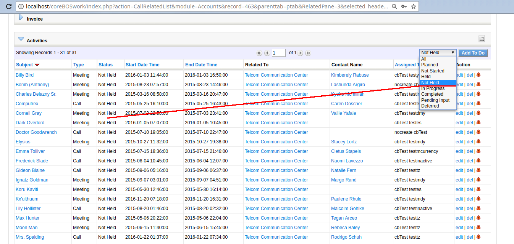

This month is similar to the previous one, where the new calendar consumes a lot of our time but we still fit in some incredible enhancements, like a new translation infrastructure, a rule evaluation system, two factor authentication, many global variables and security fixes along with a very long list of other changes for a total of 324 commits. **Simply amazing!**

===

 ! Calendar

 - eliminate hardcoded account fields from a query in case someone eliminates that relation
 - correctly set 12pm
 - add default time span when start and end date are the same
 - test timezone loading
 - add Contacts to the related list and treat Accounts as a normal module
 - show name of related record at second level, accountname on potential related to calendar
 - adapt events query to cbCalendar module
 - separate create and edit follow-up workflow task
 - load and set fullcalendar locale for date formatting
 - pt_br Thanks Ranieri Slemer
 - de_de Thanks Henning Matthaei
 - fr_fr Thanks Gerald
 - translate status picklist on calendar related lists
 - set correct workflow conditions for "Notify when a task is delayed beyond 24 hrs"
 - define calendar related modules so related lists work correctly
 - the time_start for reminder popup, was saving with user timezone and we have to save on UTC always
 - adjust home dashboard query to new cbCalendar module
 - sort user list for non-admin users
 - permit delete of old calendar events from new calendar module.
 - set default end time when creating a record
 - validation for users with non-iso date format
 - redirect C4You Detail view to new calendar
 - no validations on mass-edit: we cannot guarantee anything
 - load event columns for special blocks and fields.
 - set field presence value so they can be edited in Setting > Field Access
 - Calendar_Push_End_On_Start_Change global variable and validate dates using current user format
 - move Activity and Activity History related lists to cbCalendar. With the new calendar development we decide to eliminate the activity history related list and substitute it for a status picklist filter on just one related list. The functionality isn't exactly the same but it is in line with the other related lists in the application and with the future development plans we have for searching on related list.

 ! Global Variables

 - Export_Field_Separator_Symbol 
 - EMail_Maximum_Number_Attachments
 - delete duplicate entry helpdesk_support_name
 - exact case delete in continuos changeset
 - Application_Global_Search_TopModules global variable: Comma Separated List of modules that the global search will put first in the result list
 - Application_Permit_Assign_Up and Application_Permit_Assign_SameRole
 - Definitions for PDF customer portal variables
 - CustomerPortal_PDF
 - Calendar_Push_End_On_Start_Change

 

 ! Security
 
 - A normal user can delete any other user with specific URL
 - Workflow purify JSON array elements individually to avoid breaking JSON object
 - Calendar XSS in subject

 

 ! Login
 
 - Two Factor Authentification
 - 2FA with google authenticator mobile app
 - use password authenticated user ID to check 2FA
 - do not change secret on password change so MOBILE keeps working

 

 ! Developer

 - Minor optimization and permit selecting any user, not just current_user in getUserslist API function
 - Add Webservice Client library so we can easily connect with other coreBOS installs
 - [Lightning design system](https://www.lightningdesignsystem.com/) combo box component
 - Add new function in ExecuteFunctions to get the number display value with the user format
 - Add function to convert a number to standard format from javascript in order to operate correctly with the value
 - Support for code execution when no user is logged in
 - Set MassEditable to 0 for uitype 4 fields
 - Correctly detect date type in conditional web service queries
 - Methods to get individual components of a date both in ISO and User format

 

 ! coreBOS Rule Evaluation

The goal of this project is to have an easy interface with which we could separate business decisions from code. [Read all about it here.](http://blog.corebos.org:8080/en/blog/corebosrules)

 ! coreBOS Generic Translation module

A complete translation infrastructure capable of translating fields and labels with full support for gender and plurals. I will write a post about this in the near future but if you can't wait, [have a look here](http://corebos.org/documentation/doku.php?id=en:devel:cbtranslation).

This enhancement to coreBOS is based on the work of [@bertrand.wattel](http://code.vtiger.com/vtiger/vtigercrm/merge_requests/238). Thank you very much!! I'm sure vtiger will pay just as much attention to your effort as I did :-D

 ! Other changes

 - permit usage of field values in event conditions
 - support MySQL strict when inserting a new workflow if schtime or schtypeid are empty
 - Webservice get PDF output and Customer Portal now support PDFMaker if it is installed via the **CustomerPortal_PDF** global variable
 - query generator queries do not have parameters in ConditionQuery Business Maps
 - make sure FIELD types have a leading dollar so Business Map expression engine can compile them correctly
 - support for image fields in product lines through master-detail mapping in Inventory Modules
 - add up to date LDS spinner class without updating the whole library which breaks the UI
 - always merge EMail against current user and account related to contact (Mail Manager)
 - transfer custom view filters to destination user when deleting a user
 - open Key Metrics in full window
 - permit Application_ListView_MaxColumns in Home Dashboard module/listview widgets and make them bigger
 - support for special characters in menu name in the editor
 - correct regexp to get_cookies in order to avoid substring detection: one = done, for example
 - Workflow: get context module name from method if property does not exist
 - return Global Search list of results and picklist filter sorted by module name
 - avoid searching in some administrative modules in Global Search
 - eliminate inactive modules from capture options
 - redirect to home if no module is given and the Application_Default_Module is invalid. Thanks Ranieri
 - standardize Payment EditView file by moving edit check to a preEditCheck method
 - Autocomplete feature for uitype2 and uitype10 fields. I will dedicate a post to this in the near future
 - change AuditTrail header icon to trail
 - correctly escape double quotes in Workflow update field raw value
 - ChartJS update library and set maximum scale value
 - getCurrentUserField Workflow function
 - set the default value of the assigned user to the current user if none is given in FieldMapping Business map, basically for default values
 - no mass edit for emails
 - set the visible option on by default for new options and mark entries as visible or not in Menu Editor
 - update ModTracker simplediff library to latest version
 - correctly show non-image content for image fields
 - new field uitype 1615 which is a picklist of picklists in the application
 - correct formatting of print email
 - eliminate unused function and code in favor of direct calls in index.php
 - eliminate warnings, notice, MySQL strict and code cleanup (this one is a constant every month, even today)
 - translations

**Thanks for reading.**

