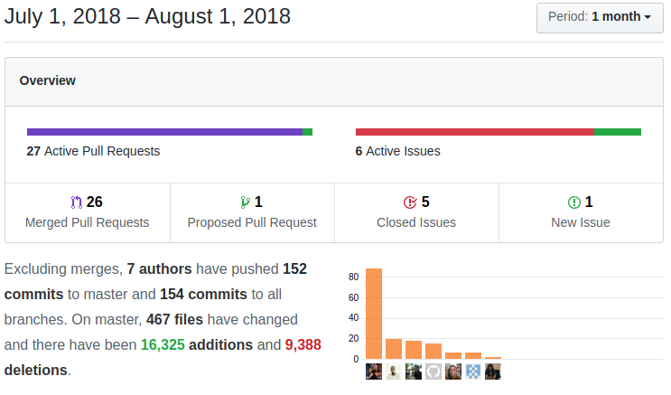

We start our hot summer season with a lot of new features and enhancements, a lot of new functionality for implementors, users, and developers to enjoy!

===

 ! Mobile
 - New button to add related documents, from the detail and related list views
 - Return to the related list when creating a record from there
 - Fix syntax error on Save Record

 ! coreBOS Standard Code Formatting, Security, and Optimizations

As the Standard Code Formatting project approaches its end, it continues to catch bugs and optimize the code.

 - Format Dashboard, Events, Webservice, Settings, HelperScripts, Popup, Users, Emails, vtlib, wsChanges, webservice Client, a lot of javascript code
 - Eliminate warning in Webservice, Workflow, Documents, Users, MailScanner, creating a field on an empty block, and others
 - PHP 7.1 fix call to 'updateAmountDue'
 - Eliminate obsolete property in document folder list view
 - Change incorrect variable names in Settings, Business Maps, Mass Edit and Web Service
 - Simplify reference field check condition to optimize web services execution
 - Refactor Web Service code: Delete an unnecessary file and refactor getRelatedModules
 - Refactor Reports code
 - Security: Update htmlpurifier

 ! Features
 - Add **Survey Modules** to control online surveys and their responses directly from within your coreBOS! There are now four survey modules, two to define the survey and questions you are conducting and two to manage the responses of your clients. These are tied in with the workflow system so you can do all sorts of automation upon the responses.
 - **Business Actions** module which is the first step in giving the implementor full control over the action panel contents. Expect more development on this feature in the next weeks to get it finished.
 - Convert Edit DetailView Links to Copy. About 4 years ago, when we started the **coreBOS** project, one of the first things we did was make the inline edit in the detail view accessible with a click anywhere in the cell. This made the "Edit" link obsolete but we left it there. At that moment one of the major complaints was that this made it hard to copy the value, so we decided to convert the "Edit" link to a "Copy the value to the clipboard" link. Really useful!
 - Don't allow saving a new inventory module record when discontinued products or services are selected.
 - Support for custom fields on get_dependents_list and get_related_lists
 - Following up on the recent mass edit change to server-side events we:
  - Add a close mass edit information panel button
  - Eliminate an empty/unused key that was being sent in the mass edit request
  - Send the list of mass edit records via POST to avoid GET limit when selecting many records
  - Set mass_edit_check so validations and numeric calculations are done correctly

 ! New Features and Development
 - More information on the "invalid identifier" error in coreBOS Rules
 - Deprecate getRelatedListsInformation
 - Support for creating document folders via Web Service and return the ID
 - **get Login Page** Web Service call [plugin:youtube](https://youtu.be/TBDMJ-V_OwM)
 - **getRelatedModules** Web Service call that returns the information of the related modules of a module
 - **getfilterfields** Web Service call which returns the HTML select box of filters on the module for the user
 - Return filename on Documents Web Service retrieve
 - Add missing module images
 - Save Business Map XML in JSON format on contentjson field in order to make it easier to use the maps from javascript. You now can get the map in JSON format from this new field when you retrieve the record through the web service API
 - [Allow Web Service clients to send database formatted product line currencies and skipping conversion on a per-field and record-wide base](../WSFieldFormat)
 - Add Workflow function **aggregate_time** to aggregate time fields into HHH:mm:ss format
 - Compare time fields as a number of seconds (even for values more than 99 hours) and send e-mails using the direct field values in the workflow system
 - Permit field operation aggregations on the same module
 - Add Workflow function **diffyears**
 - Enhance workflow template system to support **record_id** and **record_module** fields
 - Relate email attachments with emails sent through the workflow system
 - Add business map selection for filtering functionality on the Delete Related Workflow Task [plugin:youtube](https://youtu.be/J-FmnBx4SS8)
 - Send ExecuteFunctions javascript method parameters via POST call instead of GET to support bigger payloads
 - [Application_Permit_Assign_AllGroups global variable](https://github.com/tsolucio/corebos/blob/master/modules/GlobalVariable/language/en_us.gvdefs.php#L1141)
 - Permit setting default related list calendar filter via [RelatedList_Activity_DefaultStatusFilter global variable](https://github.com/tsolucio/corebos/blob/master/modules/GlobalVariable/language/en_us.gvdefs.php#L1176)
 - Allow multiple validations of the same type on one field in Validation Business Maps
 - Add [coreBOS Key-Value store Settings](http://corebos.org/documentation/doku.php?noprocess=1&id=en%3Adevel%3Acorebos_settings) API to Execute Functions
 - Convert [coreBOS Key-Value store Settings](http://corebos.org/documentation/doku.php?noprocess=1&id=en%3Adevel%3Acorebos_settings) value to text in order to support larger values
 - Override system permissions for the Business Map module so all maps can be read by any user when they are accessed via code for configuration purposes

 ! Others

 - correctly define JavaScript log to not overlap with background log
 - filter CSRF variable from the "selected search modules" global variable
 - increment size of Workflow Test field
 - correctly set file type for external web service document retrieval
 - correct create table SQL for PBX Manager installation
 - add missing module images
 - remove list styling on autocomplete suggestion list and align it with the input
 - block inline edit for displaytype=4 fields
 - eliminate hardcoded fieldid in Email field detection
 - command line coreBOS updater execution fix
 - Set DiscountAmount 0 if is null when calculating financial fields and do not calculate values if the lines have not changed or it is called with a non-inventory module
 - create Inventory Details tax fields for deleted taxes also
 - make sure we have an active user to launch Mail Converter process
 - register Potentials sales stage history when no closing date is set
 - avoid loading inexistent translation file in getTranslatedString
 - as usual, we keep translating and fixing internalization issues:
  - add a missing label in nl_nl
  - add Dutch translation to Terms and Conditions and for new Financial fields
  - global variables
  - correct syntax error in products error message and add "Is Discontinued" validation message
  - continuous pt_br fixes thanks to Slemernet

 !!! Thanks

A very special thanks this month to [Luke](https://github.com/Luke1982) who has been very active and contributed some very interesting and helpful enhancements!

**Thanks for reading.**

