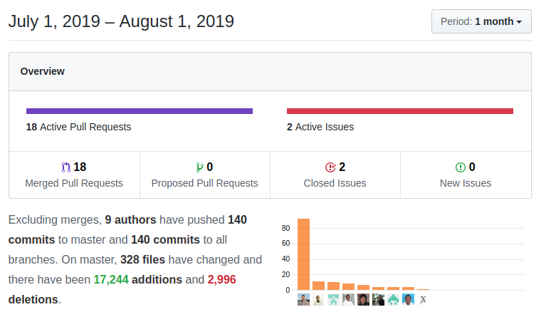

Keeping up the pace we start working on a generic payment gateway integration, we add individual SMTP settings per user, new workflows and conditions, release new code and keep fixing and enhancing. Enjoy!

===

 ! Features/Implementor

 - Omnipay gateway integration code. Years ago we implemented an integration with [Omnipay](http://omnipay.thephpleague.com) but it never got into the main branch of coreBOS. This month we clean the dust off the project and make it part of the application. We are still working on it and I will most probably formally announce it in the next months' post, but it started this month.
 - Payment control fields on Accounts, Contacts, Vendors, Invoice, Sales Order and Purchase Orders: [Payment and Wallet ConTroL Patterns](../walletpattern)
 - Add basic statistical information to User ListView
 - convert User action buttons to LDS menu and add support for business actions so anyone with permission can add functionality to the Users module
 - add Global Variable **Application_RTESpellcheck** to activate browsers' spell checker in CKEditor (RTE Editor). (Thanks Kiko)
 - generate document workflow task
 - support many to many relations mass updates with the option o launch workflow on related updates. Be careful, this may cause infinite loops.
 - support email sending to Project/Potentials
 - enhance [field mapping business map](https://corebos.com/documentation/doku.php?id=en:adminmanual:businessmappings:mapping&noprocess=1) to support [Rule option](https://corebos.com/documentation/doku.php?noprocess=1&id=en:adminmanual:businessmappings:mapping#rule_directive) which permits us to launch a business rule and save the result in a field
 - add Workflow condition to check if the parent has this as an nth-child on uitype 10 capture field (thanks Luke)

 ! Developer
 - migrate uitype 20 (long text area) to the standard uitype 19
 - migrate uitypes 22 and 24 (short text area) to the standard uitype 22
 - web service GetRelatedModulesManytoOne: eliminate hardcoded relations that have been converted to uitype 10
 - web service:getRelatedModules: return field name for one to many relations
 - global variable **Webservice_PermitQueryOnInactiveUsers** to include inactive users in results of web service query
 - coreBOS Rule web service call missing context
 - add background logging messages for mass relation update and aggregation function workflow tasks
 - accept JSON encoded string as context (must contain record_id) in the coreBOS Rule web service method
 - setEmailOptOut helper script to directly set email opt out in Accounts, Contacts, and Leads. It is recommended to use web service for this
 - fix javascript "Do not access Object.prototype method" thrown in Continuous Integration
 - add Debug_ListView_Query support for Documents folder view
 - return Picklist array values indexed by their internal ID
 - do not repeat Business Actions links of the same link type

 ! SMTP per User

coreBOS, inherited from vtigerCRM, uses one outgoing SMTP account to send all the emails from the system. To accomplish this the SMTP server must support a feature named Relay. With this feature, we can send emails in name of other users as if they had been sent directly from their own SMTP account. Not all email servers support this (namely Google and Microsoft) so we added the possibility of configuring an individual outgoing SMTP setting per user.

Access the URL: `https://your_server/your_corebos/index.php?module=Utilities&action=index` and click on the "**SMTP Settings**" section.

This is just an option, another one of the many features coreBOS has, if you need it, you can configure it per user, if you don't, coreBOS will continue to work as it has up to now.

Soon, we will permit administration users to configure the settings per user (endless fun).

 ! Detail View inline edit update

When we used the Detail View inline edit functionality to edit a field individually, the application was sending the new value to the backend and showing the value in the browser if no error was returned. The problem with this approach is that workflows can be launched that change values in the record, even the same value that has just been sent (formatting for example). Additionally, with the [Field Dependency maps](http://corebos.com/documentation/doku.php?id=en:adminmanual:businessmappings:field_dependency&noprocess=1) we could need to act upon some other fields or blocks depending on the new value.

With the change we introduce this month, the whole detail view record is updated so changes will appear immediately.

 ! coreBOS Standard Code Formatting, Security, Optimizations and Clean Up

 - eliminate warnings, variables, and quotes in GenDoc, MailScanner, Number2String, SMS, Users, Workflow, Business Map, Utilities, Documents
 - change "locate map" div to LDS in Contact and Accounts
 - code and HTML format and eliminate space in Detail View
 - add some spacing, center buttons and move "save" button inside header in Menu Editor
 - apply some space to user preferences layout
 - correct unwanted spaces in JS lang files

 ! Others
 - move action buttons to their own template and move them into header for better screen real estate
 - Quick Create tax fields in both Products and Services modules
 - application translator: correct regex to manage JS translation files with colon
 - broader SQL to correctly capture images shared between modules
 - fix some errors in changeSets file
 - show integer values with no decimals
 - fix error in Layout Editor in blocks with no fields
 - longer URL and permission fields in Menu
 - correctly use updated FPDF libraries to support PDFConcat (coreBOS knows how to manipulate PDFs, concatenating among other things)
 - mass print native Invoice/SalesOrder PDF
 - format tax fields to the standard used in the rest of the forms so field dependency can work
 - sync Call Related list changes for modules with custom scripts
 - Related Panes Business Map: use relationID to retrieve related list if we cannot find the list by name
 - return invalid time value as a string in Reports
 - default support for http**S** in uitype URL
 - add error message when field cannot be found in coreBOS Updater
 - support application message class format in Users module
 - eliminate sendgrid user and password which are not required anymore
 - eliminate specific detail view in favor of common one in SMSNotifier
 - update project README file with some badges
 - change User error message and security check to standard
 - GenDoc changes
   - **generate document workflow task**
   - don't translate field tag result if the field isn't a picklist
   - return false if fieldname does not exist in is_picklist
   - remove the first element (empty) when retrieving related list from a query
   - remove offset of element 0 on related list (for obsolete Listviewcolors module)
   - add Contacts->Accounts relation
   - solve errors in postrpcessing (includeGD tag)
 - add created time to SMSNotifier related list
 - permit adding SMS related list on Accounts, Contacts and Leads
 - support sorting in Emails and Documents list view
 - better Global Variable explanations
 - fix errors (typeofdata) in manifest.xml files of cbtranslation and cbTermCondition
 - **Continuous translation effort:**
  - **Romanian translation "ro_ro" arrives** this month! thanks DIGINET
  - Number2String support for Dutch (thanks Luke), French (thanks Gerald Bigot), Portugues (thanks Slemernet), Romanian (thanks DIGINET)
  - Business Actions: add translation for some application actions
  - eliminate text from labels in workflow grid for better i18n support
  - "finished all tasks" Calendar message for future notifications popup screen
  - Update cbTranslation getLanguage with Dutch
  - MailManager, Pulse, Users, Utilities

**Thanks for reading.**
