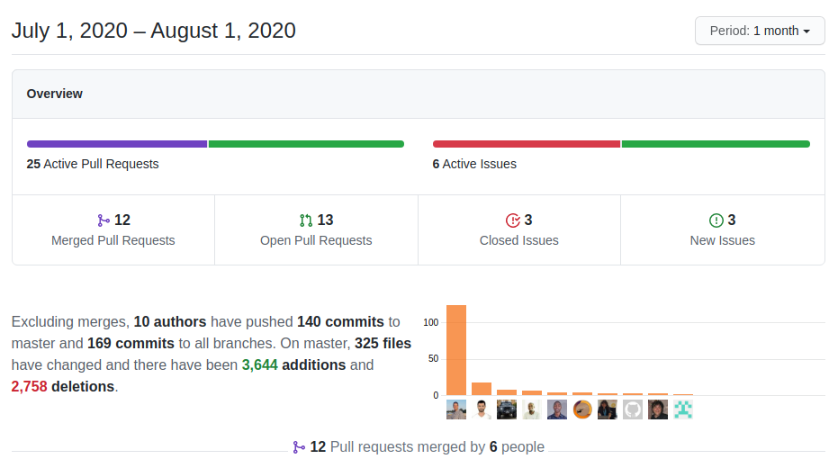

A month full of a large set of small but very interesting changes, a nice balance between user and developer enhancements complement the typical coreBOS beat.

===

 ! Features and Implementor/Developer enhancements

- MailConverter Enhancements
  - add email comment options: now we can add the email body (as before), a link or avoid adding a comment completely
  - add an option to obligate email to be related to the record being updated or not: by default, the email being processed must be related to the record that has been found by email, if the emails do not match the email is discarded, this is done to reduce spam but sometimes it is not what we want, so now we can decide how to attach the email
  - UI for "email attach as" functionality
  - search on ID field if not found in reference and autonumber field
  - set correct assigned user for project comments
  - relate the incoming email with all the records we find
  - set default values for existing rules
  - add missing query parameters
  - correct array index and eliminate warning
  - correctly show/hide assign user row
- Server-Side Events mass actions
  - support for Business Actions that launch Server Side Events mass actions with progress information on ListView
  - pass additional parameters to **runBAScriptFromListViewSSE** method
  - permit indicating the script to launch on event source so we can reuse the Mass Edit information screen

[plugin:youtube](https://youtu.be/ovCt_ljx0J4)

- functions to empty cache objects (for RoadRunner support)
- add workflow expression support on Decision Table input variables via [the preprocess directive](https://corebos.com/documentation/doku.php?noprocess=1&id=en:adminmanual:businessmappings:decisiontable#preprocess_directive)
- add "preprocess" element to XSD validation
- Deduplicate: limit deduplicate query to current filter
- Execute Functions: get user name function
- FieldDependency
  - functions to update assigned_user and 101 fields
  - set checkbox fields
- permit retrieving values from the Key-Value store without cache
- MsgTemplate
  - pass custom function on MsgTemplate submit template method
  - prefilter templates per base module
- add **corebos.login** and **corebos.logout** events
- set browser variables in compose email and Popup screen
- support for LIKE operators on date fields in QueryGenerator: like on date fields was being converted into a "is null or empty", now it is treated as a LIKE SQL operation
- support related field syntax in Validations expression maps on create
- LDS
  - Email detail view formatting to LDS and eliminate redundant buttons
  - Button with icon component
  - Page Subtitle header component
  - Workflow tasks styling
  - Settings page styling
    - add parameters to page header so we can customize per settings section
    - changes on currency edit view and currency detail view
    - changes on header and hidden value
    - header on taxConfig and cancel button
    - modal changes

 ! Web Service

- add AUDIT login and logout corebos events to webservice login and logout
- add more formatting information to getPortalUserInfo for the front end applications
- execute business map: ProcessMap web service endpoint
- INVALID_USER error code
- give non-admin users access to basic user information
- **permit users to Retrieve their information**
- correct update action in changePortalUserPassword
- email query support for filename
- eliminate warnings not finding the file in **RetrieveDocAttachment**
- ignore empty IDs in delete and convert parameter to array by default in Mass Operations
- include ModifiedBy as a read-only field and eliminate a redundant condition
- index records by their WSID in Actor Mass Retrieve so it is the same as module Mass Retrieve
- delete ModTracker active check which is done later
- **return JSON formatted error message** to be consistent with the rest of the API
- better error messages
- upsert support for searching on ID and CBUUID fields
- getLoginPage: use English and default login page if none is given
- better WSID creation for Mass Retrieve index
- use a common function instead of implementing functionality again

 ! Workflow

- enhance AND and OR to accept more than two parameters
- access Fully Qualified Name fields in inventorydetails meta variable
- clear cache between task execution for condition evaluation
- more minute intervals for scheduled workflows
- convert CRMID to WSID for Simple Template evaluation
- add context to Evaluate Rule evaluation
- add SendEmailTo workflow context
- email CC was overwriting TO due to copy/paste error
- line breaks in HTML and TABLE inventory details output in emails
- merge the template with passed records
- scheduler query needs to get reference field names, not values
- setCache method to load data into Entity Cache, use it to load current workflow entity data and avoid database access on reference field evaluation
- support any column name in inventorydetails table/html output in emails

 ! coreBOS Standard Code Formatting, Security, Optimizations, and Tests

- coreBOS Standard code Formatting: Edit View, Login History, Validations, Emails, Templates, Taxes, Users, Customer Portal, List View, Purchase Order
- eliminate old Calendar support
- **optimizations**
  - change variable for direct access to value
  - convert variable to constant and inline value in CRMEntity
  - convert variables to constants and move assignment outside of loop in Profiles
  - change profile column capitalization to optimize code
  - add database index on attachments name column
  - retrieve uitype in one DB call instead of two in Global Search
  - MailConverter
    - reduce SQL result set
    - eliminate redundant SQL
    - use type casting instead of IF check
  - reduce memory impact of modules eliminating unused property in favor of global object
  - change variables for direct calls, eliminate unused variable and make parameters non-reference in Users
  - directly return and use results
  - reduce fields from query and change loop for variable initialization
  - eliminate variable for direct reference in ModuleTypes web service
  - load once Describe in Master-Detail Map
- Login security: constant time string comparison
- **official support for PHP 7.4**
  - modify RELATED query regex due to change in PHP processing in web service
- **Tests:** keep getting some love and care as usual but with special attention to the web service system

 ! Others

- removing scroll to top in Settings
- return an empty string instead of no permission message in Business Question
- do not try to merge array context variables in Business Rule
- set correct module for Calendar double click event
- translate Calendar picklist fields on event
- change Customize Number blocking screen to the standard central function
- avoid error on not found/readable file Download
- get field instead of column name to access column_fields in Emails
- select fieldname/columnname for custom modules in Emails
- Field Dependency map was reading function parameters from wrong XML directive
- List View was applying currency conversion on non-currency fields
- update changesets to permit updating from vtigerCRM 5.4
- MySQL Strict: set empty time field (uitype 14) to null to avoid MariaDB strict mode error
- fill vendor field when converting Purchase Order from Product
- change temporary table name for Reports queries
- avoid SameSite cookie warning on empty path installs
- correct search_field assigned_user_id field definition in Service Contracts
- apply HTTPS to Skebby SMS
- do not add cbuuid on Users export
- send correct value for RTE fields validations
- avoid warnings on undefined discounts in setVAT
- constant translation effort:
  - correct syntax error

**Thanks for reading.**
