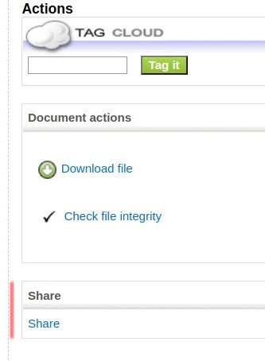
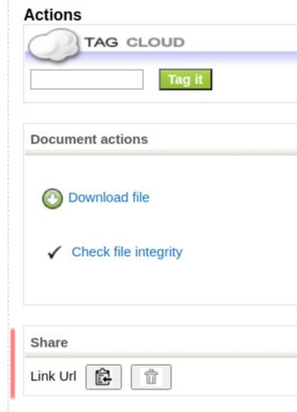
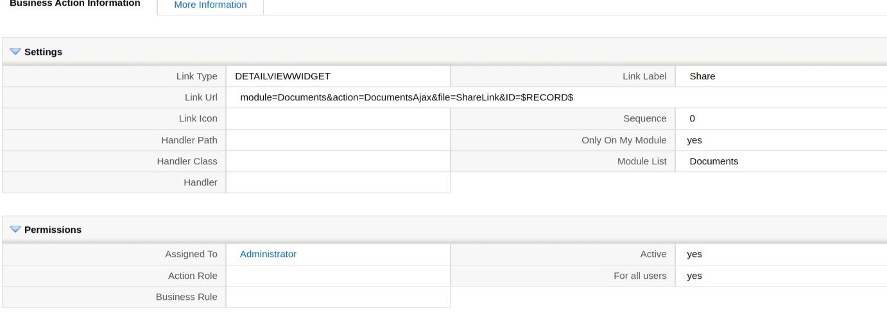
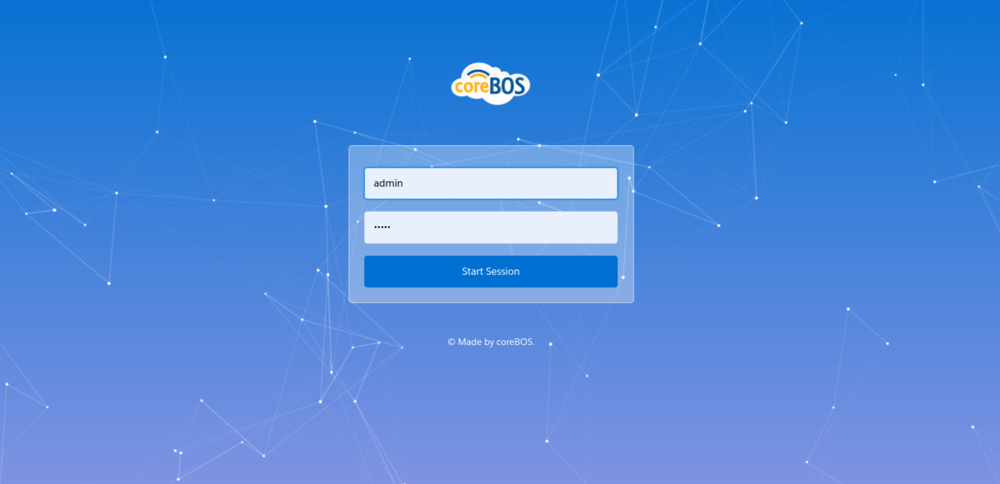
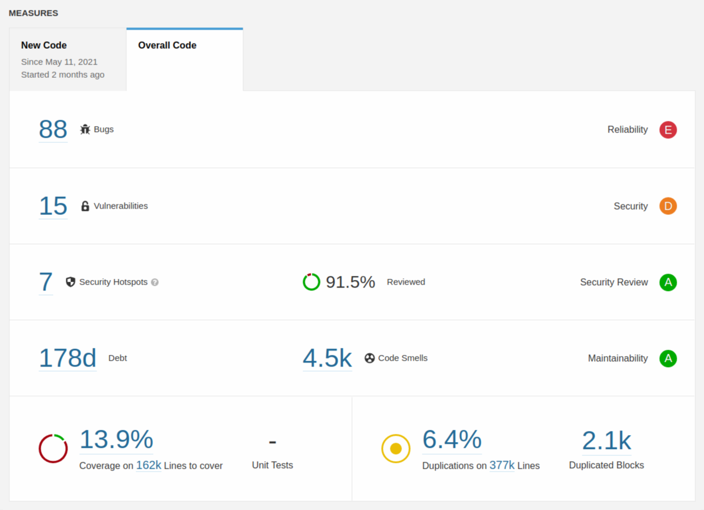
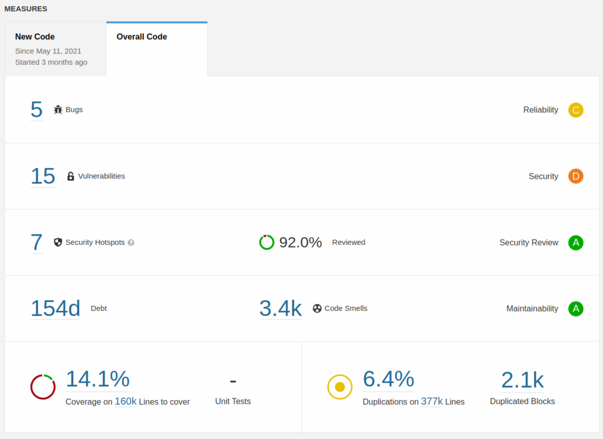
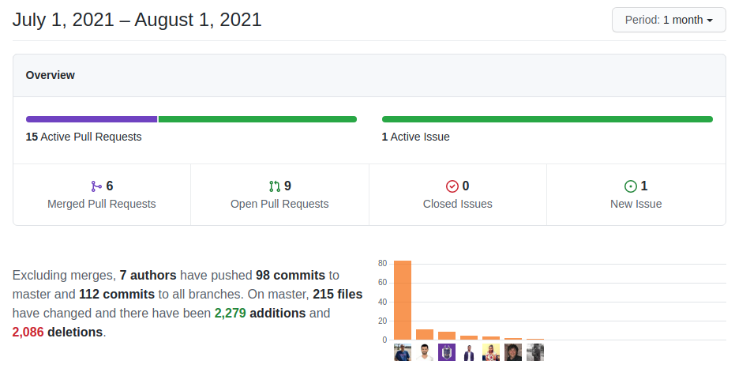

A rather slow maintenance month that still gets a very nice set of new functionality. Very interesting.

===

 ! Features and Implementor/Developer enhancements

- add delete settings button to PBXManager
- add documents related list to Comments
- add an LDS icon component
- add support for tooltip on the left of icon in tooltip component
- **Documents share link** by adding a business action to the documents module you can now share your documents with anyone. This is the business action: `module=Documents&action=DocumentsAjax&file=ShareLink&ID=$RECORD$` This functionality is supported also in the Generate Document workflow task which has a new "share on create" functionality.

| Share Action | Shared Link |
| --------- | ------------ |
|  |  |



- Import
  - import skip event: **corebos.entity.import.skip** triggered when a record is skipped during the import process. It receives an array with:
      - the import row ID
      - the import temporary table name (so you can retrieve the original row)
      - all the current record and module information
      - the user object doing the import
  - global variables to set the duplicates values
      - Import_DuplicateRecordHandling_Open: if step 3 (deduplicate) is selected or not
      - Import_DuplicateRecordHandling_Type: the type of deduplication we want to apply
      - Import_DuplicateRecordHandling_Fields: the fields to search on
- **Logging enhancement:** add process ID to log line and simplify datetime so we can track parallel processes. When debugging issues in processes like Kafka consumers or external applications using the web service API, or simply in production installs with many users, the log messages are written to the file in sequential order mixing different executions and making it very hard to follow a process. To manage this situation we have added the process ID to the log message

```
line 30:  [2021-07-30 11:26:48:886423{12462}]  {12462}
line 31:  [2021-07-30 13:41:57:454577{18827}]  {18827}
```

This number will permit us to filter the lines for each process and simplify our investigation work.

- new Particles Login Page



- Master Detail Editor
  - add pagination global variable
  - reload detail view on create global variable
  - find the correct instance of grid after reload the whole view
- support commas in number2string
- support WebDAV Basic Authentication for [Filestash](https://www.filestash.app/)
- **Workflow Enhancements**
  - add Condition Query, Expression and Decision Table in Launch Workflow task, making it incredibly simple to select the reocords to work with
  - add support for context input in Generate Image Code Workflow Task: **GenerateImageCode_ValueToEncode**, **GenerateImageCode_EncodingType**
  - aggregation group_concat on uitype 10 fields now can return the name instead of the ID concatenating 'name' after the separator `aggregation('group_concat','Invoice','account_id separator ";"name')`

<span></span>

 ! coreBOS Standard Code Formatting, Security, Optimizations, and Tests

We continue working with [Sonarqube](https://www.sonarqube.org/).

| Last Run June | Last Run July |
| --------- | ------------ |
|  |  |

- coreBOS Standard Formatting: eliminate warnings initializing vars, eliminate useless code and comments, format code
- Eliminate technical debt
  - eliminate unused variables. sonarqube
  - eliminate/change variables, parameters, and functions. sonarqube
  - eliminate useless code in Currency
  - eliminate obsolete code in MailManager
  - eliminate unused old Word/RTE merge code in Settings
  - update obsolete HTML
  - convert repeated string to a variable and change an incorrect comma
  - cleanup javascript
  - throw javascript error object
- Refactor and duplicates
  - string literals should not be duplicated: attachment postfix entity string **Field_Metadata::ATTACHMENT_ENTITY**
  - string literals should not be duplicated: multipicklist separator **Field_Metadata::MULTIPICKLIST_SEPARATOR**
  - apply basic LDS and cleanup event settings and calendar settings in Calendar
  - change GenDoc strange variable check for PHP empty
  - simplify Reports cell print output logic
- Documentation:
  - function headers, and comments
  - non-stop wiki enhancements
- Optimizations
  - Boolean checks should not be inverted php:S1940
  - remove the unnecessary boolean literal
  - eliminate unused function results
  - use forEach instead of map where we don't modify the original array
  - eliminate useless column in definitions in Global Variable
  - delete duplicate SQL condition in List Search
  - increment document download database column in one call in Mobile
  - use direct SQL value instead of variable in GenDoc
  - reduce SQL query column resultset in Workflow
  - simplify switch and optimize conditional in WSApp
- Security
  - update DOMPurify 2.3.0
  - update Sabre 4.1.5
  - update Valitron 1.4.10
- **Unit Tests:** keeps getting more and more assertions and we make some code modifications to permit unit and integration testing easier

<span></span>

 ! Others

- set the correct header for GET javascript language API call
- apply standard error message when no module has autonumber field
- check for vendor_id on PurchaseOrder Contacts Popup to retrieve Contacts by Vendor
- set user variable in Contacts function
- continue looping over records if field result for image fileindex is not valid
- fully qualify fields in mail converter and home to support denormalization alias
- always return file when download is called: return file with error
- GenDoc: set correct number of parameters in function (eval_existe) call and respect cache file name if given
- set the correct module for **Inventory_Check_Invoiced_Lines** global variable
- ModTracker: access displaytype 3 fields when they are in individual blocks
- make standard uitype 10 capture work in MsgTemplate as all the other modules
- set Notifications current_language to the default language
- call correct functions with the correct parameters in Profile settings
- collapse IFs and reduce cognitive complexity in Reports
- apply LDS to View Permissions test functionality
- add user ename to Web Service query
- initialize variables and refactor common code in Web Service
- Workflow fixes:
  - add uppercasewords missing definition
  - correct expression function filter return value
  - correctly load GenDoc context for shared link
  - generate document share link fill context always
  - group_concat on name between salesorder-invoice-contacts
  - use getEntityField to get a fully qualified column name
  - match operators with correct label: **WARNING** this error caused an incorrect operation assignment in workflow conditions on reference fields. The error appeared on May 19th. It is recommended to update any installs updated after that date and review any workflow conditions on reference fields created/edited during this period. You just have to edit and select the correct operator from the picklist.

 !! WARNING: this error caused an incorrect operation assignment in workflow conditions on reference fields

- Translations
  - Application, Email, Documents, GenDoc pt_br. Thank you SlemerNet!
  - Email it_it
  - GlobalVariables

<span></span>



**<span style="font-size:large">Thanks for following.</span>**
