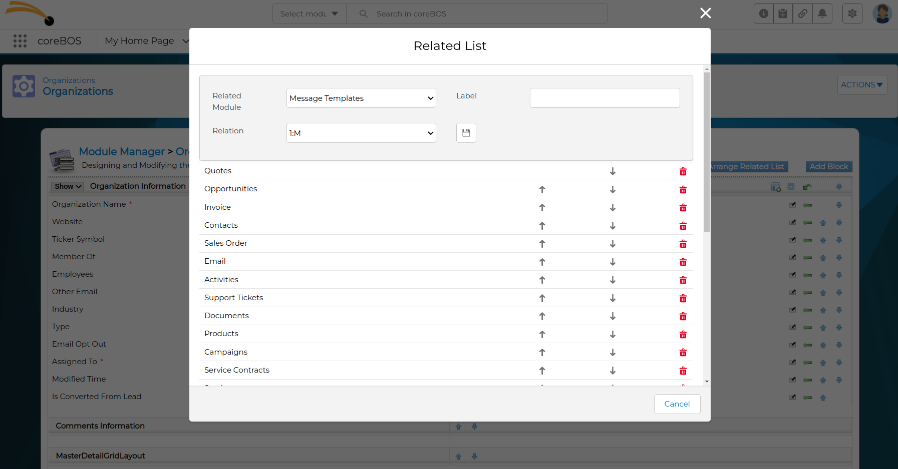
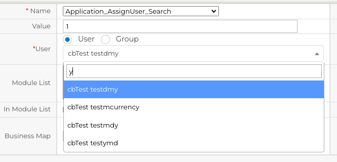
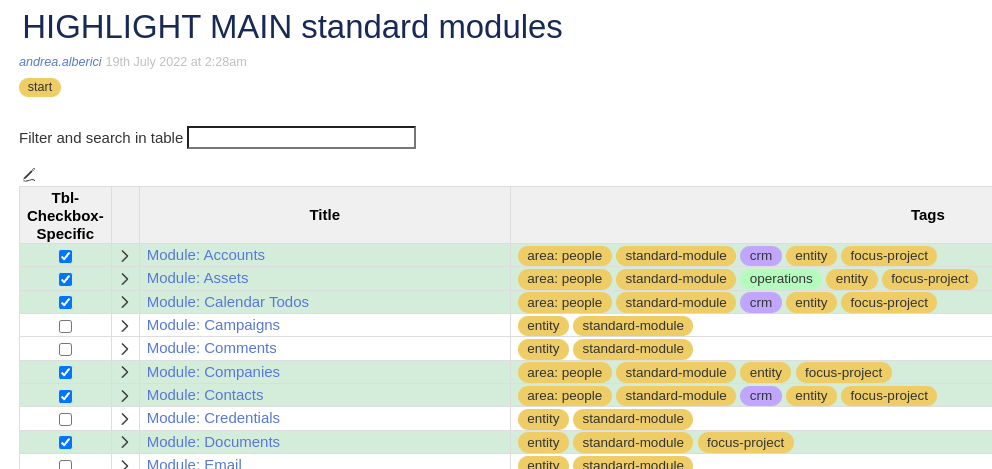
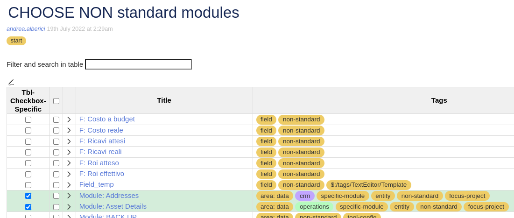
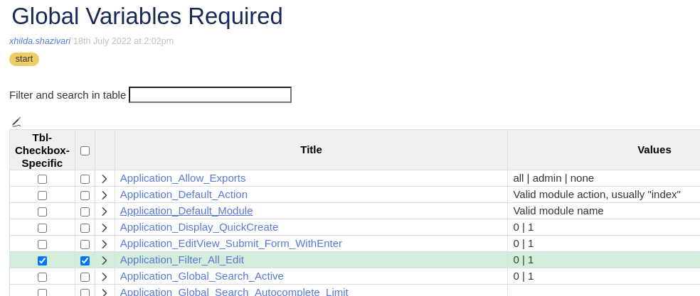
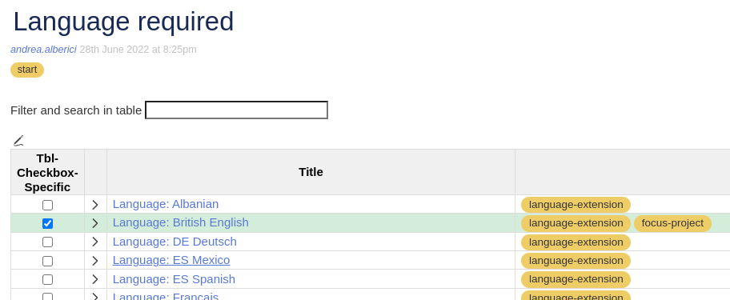
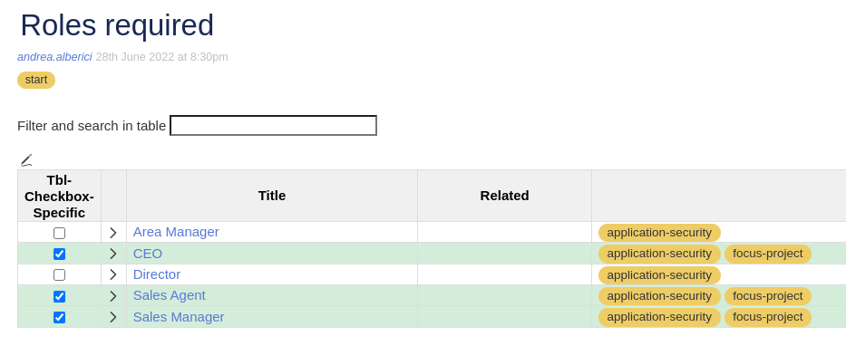
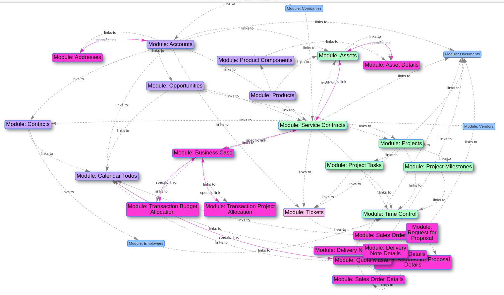
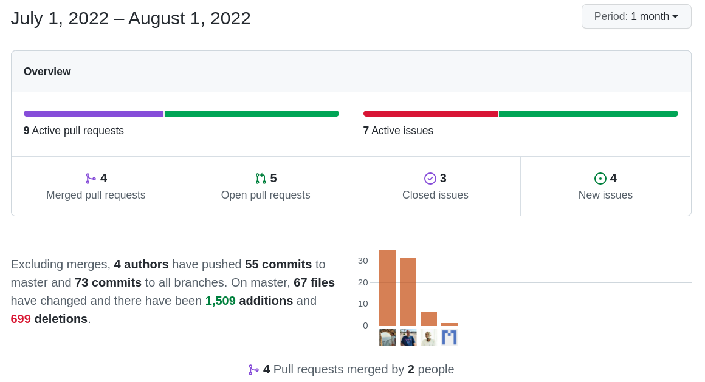

Not too many changes this month, which surprises me because there are so many things going on. I suppose those things just didn't get in this month. Let's see what happens next month. Happy vacation to all of those that have them. Enjoy!

===

 ! Features and Implementor/Developer enhancements

- **Facebook Integration**
  - sync facebook lead data to coreBOS
  - using hub verification and access tokens
  - code formatting
- add module label in gVTModuleLabel global variable for Browser Variables
- drop zone widget to create documents from URLs now gets the title from the page URL
- add data uitype attribute for users fields
- save filter without mandatory fields if "FilterValidateMandatoryFields" is enabled
- read filters from web service and hide/show "All" filter based on global variable
- show related module fields in tuiGRID in List View
- session debug helper script with steps in HelperScripts
- improve related list functionality in Layout Editor

- permit searching in Assign User fields
  - apply basic LDS to user selection field
  - re-call select2 after an update in DetailView

 ! coreBOS Standard Code Formatting, Security, Optimizations, and Tests

- coreBOS Standard Formatting: eliminate warnings, eliminate useless code, variables, and comments, format code
- Debug Message Reduction: DetailView
- Documentation:
  - update all Global Variable definitions
  - function headers, and comments
  - non-stop wiki enhancements (working a lot on this)
- Security
  - loose file contents check avoid javascript in PDFs
- Updates
  - update DOMPurify library
- **Unit Tests:** keeps getting more and more assertions.

 ! Global Variables

This month we have started a very interesting and promising documentation project using [TiddlyWiki](http://tiddlywiki.com/). We are documenting all the modules, changesets, fields, actions, global variables, ... everything in coreBOS. This tiddlywiki is the starting point for new customizations for clients that permits us to naturally document their requirements and also implement features directly from the tiddywiki into the client's coreBOS install. We will dedicate some blog posts and videos to this functionality in the near future.

To help us keep that main tiddlywiki up to date with the constant changes in coreBOS I am starting this new section in the regular CHANGES blog post where I will list all the new variables that appear each month. That way we can easily add them to the wiki.

This is the list of new global variables that have arrived in July:

- **Application_All_Filter_Show:** Hide the default "All" filter. By default it is shown.
- **Application_AssignUser_Search:** Activate for installs with a large number of users to permit searching and selecting easier. Default is 0.
- **Application_FilterValidateMandatoryFields:** By default when creating a filter you have to include at least 1 mandatory field. For the cases when the users doesn't want to include mandatory fields on the filter set this variable to 0. Default is 1.

This is a glimpse of what the new documentation project looks like:

 ! Others

- support special characters in Blocks label
- return error in format expected by Dashboard code when no values are returned
- DetailView open block status in session with special characters
- eliminate HTML from Documents error message for session
- show search documents button only when global variable is active
- convert CSV strings to array in Global Search autocomplete functionality
- copy field information to input array in Hierachy Grid
- delete extra LDS example div in Leads "show in map" functionality
- show actions for records in list view
- show menu element only if it exists
- correct SQL quote balancing in ModTracker
- be more specific detecting Product field in Related list
- updating class names in templates
- tuiGRID set contextmenu null and allow normal right click
- decode html entities for Users database privileges
- correctly format validation messages with percent sign
- company image support and filter deleted company records in GenDoc
- apply LDS and coreBOS Formatting to delete Group screen
- Workflow
  - verifying parameters before passing to cURL
- Translations
  - Global Variables: ES
  - Settings: module manager related list organizer

**Congratulations to Denald** who is probably the first person to make more commits than me in a month. Wonderful!!

**Thanks for reading.**
