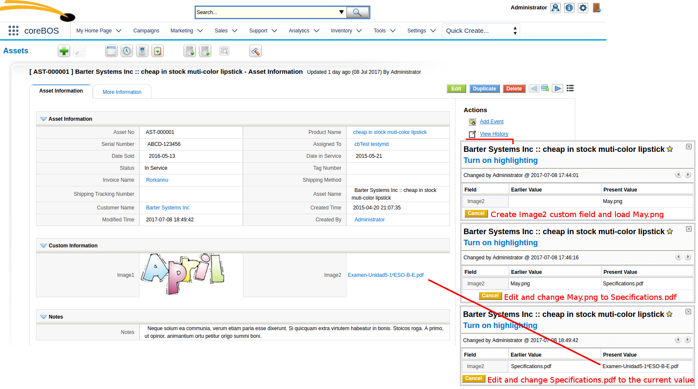
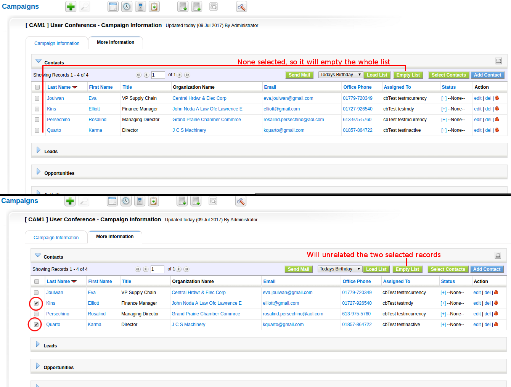

June 2015 was a maintenance month where we stabilize the functionality introduced in the last months with minor enhancements and keep creating an awesomazing application.

===

 ! Workflows
 - **Update field task with support for delay**. An interesting but delicate enhancement which must be used with care. Now you can establish a field update in the future, so when an event happens and you decide that a field must be updated you can delay that change to be done in a few days. This could be delicate because the value could change again in that time but the update cannot be unprogrammed.
 - **Conditions on tasks**. This is a really important change which compliments the previous update delay and increments the power of workflows considerably in general. With this change, we can now set conditions on the task execution. These conditions will be evaluated at the moment the task is executed and the task will be launched only if they are true. So we can create workflows that will not launch all their tasks, only those that apply. For example, the typical use case where we want to send an email to the assigned user of a ticket 5 days after it was created but only if it hasn't been closed. So your workflow launches on the ticket creation and creates the email task to be sent in five days but also adds the condition on the task to check if the ticket is still open.

 !!! Note that we can also accomplish this use case with a [scheduled workflow](../ScheduledWorkflows) that launches once a day, gets all the open tickets created five days ago and sends out the email. There are many ways to accomplish the same goal.

 

 ! Global Variable JavaScript function

Method to retrieve a global variable in JavaScript. We explained this in the [global variable post](../GlobalVariable) and you can read all about it on the [documentation page](http://corebos.org/documentation/doku.php?noprocess=1&id=en:adminmanual:globalvariables#javascript).

 ! Image field support for non image files and various fields on the same module

[plugin:youtube](https://youtu.be/vgbrz092VDE)

 ! Image field support for modtracker

With the image field enhancements made during the last two months, we can now have images in any module so it just seems natural that the rest of the application tries to keep up and now the modtracker extension is capable of informing that an image field has changed. With the previous image name which is tracked, you can retrieve the image from the storage directory if needed.

 ! Correct related list navigation and return

This is another one of those _all time classics_ in vtiger crm where your list view context was lost depending on where you navigated to. Now, this should work as expected which is maintaining your context as much as possible.

 ! Updater import/export changesets

We can now export and import **coreBOS Updater** changesets, making it incredibly easy to send a change to any coreBOS install in the world

 ! Empty campaign related list

We can now mass unrelated records on campaign module related lists with Leads, Contacts, and Accounts.

 ! Backup eliminate from admin log out and add cron based copies
 
Automatic backups were automatically launched when an admin user logged out of the application. This was an extremely odd usability decision to be implemented which nobody expected, so we eliminate that behavior and add two different cron based backup systems.

You can get [more details on our documentation site](http://corebos.org/documentation/doku.php?noprocess=1&id=en:adminmanual:backupserver)

 ! Webservice

- [get max upload size from PHP](https://github.com/tsolucio/coreBOSwsDevelopment/blob/master/testcode/480_getPHPMaxUploadSize.php) so we can avoid sending files bigger than permitted

- [get user list for assignments](https://github.com/tsolucio/coreBOSwsDevelopment/blob/master/testcode/480_getAssignedUserList.php) in external apps. When creating external applications we may need the possibility to list the users in the system so one can be picked to assign the record to that user. You can achieve this with the **getAssignedUserList** API call.

 

 ! Some others:

 - Add link to selected product and service on Inventory module lines
 - Get related Account/Contact. A developer function that returns the related account or contact of any record in the system. You can find [some examples in our unit tests](https://github.com/tsolucio/coreBOSTests/blob/master/include/utils/CommonUtilsgetRACTest.php)
 - **evalwf** show merged email if email task is found
 - Copy Services in Potential to Quote conversion
 - Better UTF8 support in MailManager for some messages
 - Eliminate warnings, notice, MySQL strict and code cleanup (this one is a constant every month, even today).
 - Security and optimizations
 - Translation.

**Thanks for reading.**

