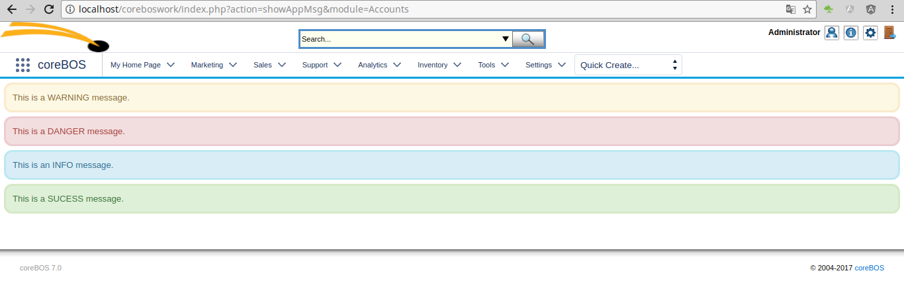
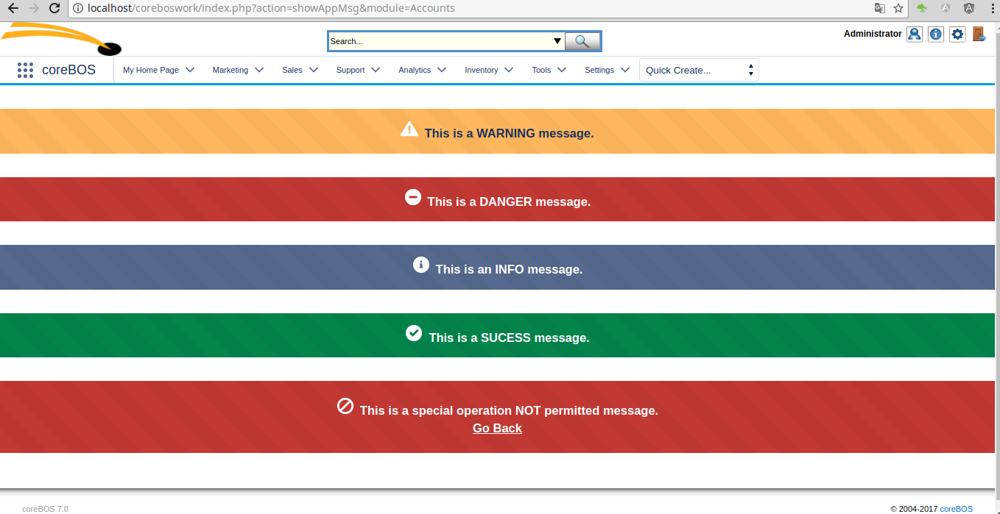
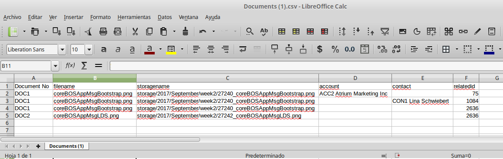

The effort we have been making during the last year's is starting to take effect as it gets easier to use the system as a development platform and an end user application. It just gets easier and easier for us to add functionality for both use cases.

===

 ! Change password enhancements

 - Force password change 
 - Expire password after Application_ExpirePasswordAfterDays (global variable) days. Now that we can force the user to change their password it was easy to add a scheduled task that checks for users who haven't changed it for some given time period and force them to change it. You can activate the functionality in the scheduled task settings section and define the time span with the  Application_ExpirePasswordAfterDays global variable

 

 ! Application Message

We add a standard message template in an attempt to give the user a more consistent experience. With this message template, the developer can emit messages of different types that will look the same on all modules.

At this point in time, we use the bootstrap CSS definitions which now have been moved to [LDS](https://www.lightningdesignsystem.com). This is what they looked like 

And this what they look like now with LDS

You can [see how they work reading this code](https://gist.github.com/joebordes/1502f50006d827aab3f1eb539182501e), which you can copy to any module and call directly to get the screen captures above.

[Documentation on the wiki](http://corebos.org/documentation/doku.php?noprocess=1&id=en:devel:standardoutputmessage)

 ! Documents export with more information

We now export enough information for you to be able to relate the Document record with the physical file on disk, making it a lot easier for you to import this information anywhere else. The additional information is the physical storage location of the file and related account, contact and all other related entities.

 ! Invoice select assets
 
We extend the product line functionality by adding the possibility of relating assets to each line. Have a look at this video for a small demonstration on how that works.

[plugin:youtube](https://youtu.be/GXE9DWr1PjA)

 ! coreBOS Mobile Interface

This month we start another long-running project whose goal is to create a flexible and powerful mobile interface for coreBOS.

We start this project by incorporating the work done by CRMNow (thanks!!) upon the existing project and defining the set of goals and tasks we want to accomplish.

 ! Developer enhancements

 - API get related SQL: This is a very helpful developer enhancement that permits us to get the SQL that relates two modules. Simply getting the related function from the database, setting the global variable **$GetRelatedList_ReturnOnlyQuery** and calling the function, we will get the specific SQL that relates the two modules.
 - vtlib_executeJavascriptInElement: Javascript function that will parse text in search of JavaScript code and execute it. Fundamental when we get the code via an AJAX call.
 - vtws_getEntityId: This helper function will return the web service module ID of a given module. Given the importance of the webservice API in general and in particular being executed from inside the application. This is a function we use a lot.

 

 ! Global Variables

 - **Product_Maximum_Number_Images**
 - **Debug_ListView_Query**
 - **Application_ListView_MaxColumns:** Very interesting option that unblocks the limit of columns you can have in a list view. Obviously, there is a physical limit as the space on screen is limited, but now the default is set to 12 columns and you can change that if you need to.
 - **Accounts_BlockDuplicateName:** coreBOS, in general, does not have many business process or logic implemented, its goal is to start from a clean state that you must adapt to your particular business needs. That is why we call it a **Business Operating System** and why we dedicate a lot of effort to configuration options. One of the few places that there is some logic is the restriction that avoids duplicate account names. With the addition of this global variable, you will be able to deactivate this validation.

 

 ! Mass duplicate config business map

Another very interesting functionality based on business maps. You can [find some information here on our wiki](http://corebos.org/documentation/doku.php?noprocess=1&id=en:adminmanual:businessmappings:duplicaterecords) while I get around to writing a blog post about it.

 ! Eliminate Prototype

The long-running project we started months ago gets merged into the main branch: **No more Prototype.**

 ! Some others:

 - User default values on create. Values must be  directly inserted in the database column
 - Lead conversion fixes
 - Helper script reset admin password
 - Support for uitype 10 capture fields on custom fields
 - Support for document download in related list
 - Move hidden fields to another block when block is deleted so we don't lose the possibility to manage them
 - Sales Order recurring 2 to 5 years
 - Deduplication campaigns and import pricebook
 - is_permitted support for webservice id
 - Workflow scheduler minute interval
 - Service contracts. Consistent translation and support for decimal values on summary field
 - Sync invites on Google calendar
 - Query Generator in/notin support on ID fields
 - Eliminate warnings, notice, MySQL strict and code cleanup (this one is a constant every month, even today).
 - Translation. Notice warnings, eliminate unused code, cleanup

**Thanks for reading.**

