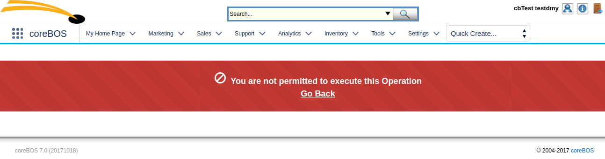

Another incredibly productive month, packed with enhancements for users, administrators, and developers alike where you will find a whole new set of changes in the workflow system, security fixes, web service functionality, a load of global variables and all that along with the massive uphaul of improvements in the new calendar.

You are in for an interesting read :-)

===

 ! Development

 - Support footer script links
 - [JSHook](http://blog.corebos.org:8080/en/blog/corebosjshook) rename coreBOS Javascript hook functionality
 - "more data" javascript hook for detail view ajax save
 - Add current user ID javascript variable to popup window
 - Update javascript ExecuteFunctions to be a generic function that can call any function from ExecuteFunctions.php. Now the second parameter is for the parameters on the URL
 - BULK_SAVE_MODE: correctly define global variable which is being used as such
 - Accept target attribute in HTML anchors via vtlib_purify
 - Format "operation not permitted" message based on LDS and standardize usage in application



<br/>

 ! Calendar

 - migrate the Events/Calendar filters to cbCalendar
 - duplicate the Events/Calendar workflows to cbCalendar, replacing old field name values with the new ones
 - we need the date time fields from original module to cbCalendar, because we have references to these fields on workflows and task conditions
 - only notify on first 10 events on repeat creation
 - date start-end validation
 - support for tooltips
 - fill in follow up type picklist with same values as activity type picklist on install
 - support for global variables
 - redirect settings to cbCalendar
 - Webservice support
 - set correct delete link/action
 - apply htmlpurifier selectively to respect links
 - support for multiple contacts on web service create and edit
 - change hardcoded URL to the new cbCalendar module
 - incorrect order when inserting a new record to vtigar_activity_reminder_popup
 - permit list and view access to shared and invited events

<br/>

 ! Global Variables

 - deprecate PerformancePrefs class in favor of Global Variables
 - eliminate repeated global variable creation
 - migrate config.performance variables to global variables
 - move LOG4PHP_DEBUG and SQL_LOG_INCLUDE_CALLER to config.inc.php in order to eliminate config.performance.php
 - rename Application_Action_Panel_Open and Application_Search_Panel_Open
 - Application_DetailView_Inline_Edit
 - HomePage_Widget_Group_Size
 - HelpDesk_Notify_Owner_EMail, to control default HelpDesk workflows
 - Application_DetailView_Record_Navigation
 - Application_ListView_Compute_Page_Count
 - Application_ListView_Default_Sorting
 - Application_ListView_Record_Change_Indicator

<br/>

 ! Workflow

 - support functions in template text by means of the WorkflowFunction directive
 - functions to calculate next date in valid day values including workable day options
 - duplicate records now support infinite relation for modules with an isduplicatedfromrecordid field which must be added manually if needed. When the duplicate records are created we indicate that these records are duplicates
 - support for dynamic expression functions loaded from directory or database. move current functions to a directory
 - support for related field in expressions: see related unit tests for examples
 - getUser ID and Name functions
 - support for functions with no parameters
 - eliminate unused and incorrect method

<br/>

 ! Webservice

 - getRelatedRecords: fix ModComments to get related comments due to copy paste error
 - add attachment upload by web service (uitype 69) To upload add array 'attachments' to parameters with uitype 69 fields and filename array following the same structure as used in the Document module.
 - incorrectly detecting "like" condition when in uppercase and substring of field name
 - correctly set module name for inventory module product line support
 - convert revise into update as both were trying to do the same but update was doing it better

<br/>

 ! Security

 - Emails potential SQL injection and eliminate warning
 - sytem-wide isInsideApplication function: tests
 - eliminate XSS

<br/>

 ! Optimizations

 - eliminate document.write: refactor WorldClock, create div in javascript for address capture
 - avoid loading twice merge duplicates and module javascript code
 - enable persistent database connection by config variable, although this is not recommended
 - eliminate unused variables dbconfigoption and disable_persistent_connections
 - eliminate md5 calculation in Global Variable module which is not more specific than cache key itself
 - optimize index.php by moving frequent actions to top of evaluation and eliminate unused prefixes
 - RSS: delete unused cache property which is now defined in simplepie

<br/>

 ! Business Maps

 - Field Mapping master directive: used for integration mapping between two systems; indicates which field is master in case of conflict
 - generic function getMapArray to access the converted XML array

<br/>

 ! Emails

Add possibility to send attachments directly without loading from storage by passing in the files in an array with this format:
```PHP
$attachments = array(
	'direct' => true,
	'files' => array(
			array(
				'name' => <filename>,
				'content' => <file content>
			),
			array(
				'name' => <filename2>,
				'content' => <file2 content>
			),
		...
		...
		)
	);
```

 ! Other changes:

 - coreBOS Message Queue and task manager testing basic functionality and add new memory usage process example. Make sure we can access database in daemonized process
 - Webforms: eliminate hardcoded strings and permit access by normal users
 - Image fields supported on all modules: products and contacts. The first step towards multi image field (69m) which is only working now on Products
 - eliminate carousel code from Products module as it is already loaded in uitype69 widget
 - getFieldAutocomplete: add OR glue when searching on various fields
 - move HTMLPurifier cache from test/vtlib to cache directory
 - move ADODB library to include directory
 - eliminate hardcoded test scripts which are now in the coreBOS tests project
 - Mail Converter Global Variables conflict due to installation strings
 - validations support for using values of other fields in the rules
 - ignore group glue in Query Generator if no group exists yet
 - set maximum decimals permitted by MySQL
 - show query parameters on coreBOS Updater error
 - update vtlib menu interface to work with new menu system: basic module functionality
 - On HelpDesk save, update directly related Service Contracts also, not only the ones on m:m related list
 - fix incorrect numsent type in Campaigns
 - permit any user to access Utilities so AJAX calls may be made to API endpoints
 - Workflow Email load user with correct variable
 - format number based on user settings in order to correctly validate the value in Leads
 - eliminate directory check in install, which has been moved to cache
 - eliminate warnings, notice, MySQL strict and code cleanup (this one is a constant every month, even today)
 - translations

**<span style="font-size:large">Thanks for reading.</span>**

