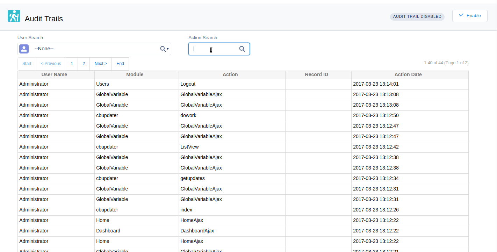
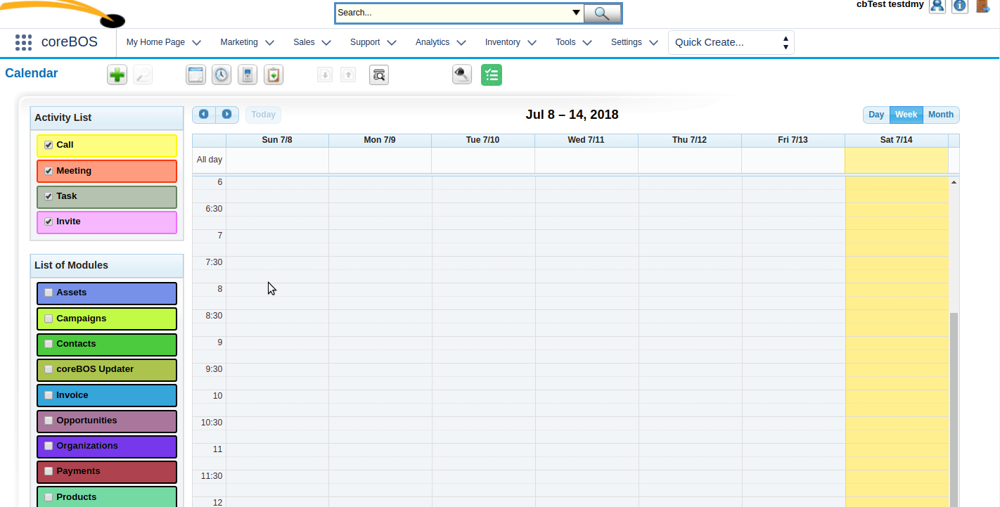
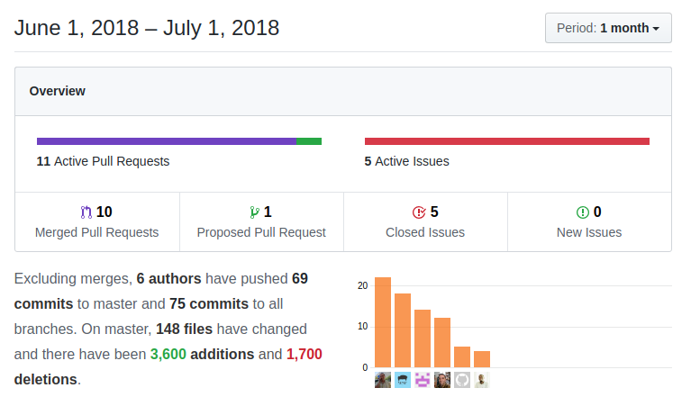

A very interesting month at coreBOS where we continue the tendency to keep getting better and see a whole new set of features and fixes from our community members. **Thanks for your continued support!**

===

 ! Mobile
 - Add events to querygenerator on Mobile ListView
 - Support attaching/uploading files when creating a document
 - Support folders picklist on Documents module
 - Correctly set default value of checkboxes when creating
 - Eliminate error if cache directory does not exist

<span></span>

 ! coreBOS Standard Code Formatting, Security, and Optimizations

This non-stop effort continues to make coreBOS better and better each day!

 - Format CMREntity, Webservice, Contacts, Dashboard, Email, Merge, Mobile, Vendor, Rules
 - Eliminate warning in send email action on Accounts, Contacts and Leads
 - Eliminate obsolete code, unused login files, empty lines, and unused variable
 - Simplify reference field check condition to optimize web services execution
 - Refactor Workflow code
 - Security: Block robots from indexing. fixes [Issue #289](https://github.com/tsolucio/corebos/issues/289)
 - Security: [Deleting any record](https://github.com/tsolucio/corebos/issues/259)
 - Security: XSS protection on description and comment in list view
 - Security: [Verification of data permission](https://github.com/tsolucio/corebos/issues/260)

<span></span>

 ! Features
 - Add **Action search** on Audit trail grid. [Thanks Orion](https://github.com/orionliciAT)



 - Displaying **Week Numbers** based on global variable Calendar_Show_WeekNumber [Thanks Timothy](https://github.com/tebajanga)



 - Support uitype 55 and 255, special fields form modules Leads and Contacts in Autocomplete search
 - Correct UpperCaseWords workflow function to work with capital strings

<span></span>

 ! coreBOS Console for Developers

[Albert](https://github.com/albertxhani) and [Lorida](https://github.com/loridacito) have implemented and contributed a spectacular enhancement that permits us to execute all sorts of actions and commands to a coreBOS install. From the command line we are now capable of modifying our coreBOS install with new actions, events, checks and easily execute those typical and repetitive commands we need from time to time. We will formally present, document and show the functionality of this new tool in future blog posts but you can already start enjoying it!  Here are some of the commands that are supported:

 - create command to create a new corebos action
 - entitymethod: create a command that creates a new workflow
 - eventhandler: create a command that creates a new Event handler function
 - link: create a command that creates a new Link
 - logs: disable, command to disable corebos logs
 - logs: enable, command to enable corebos logs
 - privileges: grant, grant privileges to some directories that need rw permissions
 - relatedlist: creates a new related list between modules
 - smarty: clear command that clears smarty cache
 - updater: create a command to create cbUpdater files automatically
 - updater: log command - watch cbUpdater logs
 - vtlibfield: create a command that creates a new field for a specific module
 - validatecode: show, validate code based on corebos standards

<span></span>

 !!!! **Thank you Albert and Lorida!!**

<br/>

 ! New Features and Development
 - Functionality to log javascript messages to the backend. We now have a new log file which can be activated in the [log4php.properties file](https://github.com/tsolucio/corebos/blob/master/log4php.properties#L58). To send messages to this file you can use the [**jsLog** web service endpoint](https://github.com/tsolucio/corebos/blob/master/include/Webservices/doJSLog.php#L16)
 - Support for calling Mass Duplicate functionality as a detail view action which looks something like this:
```
'index.php?module=Accounts&action=AccountsAjax&file=duplicate&module_name=Accounts&record_id=$RECORD$&redirect=1',
```
 - We convert Mass Edit functionality to Server Side Events. With this change, we now get full information about the process that is happening. [Thanks Lorida](https://github.com/loridacito)
 - Enhance validation mappings to support using current record values which open possibilities to a whole new set of validation options. [Thanks Mikel](https://github.com/Mikel1995)
 - Add/Subtract months Workflow expression functions. [Thanks Orion](https://github.com/orionliciAT)
 - Enhance convert inventory module task to support all modules with related products/services. This is a VERY powerful enhancement that permits us to convert any record with a related list of products/services into a Quote, Sales Order, Purchase Order or Invoice.
 - hash Workflow expression function. [Thanks Etleva](https://github.com/ebiba)

<span></span>

 ! Others

 - update authentication token only when it has expired
 - add more field information to Autocomplete in order to make it easier to fill in other fields and support similar programming logic
 - fix Related Panes business mapping with better map definition detection to make it easier to define panes and avoid warnings
 - fix error in autocomplete query
 - set currentModule to cbEmployee on get_employees Mail Converter function and set current user to admin on getEmployeeList if this module is active: support for Employees in Mail Converter
 - fix lead conversion mapping error message
 - update get_purchase_orders query to support the latest functionality
 - fix Web service GetTranslation exception on Events
 - as usual, we keep translating and fixing internalization issues




**<span style="font-size:large">Thanks for reading.</span>**

