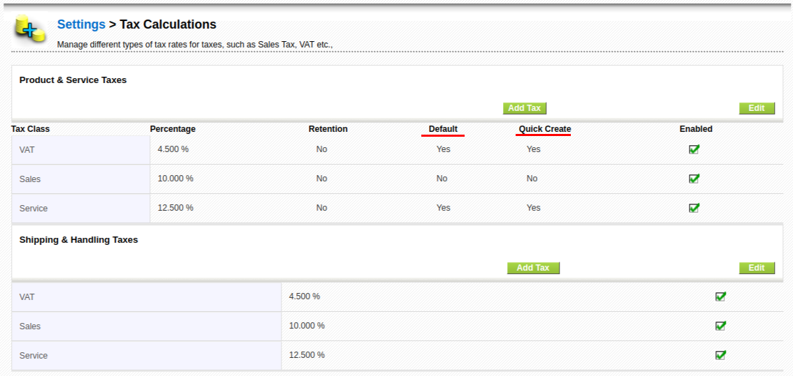
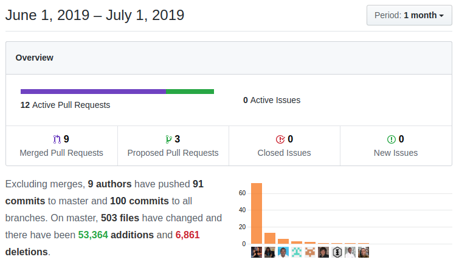

Some interesting new functionality arrives this June, like the SendGrid and HubSpot integrations and a very important new workflow task to call web services, but there is more and the usual maintenance stuff as we keep enhancing the project.

===

 ! Features/Implementor

 - load default email template per origin module. For some time now we have had the **Users_Default_Send_Email_Template** global variable to load a default email template per user, now we can load a different template depending also on the module we are in, so we can have a default template for Invoice emails and another one for Accounts emails.
 - merge Email templates with mixed legacy and workflow syntax
 - new Workflow task to execute a REST web service call and update some fields in the application. A VERY powerful task. [Thanks Lorida](https://github.com/loridacito)
 - support default values for individual taxes on product/service

 ! Developer
 - permit executing manual/system workflows even if they are not immediate (so emails are sent directly not queued)
 - migrate uitype 76 (Potential capture on Quotes and Sales Orders) to the generic uitype 10 in order to standardize the code and user experience
 - update Service Worker from the discontinued [sw-precache](https://github.com/GoogleChromeLabs/sw-precache) to [workbox](https://developers.google.com/web/tools/workbox/) this fixes some issues using the application on mobile apps
 - set "last start" and "end time" methods to [manipulate execution time dynamically](http://corebos.com/documentation/doku.php?id=en:devel:reschedulecrontask&noprocess=1)
 - add Decision Table map XSD validation
 - add support for .service files in Console validation
 - add **'corebos.popup.footer'** event to Popup window which is used by our Colorizer extension to show colored elements now in the popup too

 ! Translations

A long time ago we [added the possibility to translate coreBOS from within the application](../translation-extension-for). This month we clean up the project and adapt it to the latest translation recommendations (using the xx_xx.custom.php file).

 - post translations for big language files
 - incorrect filter option
 - use the complete set of translation strings for modules
 - use latest translation functionality to get translations
 - write new translations to custom file

 ! Sendgrid

[read all about it here](../EmailAPISendGrid)
 - email sending and notification driver
 - support inline logo and qrcodes
 - workflow attachment format

 ! HubSpot

We complete the release of the Hub Spot integration. You can [get some information here](https://www.youtube.com/watch?v=4pRhhD4ehec&list=PL0oN2FI_W55wuDJo2bxmPW6rTLx0Y-I6N)

 ! GenDoc

 - in the GenDoc Labels extension, you can now copy the label to the clipboard simply clicking on the row
 - the GenDoc extension has the functionality to save the merged document in the Documents module. The folder where the document is saved is defined by the **GenDoc_Save_Document_Folder** global variable. Now this variable uses the correct module context to obtain variable where to save merged documents so we can have different folders per module.
 - support for cbCompany entity
 - map Organization tags to cbCompany module
 - convert checkbox to LDS toggle in direct compile page
 - apply LDS to GenDoc direct merge pages
 - apply LDS to GenDoc merge labels page

 ! coreBOS Standard Code Formatting, Security, Optimizations and Clean Up

 - formatting and eliminating warnings in Calendar, GenDoc, File Translation, Inventory Edit View, Picklist, Taxes, Whatsapp/Events
 - cleanup quotes, spaces and indentation
 - exclude HubSpot libraries from Continuous Integration
 - eliminate warning in mail converter and delete a duplicate line of code in merge
 - adjust Business Map definition in documentation
 - eliminate unused files in Business Map
 - substitute variable for direct access in Contacts
 - eliminate unused file: DefaultDataPopulator
 - ignore visual studio code and node_modules files
 - correct Picklist function comments
 - eliminate unused code from vtiger crm listypes in Web Service
 - move Whatsapp log file to the logs directory
 - eliminate warning in RecordSet Map
 - eliminate warnings and bluepay code in the Payment module
 - update LDS package version to reflect the latest version of the code
 - eliminate execution bit in TCPDF files
 - update TCPDF to the latest version for security and fixes
 - correctly validate isPermitted call in Autocomplete
 - detect comment creation mode to apply correct permissions

 ! Others
 - correctly call Related Panes Business Map in the test script
 - Google insert cron not permitting Calendar events to be deleted
 - fix Extended Field Info business map XSD validation to accept more than one field definition in the same map
 - decode cbQuestion conditions for query
 - use application error message for Global Search error
 - move Global Search implementation to Utilities Module so we can deactivate Home module and still keep searching
 - make LanguageImport methods public as they are used during install
 - use language also in Module Translation cache key to support working with other languages than the currently selected one
 - get correct MktAction field names in MsgTemplate
 - avoid JS error due to non-existant function in Product and Service
 - support html encoded separator and avoid generating qrcode on empty values in QRScanCode tag
 - use main class methods to obtain sort and order so global and session variables are used when sorting Related Lists
 - Sort/Order: use correct module name when class is called in the context of another module (RelatedList)
 - do not show tax rows if there are no taxes configured
 - name Tax Fields table cell container consistently: like all other fields
 - Product/Service: show taxes in individual rows when editing
 - Users sort by admin property missing break
 - redirect Utilities to integrations by default
 - return true if one of the date objects to validate is null
 - always load product line functionality for inventory modules in Web Service so they work inside loops in direct scripts
 - return all picklist values accessible to Web Service user including subordinate roles. like inside the application
 - add module field picklist in Whatsapp Workflow Task form
 - directly load edit template as create template does not exist anymore for Product and Service
 - module icon for MailManager and Workflow
 - **Continuous translation effort:**
  - load fr Global Variable extended definitions instead of en
  - Workflow new task and map
  - document GenDoc global variables

**Thanks for reading.**
