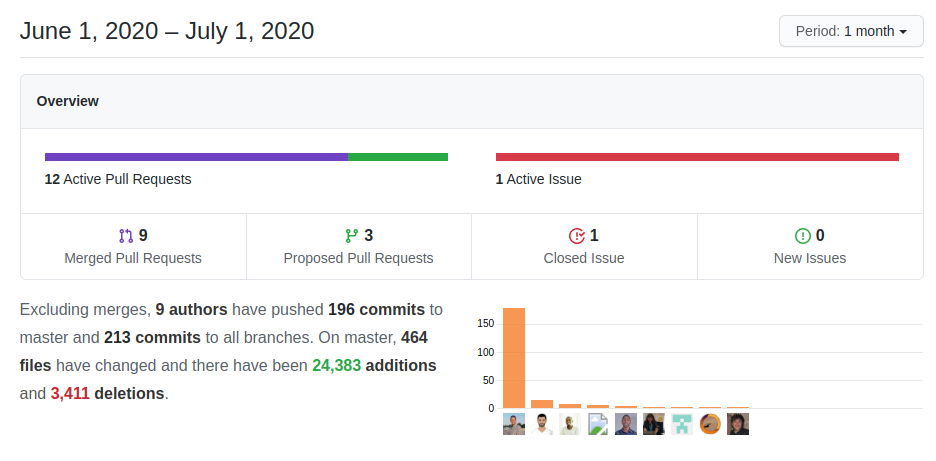

This month has been all about consolidating coreBOS as a developer platform both using it as a user application and as a backend to support external applications. Webservice, hooks, and enhancements to make it easier to embed the functionality you need into coreBOS while we keep up with the constant love and care work that an application like this needs.

===

 ! Log All Extension

|         |            |
| ------------- |:-------------:|
|The Log Everything extension is a new addition that can be activated in the Utilities section. Once this is activated, it will send messages to the [coreBOS Message Queue](https://corebos.com/documentation/doku.php?id=en:devel:corebos_mqtm&noprocess=1) for every event that happens inside the application. These messages contain the module, crmid, cbuuid, operation, user, date time, and information about what has been done. This functionality is similar to the [Elastic Search](https://www.elastic.co/) Integration but putting the information on the queue where it can be consumed by any process that needs to manage this information in any other way. For example, we are using it to synchronize different coreBOS installs using [Apache Kafka](https://kafka.apache.org/)!||

- log everything into the message queue
- use cbUUID instead of crmid for reference fields
- Application_Unique_Identifier global variable used in LogAll to identify the origin system of the message

 ! Features and Implementor/Developer enhancements

- global variable to permit submitting the edit form with ENTER key: **Application_EditView_Submit_Form_WithEnter**

[plugin:youtube](https://youtu.be/rXwuQ_ImD7s)

- Add send individual emails checkbox and logic. By default, coreBOS sends individual emails to each email address in the Destination/TO input of an email. This is mostly for mass email goals, but, many times we just want to send the same email to all the addresses, like a normal Mail User Agent (MUA). We also add the **EMail_send_individual** global variable that permits you to set the default behavior you need in your coreBOS.
- Merging template with specified records: **Merge_template_with** context variable permits us to force merging an email template with a different set of records besides the ones coreBOS would normally merge the email
- Add custominfo input fields for into Email Composer template
- **Import_Launch_EventsAndWorkflows** global variable. By default, workflows are not triggered during the import process, this can now be defined using this global variable
- Add **dateEqualorAfter** Validation (for typeofdata ~OTH~GE)
- MySQL strict varchar size validations. This is a **very important** change. MySQL strict mode, the default for some time now, will emit an error if we try to save a string in a field that does not have enough space for it. With this change, we retrieve from the database the size of each field and validate that the record can be saved avoiding the error. Since all modules have validations now I eliminate the ValidationExists step
- avoid die instruction when launching events on not found record
- eliminate die from Accounts and Company validations
- do not validate autonumber fields length
- sanitize date fields to ISO for validations
- support [dynamic message in custom validation functions](https://corebos.com/documentation/doku.php?id=en:adminmanual:businessmappings:validations#validation_message&noprocess=1)
- convert Workflow conditionMapping method to a public class property in case we need it elsewhere
- Business Map List Columns support for not defining label directive: works only with the field name
- method to empty the generic cache variable: **emptyCachedInformation**
- log fatal errors inserting records in the application. this will be used shortly to get better error reporting during the import process
- Custom View functions to convert filter query syntax to Extended VQL syntax
- **EDITVIEWHTML** and **DETAILVIEWHTML** hooks to insert HTML (usually hidden inputs) in Detail and Edit forms
- support for Users related field 101 in QueryGenerator
- support for createdby user access with virtual module UsersCreator in QueryGenerator and web service
- return Global Variable default value if no variable name is given and eliminate warnings
- **Tests:** keep getting some love and care as we fix things and add coverage, especially in the web service part of the application.

 ! Web Service

- Web service Query
  - include [PHPSQLParser](https://github.com/greenlion/PHP-SQL-Parser) library for better SQL support in web service query language
  - closer support of SQL standard query language in WSQL
  - support query on related field 101 using virtual module UsersSec
- unset relation endpoint: **UnsetRelation**, missing brother of SetRelation
- Global Search
  - **GlobalSearchArrayWithTotals** global search with information of totals
  - correctly manage user permissions, limit results on queries and only prefix table if not already there
  - create correct SQL for search based on defined columns and prefix table name with vtiger and avoid empty column definitions
  - support global search results limit through restrictions object
- Actor modules. Actor modules are special non-standard modules that ACT as if they were normal modules in the web service API. Currency or DocumentFolders are examples of this type of actor module where you can query, create, and retrieve using the normal web service API but they aren't coreBOS modules.
  - add getTabName to Actor modules
  - support for adding another table, getting a list of fields and setting some of their properties
  - permit setting field uitype
  - add filter fields to Actor module Describe, like the others
  - actor module to access **ModTracker** information via web service
- correct Custom View rawtext property value in Extended VQL conversion
- empty cache functionality for query and VtigerWebserviceObject
- WebserviceEntityOperation cache control and access to tabid property in ModuleOperation
- add last USER parameter missing in some definitions
- better support for group/order/limit clauses in Extended VQL
- call the correct function to convert fieldname to columname and use a local variable instead of a database query to get the module name
- correct spelling for UNKNOWNENTITY exception and use it in GetRelatedRecords instead of a hardcoded string
- delete eliminated web service mobile methods
- Documents: return download link and relations on create, similar to retrieve
- fill in the module if only record ID is given
- get_maxloadsize: return converted number of bytes
- incorrect save method capitalization
- return FQN in orderby fields and support special ID field
- set correct path to method for getUsersInSameGroup
- support for all base64 encoded javascript uploads with its special syntax and encoding
- AuthenticateContact: avoid accessing SQL result if not present
- ChangePassword: restore global state and throw an exception if not permitted
- Custom View: make both Custom View methods return the same response
- web service REST call use context for Business Map processing
- Describe
  - LabelFields was returning an internal column name instead of a field name, now it returns the field name
  - empty array of related modules for actor modules instead of an exception
- getAssignedUser/GroupList: do not save current_user object, if you need to do that, do it outside the functions
- getPicklistValues: return custom picklist in Documents module
- getPortalUserInfo: always return the same fields, even if they are empty
- getViewsByModule: add Extended VQL syntax for query conditions to response
- GetRelatedRecords: bugs detected while unit testing: mostly Product query issues
- getTemplateDetails: support web service IDs
- support setting contact and return the full result of an update in HelpDesk Comments
- search reference fields by ID in Upsert
- restore global variables and eliminate obsolete Calendar module reference
- Web Service Validation
  - delete unused call and eliminate product line support which was incorrect, not sure if this should be done some other way but it was not working like this
  - get the module from web service validation ID if not given
- load user-specific language once the user is authenticated
- close database transaction on failed create

 ! Workflow

- send an email with Message Template indicated from the context: SendThisMsgTemplate. Now that the workflow system has context injection support, we keep adding override possibilities, like this one which permits us to send any message template using the workflow email task with one web service call.
- add missing number_format definition to support function in the workflow expression
- correctly detect currency module ID in workflow system
- set correct module name for mass update
- convert Email Task, Entity Method Task, and Edit Task to LDS

 ! coreBOS Standard Code Formatting, Security, Optimizations and Tests

This month, besides the normal beat of fixes and clean up work, we use [PHP Static Analysis Tool (PHPStan)](https://phpstan.org/) to review the code base and apply a set of fixes and enhancements based on the results of the review.

- coreBOS Standard code Formatting: Events, MailManager, Search, Utils, Migration, Workflow, Webservice, Workflow, general.js, Import, List View
- eliminate old Calendar support
- exclude PHPSQLParser library from Continous Integration
- eliminate obsolete LDS CSS in SendGrid integration
- eliminate obsolete change_status and change_owner code from Calendar, we use mass edit now
- GenDoc: eliminate jquery reference, mark two methods in Table as deprecated, and not used. change a variable reference in one of them
- GenDoc: add missing mandatory parameter to subelement calls, correct elimina_puntuacion array keys, correct name of construct method
- eliminate unused and broken method in Payments
- initialize variables and document functions in Reports
- correct function documentation and eliminate warning in Search
- correct getUsersInTheSameGroup function documentation
- correct misspelled class names (case)
- eliminate duplicate array elements
- eliminate warning and correct wording
- eliminate warnings and change error message
- eliminate warnings due to uninitialized variables and change some quotes
- use correct variable for reference field in CustomView
- Hubspot Integration: fix variable names, apply optimizations and cbSR
- Mobile: initialize variables before use in Login process, instantiate class instead of static call to delete records
- correct class name case in Tax management
- document web service Upsert parameters
- update Smarty to the latest version
- **official support for PHP 7.4**
- LDAP support for 7.x
- change loop variable name to make it easier to understand in DeDuplicate code
- optimization delete redundant uitype check for picklists in Search
- optimization avoid duplicate query, delete an unused variable, use a safer variable, avoid unnecessary repeated math operation and delete unused variables
- optimization only serialize web service GlobalSearch response for backward compatibility
- delete (incorrect) unused function get_users in Emails
- security set SamesSite on application Cookies
- security in web service: add module access checks to getBusinessActions, getfiltersbymodule, getViewsByModule, getRelated Information methods
- change incorrect variable names and missing global variables
- **Tests:** keep getting some love and care as usual but with special attention to the web service system
  - custom string file for unit testing of translation functionality
  - SessionManager dependency injection for unit testing of Login and Logout

 ! Others

- add default value on vtlib:field load
- check if a default Actions method exists before calling it
- make Emails popup window a little bigger
- the first step to implementing Field Mapping generator
- fix Autocomplete where minimum character trigger code was incorrectly detected due to an undefined state of the default value
- return void(0) from Business Action runBAScripts so Firefox behaves as expected
- correctly pass in test record parameter to Business Map condition expression and query
- change variable to function: error due to incorrect dollar sign
- do not send list view to GUI calendar on close, send an update call
- prevent errors in the decision table
- mark Changeset as applied even if there are some errors in optimization script
- load default language into Cron global current_language
- add parenthesis between Custom View standard and advanced filters
- respect export column order when getting columns to view from a filter
- change filter inequality operator to reduce HTML conflicts
- correct filter management SQL error
- better error detection on failed imports
- initialize variable to control incorrect relation inserts on lead conversion
- add a missing variable for list view search
- add screen blocking to runBAScriptFromListView function
- move Mail Converter assign ticket row below action
- eliminate incorrect product-product relation for reports
- QueryGenerator
  - add support for reference field
  - check for empty advanced conditions in Advanced Search
  - correctly control already joined tables with alias
  - correctly support fieldname!=columnname
  - query on Users fields, if no module is given we use assigned user
- set Sales Order recurring dates to empty on create
- hide tooltip after some time and unhide tooltip when mouseover on tooltip div
- delete Users get_column_value method so it uses the corrected parent method
- initialize variable and check for date components in Utils
- move user field uitypes to the correct array to optimize search queries
- fix regular expression in PIVA validation
- constant translation effort:
  - eliminate duplicate keys in nl_nl, pt_br and es_mx

**Thanks for reading.**
