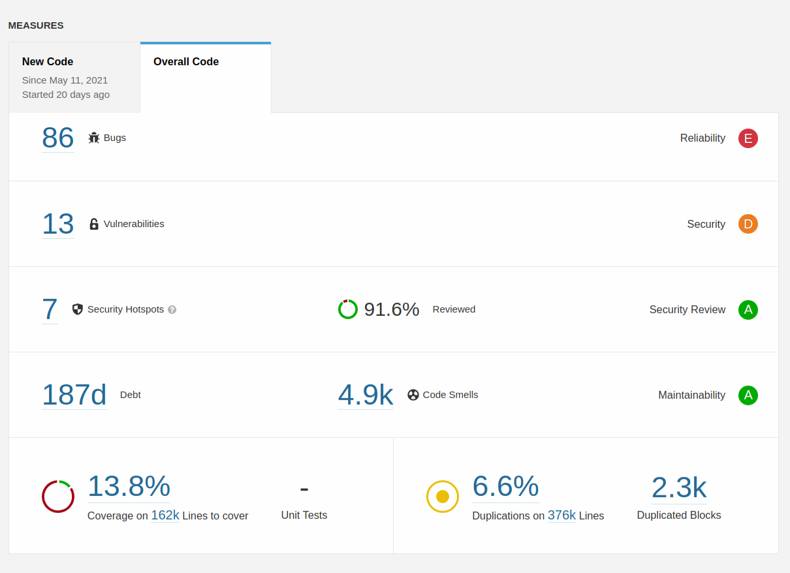

Very productive month! We implement an interesting set of feature enhancements all over the application while we reduce code complexity and technical debt. Very nice!

===

 ! Features and Implementor/Developer enhancements

- **getModuleLinkStatusInfoSortedFlat** function for generic settings of widgets in modules. Use it in Documents and Record Versioning. This function permits coreBOS programmers to easily toggle business actions on and off on a Settings page
- Export directly to XLS format 
- Export Comments of a record. Decide format with the new global variable **ModComments_Export_Format**
- Master-Detail enhancements:
  - add support for **defaultvalue** and **duplicatevalue** in Inventory modules mapping
  - reload detailview on edit of master-detail grid editor
  - show username instead of userid for uitype 77 in master-detail grid editor
- change Mobile Detail View to show fields better
- Comments enhancements:
  - add global variables to enable/disable inline edit
  - add permission check on comment edit
  - add permission check on creating comments
- Query Generator enhancements:
  - 'monthday' operator permits us to create queries comparing dates only on month and day
  - 'nsx' not soundex operator
- add an option to create **messages** in mail converter 
- **Workflow Enhancements**
  - implement monthday operator for both workflow condition and workflow scheduler
  - add new workflow expression: **getFieldsOF** to retrieve field values from any ID
  - add support for accessing previous values in [workflow expressions](https://github.com/tsolucio/coreBOSTests/blob/master/modules/com_vtiger_workflow/expression_engine/VTExpressionEvaluaterTest.php#L4198) by prefixing the string `previousvalue_`
  - add support for [expressions in aggregation method](https://github.com/tsolucio/coreBOSTests/blob/master/modules/com_vtiger_workflow/expression_functions/aggregationTest.php#L132), now we can set a filter using the workflow expression language
  - **average** workflow expression function
  - [Launch Workflow workflow task](../LaunchWFTask)
  - get related module list enhancements
  - add **isholidaydate** function to check if the given date is a holiday or not
  - implement add hours delay on workflow tasks

 ! coreBOS Standard Code Formatting, Security, Optimizations, and Tests

We continue working with [Sonarqube](https://www.sonarqube.org/). We incorporate javascript unit and integration testing using jest and playwright.

| Lasst Run May | First Run June |
| --------- | ------------ |
|  |  |

- coreBOS Standard Formatting: eliminate warnings initializing vars, eliminate useless code and comments, format code
- Eliminate technical debt
  - delete useless comments (sonarqube)
  - renaming all variables that conflict with class properties on include/module files
  - eliminate comparison to boolean and console log comment in Mobile
  - return consistent value and simplify if-else structure in Related Lists
  - fix Calendar variable to remove conflicts
  - update obsolete HTML
  - fix unexpected use of comma operator
  - remove unnecessary boolean literal (sonarqube)
  - cleanup javascript
- Refactor and duplicates
  - reduce complexity and redundant code in Business Question Builder function
  - join duplicate IF case in Calendar
  - constant instead of duplicate string in Documents
  - reduce cognitive complexity by simplifying if-else cascade of duplicate code in Emails
  - create email function to reduce duplicate code and use it
  - change variable name, direct return result, and change quotes in Export
  - move repeated function br2nl to utils
  - centralize Inventory validation code to reduce duplication
  - move duplicate Inventory code to function
  - optimize and correct ListView based on unit tests: getRelatedTo
  - simplify if-else and merge if-else conditions in ListView
  - merge duplicate Translation code into one file
  - Edit/List reduce duplicate code
  - move duplicate Validation code to loadProductValuesFromScreenValues function and use it
  - Workflow calendar related emails: move common code to function and call it
  - call existing Workflow function instead of repeating code
  - convert duplicate Workflow code into a common function
  - convert switch to IF to reduce cognitive complexity in Workflow
- Continuous Integration:
  - update sonarqube settings and deactivate Travis CI
  - sonarqube exclusions to include some Mobile code that had been left out
- Documentation:
  - function headers, and comments
  - non-stop wiki enhancements
- Optimizations
  - use constant strings instead of variables, centralize global definitions, change quotes and format code in Accounts and Home
  - direct return results
  - eliminate useless return statement
  - change variable for direct usage of value, eliminate redundant includes in Settings and Questions
  - eliminate unused obsolete vtlib function
  - collapse IFs and reduce cognitive complexity in Reports
- Security
  - update DOMPurify 2.2.9
- **Unit Tests:** keeps getting more and more assertions and we make some code modifications to permit unit and integration testing easier

 ! Others

- fix some comment editing bugs
- fix array merge issue for custom translation files. we have to invert the merge order to give custom string higher priority
- edit Currency overlay was incorrect: add LDS to the modal
- return empty Business Action link for Users module if user is inactive
- change incorrect Calendar field label for Activity Type
- Denormalization fixes:
  - activities related list referenced the wrong related table
  - eliminate Foreign Key constraint on seactivityrel and seattachmentsrel always
  - fully qualify fields in mail converter and home to support denormalization alias
  - getRelatedTo has to use crmobject to filter on any related record
  - correct main table reference in get_emails
- set empty default in ExecuteFuntions instead of tied to isModuleActive to avoid warnings
- optimize operations and correctly translate module names in key metrics list
- avoid warning and incorrect javascript on empty moreinfo fields in Inventory
- add missing MailManager parameter in class instantiation
- inline Comments edit fixes:
  - attach created ID on editing
  - change conditions for default inline edit
  - eliminate warning accessing field that may not be set
  - handle   tag
  - remove clear button on edit comment form
  - UI after update comment
- eliminate repeated entity name field in Payments
- field visibility in Layout Editor for blocks that are not labeled
- register RecurringInvoiceHandler on Workflow Events to detect activation of this property when creating Sales orders from code
- set Taxes input type=number step to support a larger range of decimals
- multiselect picklists were not validating on the correct value to be saved
- separate create and edit permissions in Web Service
- Workflow fixes:
  - fix loop increment issue in VTSimpleTemplate
  - convert user and group names to ID only if the value is not a number
  - correct closing parenthesis on count
  - correct expression function filter return value
  - eliminate warning in power function
  - errors detected by static analysis, reduce code duplication and apply normal optimizations
  - filter array values by key
  - reduce duplicate code in datetime expressions
  - set and restore global current module on related entity save
- Translations
  - Application, Email, ModTracker, Settings, Users pt_br. Thank you SlemerNet!
  - add export to XLS labels to all languages
  - GlobalVariable: ModComments_Edit_Inline
  - translate monthday operator label
  - translating labels of file format export
  - MasterDetail: es_es global variable
  - ModTracker: translate grid header
  - Settings: new label and eliminate some whitespace
  - Users: add and translate EntityName label
  - reduce whitespace in fr file
  - Workflow: getFieldsOF and isholidaydate function

**Thanks for following.**
