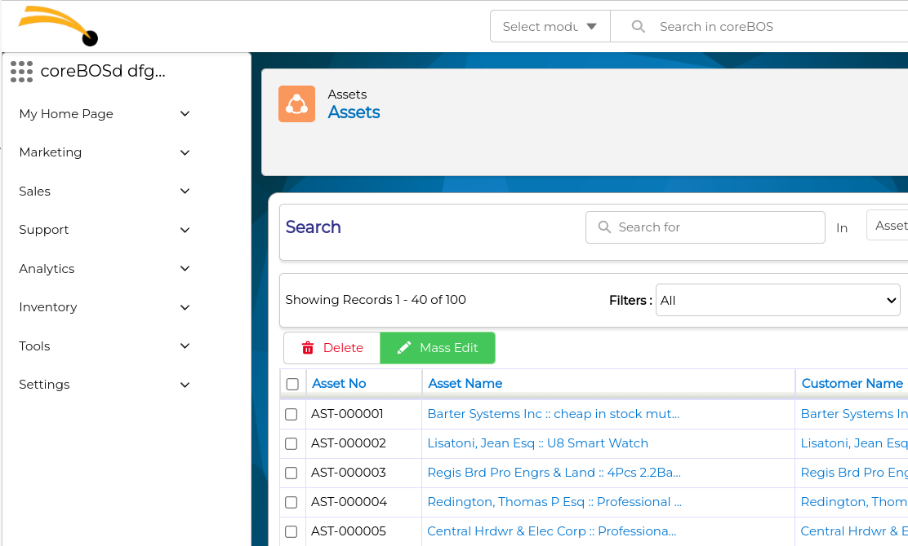
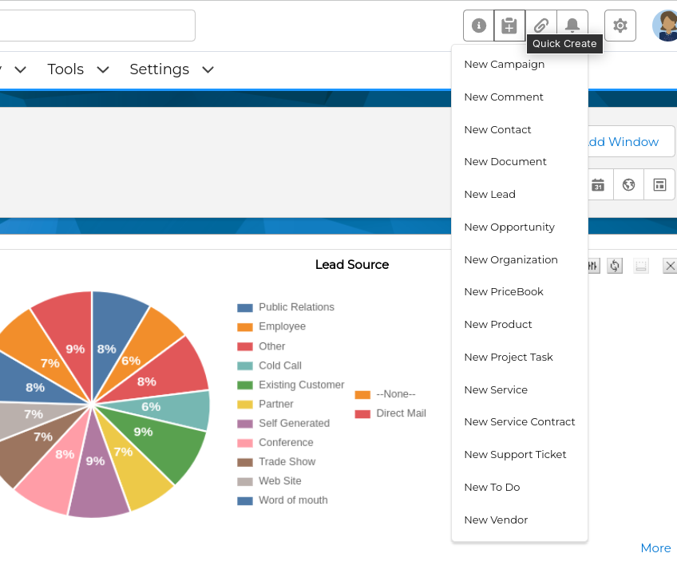
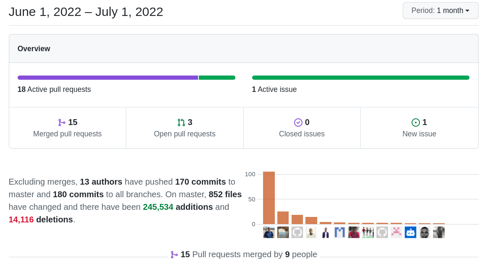

Important security enhancements, Kanban is ready to use, useful Faker integration, vertical menu, AutoNumber module, ... what more can I say? If you aren't using coreBOS, you are missing out!

===

 ! Features and Implementor/Developer enhancements

- **Vertical Menu**
  - vertical menu option with **Application_Menu_Direction**
  - Design nested vertical Menu CSS. Thanks Klajdi

- **AutoNumber** we release the AutoNumber module that permits you to define different increment counters with a prefix for fields in modules and then apply them with conditions using workflows. It will permit you to have various counter/increment fields on any module or increment differently the same field depending on values in the record being saved.
- **Kanban**  This is ready to be used!  Thanks Denald and Xhilda.
  - define the current kanbanid and use it to refresh the kanban view
  - show Business Actions in Kanban view
  - support Business Questions in Kanban View, show the result in the header column
  - support search and filter in kanban view
  - show only lanes that are defined in the map
  - add Business Actions type for Kanban
  - add KANBANHEADER action type
- Documents coreBOS Widget
  - when creating a link/external document from the widget the document will be related to the record the widget is in
  - hide the upload documents and links section in the widget by setting **nodocs** and **nolinks** parameters in the business action
  - upload link widget support for drag and drop
- move QuickCreate to the top menu tool buttons

- add filtering on the master-detail grid **Application_MasterDetail_SearchColumns**
- add displaytype info for fields in the cache
- **EMail_Company_Signature** global variable that defines a footer text that will be added to all outgoing emails
- Paint/Photo
  - convert paint2Document to a coreBOS Widget so we can put it anywhere
  - convert Photo2Document to a coreBOS Widget so we can put it anywhere
  - migrate to toastUI image editor
  - support setting the default folder
- add support for the recordid field in SimpleTemplate templates
- add MassCreate operation in WSClient library
- make **Financial Fields multicurrency**. **This one is important.** Up to now the financial fields in Inventory modules were not respecting the multicurrency feature of these modules. Now those fields will be presented in the currency of the record. We make changes in the reporting system to respect this type of field. **PLEASE review your reports and calculations with these fields if you are using multi-currency**
- Backup: **Backup_Storage_Exclude** global variable to permit excluding storage directory from backups
- Web Service
  - add an error message for invalid file contents
  - improve the readability of error messages when files contain malicious uploaded
  - add more info in Describe: helpinfo and moreinfo
  - upload file check the security
  - add security to the image path
- Workflow
  - add **Faker library** to coreBOS and to the workflow system. I will make a blog post on this!  Thanks Xhilda.
  - use context variables for attachments, from email, from name, cc, and bcc in workflow Email Task that permits us to completely define all fields of an email from external applications. Attachments must be sent as existing Document IDs.  Thanks Timothy.
  - most workflow tasks now support inBucket. This means that if we have inBucket configured and we send an SMS, for example, the SMS will not be sent, instead, we will receive a notification in inBucket.

 ! coreBOS Standard Code Formatting, Security, Optimizations, and Tests

- coreBOS Standard Formatting: eliminate warnings, eliminate useless code, variables, and comments, format code
  - JumpTo: list of quick access records
  - Kanban, ListView, Menu, Web Service
- Debug Message Reduction: Emails Users
- Documentation:
  - security headers explanation
  - correct web service parameter definition
  - function headers, and comments
  - non-stop wiki enhancements (working a lot on this)
- Optimizations
  - direct assign, eliminate unused variables, and direct usage of variable
  - delete unnecessary code in Service and Service Contract
  - Product Bundle Popup query avoid joining on product components if the module is disabled. Thanks Mohamed
  - add database index to vtiger_users.ename
- Security
  - add [huntr link](https://huntr.dev/) to Security.md
  - set login user Cookie to strict and secure
  - [Session Management enhancement for additional security measures](../coreBOSSession)
  - Single Sign-On uses a one-time password for web service. **Webservice_ExpireOTPAfter** defines the duration of the password
  - add more strict security checks for insecure documents. Thanks George
  - security headers for application and web service. Thanks Charity
  - set standard HTML doctype header
  - support Web Service authentication using headers: **corebos_authorization**. Thanks Athuman
- Updates
  - update phpclickhouse and php-apache-tika libraries
  - update symfony/pollyfill libraries
- **Unit Tests:** keeps getting more and more assertions. We have constructed this month an independent stand-alone docker environment for testing.

 ! Others

- avoid warnings in BrowserVariables when the current user is not defined
- trim spaces of Business Actions to detect coreBOS block widgets correctly
- inform the user on more error messages when sending emails
- eliminate warnings modifying save inventory line conditions
- ListView (tuiGrid)
  - correctly format picklist and integer
  - disable inline edit for fields based on profile permissions
  - disable inline editor for mulipicklists > not supported
  - get header fields information from the cache and disable inline edit for fields with displaytype 2
  - stay on the current page on inline edit action when filters are not applied
  - support **Application_DetailView_Inline_Edit**
- Mautic: Passing field values correctly using correct companiesSync value
- Mobile: add browser variables and eliminate service worker from the login page and missing favicon on the logout screen
- ModTracker: get the last 6 digits of the microtime as float with no formatting which is needed by Date-modify
- eliminate DB constraint in PriceList to permit non mandatory relation fields
- apply LDS and cbSR to delete Group screen
- apply LDS to Mail and SMS popup
- accept 0x0 value for RECORDS in QuestionWidget
- Web Service
  - eliminate warning in reference check of MassCreate with array fields
  - skip empty search fields in MassCreate
  - get_entitynum support for AutoNumberPrefix
  - picklist default value was not set by the layout editor. backward compatibility.
  - improve search functionality
- Workflow
  - set workflow context to current data if the context is empty
- Translations
  - AutoNumber, pricebookproductrel, and others in PT.  Thanks Slemernet
  - support for custom workflow expression functions
  - eliminate unused Calendar language files
  - missing error label for Documents upload widget
  - Global Variable
    - add and fix translation of the global variable label
    - Backup_Storage_Include
    - change the variable description
    - translating global variable labels
  - change HTML encoding to UTF8 in IT files
  - MasterDetail ES global variable
  - Paint EN and ES
  - ToolBar: JumpTo/Next/Previous/Expand buttons
  - Workflow: missing tasks and autonumberinc

**Thanks for reading.**
