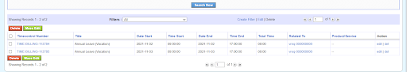

In this guest blog post from our community member [Irta Lanka](https://www.linkedin.com/in/irta-lanka-94654514b/), you will learn how to launch a workflow from another workflow and some of the possibilities that opens.

===

During the past year or so we have encountered a few use cases where starting a workflow from another workflow would have been helpful. [Mario](https://github.com/mocodertz) implemented that functionality some months ago but I never got around to merging it into coreBOS as we found alternative ways to implement the requests. The past month Irta ran into another use case and, although she also found another way of solving the requirement launching the workflow as a scheduled task, I dug up some time to get the **Launch Workflow** workflow task into coreBOS so Irta could use it to implement her requirement. I don't remember the use cases we needed this task for, but seeing what we have done I think we have opened a world of possibilities with this task. For the moment, read on to enjoy the guest post and learn how we can implement loops in coreBOS workflow system!! Thanks Irta and Mario.

## Launch Workflow

A new Type of Task has been added this month: **Launch Workflow task**. This is a powerful and very useful implementation.

There are many cases in which a loop is needed, so Launch Workflow is the best solution for these cases. Now we will be able to loop one or more Workflow Tasks until a specified condition is met.

Like other tasks, you will find it at the presented screen where you add the tasks for the workflow:

### How to configure a Launch Workflow task

The **Summary** and **Conditions** blocks are the same as in other task types. The part that changes is the **Task Operations** block. Let’s explain in detail each one of the labels and values we fill in during configuration:

- **Execute This Workflow:** Here we choose the workflow we want to trigger
- **On Current Record:** If we check this radio button, the workflow will be triggered on the record we are working on (if the record fulfills the conditions set in the first workflow)
- **On These CRMIDs:** We can set here one or more CRMIDs of the records we want to trigger the workflow on.
- **On the Related:** We can select a module to launch the workflow on all the related records.
Moreover, at **With This Condition** part we can add a condition business map to further filter the related records to launch the workflow on. For example, all the paid payments related to an invoice. 
- **On this Record Set:** We can select a Business Map where we have put the records we want to be affected by this workflow. This is the same as **On These CRMIDs**, just that the set of the records is defined in the map instead of hardcoded in the task definition.

### Use Case 1

The system needs to create for us Timecontrol records based on the Number of Days the employee has requested at a Leave Request record.

This is a Leave Request record, the initial status is Requested and Number of days in total is 7 (weekends and festivities included). We want that when the status changes to Approved, a workflow Create Entity (Timecontrol) will be triggered as many times as the Number of Days.

Let’s continue with the creation of the workflows:

The first workflow, the **Trigger Workflow**, will be the one that triggers the main workflow, which will do all the work for us.

- **When to run the workflow:** In this case we want it to run every time the record is saved
- **Conditions:** We want this workflow to be run when Status changes to Approved
- **Tasks:** Here we create a task of type Launch Workflow

Inside the task of type Launch Workflow, we have configured the workflow we want to be executed at **Execute This Workflow** operation **On Current Record** (the record triggering the Trigger Workflow).

In the second workflow, the worker or **Main Workflow**, we put all the tasks we want to be done on every execution of this workflow.

#### Conditions

To avoid an infinite loop of workflow executions we should set a stop condition. In this case, the workflow is going to be executed until the Number of Days has decreased to 0.

#### Tasks

1. **Create Entity task:** This one is going to create the Timecontrol record for each date in Approved Leave Request (Note: weekends and Festivities are excluded using `isholidaydate(date, saturdayisholiday, holidays)` function added recently)
2. **Update fields:** Will update the Number of Days field by deducting it by one on every execution
3. **Launch Workflow:** Will trigger itself while Number of Days is greater than 0

The main workflow should be set to **System. Mass Action** to reduce the possibility of launching it individually and causing an infinite loop. Normally, this type of workflow will be run by a "trigger" workflow. You CAN launch any workflow using this new task

#### Time to test it

The Employee creates a request, where he puts the dates From and To and the Leave Type he is requesting. The Status is set by default to Requested, Is Holiday is set to Yes and Number of Days are calculated using a workflow On the first Save.

After the request is Approved, we can see at Timecontrol module the records created: (Dates 2021-10-31 and 2021-11-01 are excluded as they fall respectively on Sunday and holiday)

Now we can see at the Leave Request record that Number of Days is 0

#### Isholidaydate

`Isholidaydate(date, saturdayisholiday, holidays)` is a new Expression Function added also this month.

It is a Boolean function, which returns True if the given date falls on a weekend or holiday. We have the possibility to consider Saturday as a workday or not. In the previous use case, we have used this function to control if the Leave date the Employee has requested is a holiday or not. If it’s a holiday, Timecontrol record will not be created.

### Use Case 2

This use case has been done using **Invoke Custom Function** but instead, now we can use Launch Workflow task, which will make it easier to implement and it doesn’t need developer resources.

The records in the QR Codes module will be created on the first save of the responsible InventoryDetails record. We also need to loop on the quantity field of InventoryDetails in order to create the necessary number of QR Codes.

- **Origin Module:** InventoryDetails
- **Target Module:** QRCodes

The steps we take to resolve this task using Launch Workflow:

1. Create a Workflow **Create QRCode Record** in InventoryDetails module, **Time or Setting based:** System, and **Condition:** Quantity greater than 0.
2. Create a task **Create Entity** type for QR Codes records creation
3. Create a task **Update Fields** type. Here we deduct quantity by 1
4. Create a task **Launch Workflow** type. Here we select the same workflow we are working on
5. Create another Workflow Trigger Create QRCode Record in InventoryDetails, Only on the first save
6. Create a task **Launch Workflow** type to trigger the ‘Create QRCode Record’ workflow

! Closing Notes

- as you can see the power and use cases this task covers is very big
- it is also very easy to create an infinite loop, so make sure you test the workflows before putting them into production
- this is **no code**, you are creating complex functionality without writing a line of code. I just wanted to emphasize that we have been doing the current fad of marketing words "Low Code" and "No Code" for years now. We are only missing the marketing and the design :-)

**Happy Fourth of July!**

Photo by <a href="https://unsplash.com/@rayhennessy?utm_source=unsplash&utm_medium=referral&utm_content=creditCopyText">Ray Hennessy</a> on <a href="https://unsplash.com/s/photos/fireworks?utm_source=unsplash&utm_medium=referral&utm_content=creditCopyText">Unsplash</a>
