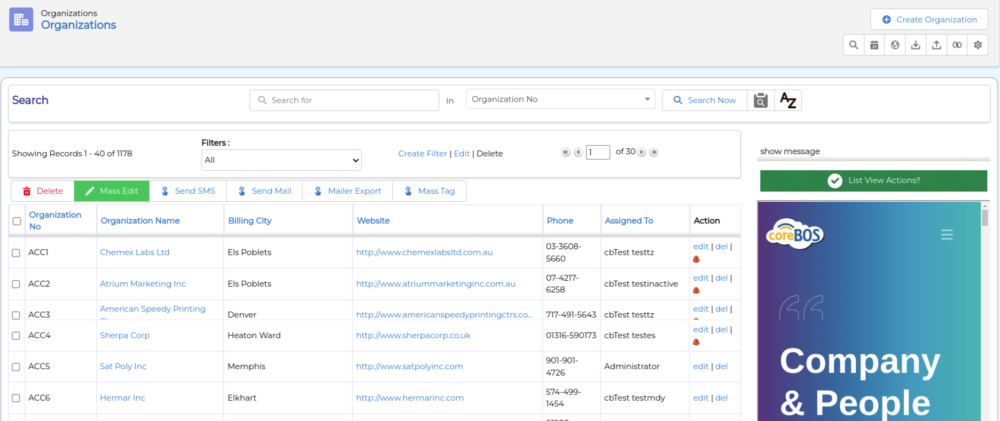
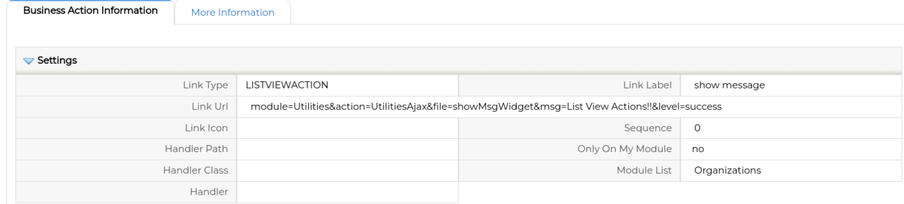

See how you can use this new business action and help us enhance the list view with new ideas and functionality.

===

We have added to coreBOS a new Business Action type: **ListViewAction**

This business action is meant to be a [coreBOS Widget](../coreBOSWidgets/) action that will load functionality in a right panel of the List View table.

Both the standard table based list view and the newer TuiGrid based table views are supported.

The next image shows two widgets loaded, a Show Message widget and an IFrame loader widget.



The show message business action looks like this:



You can download both business actions in the example above from the Gist below and import them to your test install. Then go to the Accounts module to see them in action.

<script src="https://gist.github.com/joebordes/cded8fd9b2586357ed43ca32af014e9c.js"></script>

Now, one of the most important parts of these actions is the "context". In general, in coreBOS, we talk a lot about "context" because we are an operational application that works with information, so every widget needs to know where it is, what record is it supposed to be working with, what user is trying to access the widget and other parameters that affect the way the widget performs.

The widgets on the List View have a completely different context than the same widget in the Detail View of a record. Let's take the Show Message widget as an example. This widget can show a message based on any evaluation you can create. That evaluation will receive the exact record ID when shown in a detail view permitting you to decide the message based on the values of fields and/or show fields of the record. When we use the Show Message widget in the List View we will not be able to do that as there is no one single record, we have a set of records.

The show message widget in the list view will have access to the currently selected filter and it will be able to calculate aggregations and make decisions on the total amount of records, which is a different business perspective than we have had up to now in general.

Another option that List View Actions have is to intercept when the user changes a filter or launches a search effectively changing the set of records shown. These events happen in javascript and are:

- **coreBOSEvent_FilterLoaded** triggered when the filter is selected. It receives

```json
{
    'filter': name of the selected filter,
    'module': module
}
```

- **coreBOSEvent_FilterSearch** triggered when the user launches a search. It receives

```json
{
    'searchtype': search type which can be Basic|Advanced|Alphabetic,
    'letter': letter selected when searchtype is Alphabetic,
    'search_field': search field,
    'search_text': search text,
    'advft_criteria': advanced criteria,
    'advft_criteria_groups': advanced criteria groups
}
```

So your custom widgets can listen on these events and adapt their content accordingly. Note that, currently, none of the coreBOS Widgets support these events. We will start adapting them now that we have this functionality.

**<span style="font-size:large">What will you do with these actions?</span>**

<span>Cover Image by <a href="https://www.freepik.com/free-psd/top-view-desk-concept-with-mock-up_7959649.htm#page=6&query=list%20view&position=25&from_view=search">Freepik</a></span>