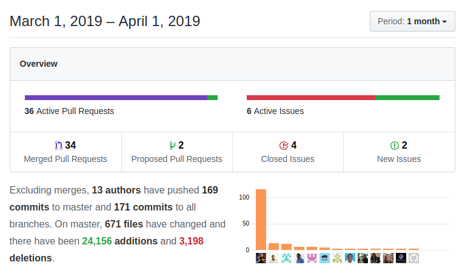

This month we start another long-running project to update and release all the closed code in coreboscrm and as a [birthday present](../happy_birthday_2019) coreBOS gets three new modules and a whole bunch of new functionality while we keep up the constant evergreen updates and fixes. Enjoy!

===

 ! Release closed code project

We are working on standardizing and releasing most of the closed code we have. This is more work than it seems as some extensions need to be adapted to the current functionality in coreBOS and others require changing libraries which have a closed source license (which is mainly why they weren't already being shared openly). In this ongoing effort, this month sees two extensions arrive: **Document Generator** and **Message Templates**.

<span></span>

 ! Release Document Generator Module

Our proposal project for formatting output is released into the coreBOS project. Now you will be able to easily create OpenOffice templates for your invoices and similar outputs. We also move the native OpenOffice and RTF merging capabilities on Accounts, Contacts, Leads and Support Tickets to the same Document based configuration in order to eliminate the admin settings section and some legacy code.

You can read all about [Document Generator Templates on the wiki](http://corebos.com/documentation/doku.php?noprocess=1&id=en:extensions:extensions:gendoc).

 - released GenDoc as standard service
 - released GenDoc Label Helper extension
 - integrate OOMerge with GenDoc functionality
 - eliminate obsolete specific code for OOMerge which is now using GenDoc infrastructure

<span></span>

 ! Release Message Template Module

An application like coreBOS requires a powerful and flexible templating management system for emails, SMS and Whatsapp messages (among others). We create a workflow syntax based template system that is capable of understanding the previous, much more limited syntax in order to maintain backward compatibility while giving the new messages all the power they need. We substitute the existing template capture features with this new module and add support for related documents.

 - fill in field picklist and insert into the body
 - load meta variables only if picklist is available
 - migrate templates usage to new module: workflow, mail manager and email send screen
 - migrate email templates to the new module and eliminate settings section
 - load attachments from MsgTemplate: if documents are related with the message template these will be added to the email when the template is selected

<span></span>

 ! Features/Implementor
 - transfer calendar records on Accounts and HelpDesk when deduplicating
 - transfer more related entities on Leads conversion
 - add globally accessible **getCRUDMode** method to make Business Validation and Condition Expression more flexible
 - add **go back** button on [MassEdit1x1](../xmaspresents18) feature
 - allow uitype 14 fields to show and save more than 23 hours
 - convert User List to BunnyJS Grid
 - send password change email to users if the Application_SendUserPasswordByEmail Global Variable is set
 - add native Partita IVA validation for our Italian users
 - add a condition for multiple fields on notDuplicate Validation [Thanks Timothy](https://github.com/tebajanga)
 - including **requiredWith** and **requiredWithout** on the Validations Business map. [Thanks Timothy](https://github.com/tebajanga)
 - adding SMS support for vendors
 - permit user to define return URL protocol on Webforms so we can support https, by default we still use http to maintain backward compatibility
 - fix Vendors contacts related list to support adding contacts directly from that related list if the option is added
 - do not show inactive modules and respect module entry label if changed in Menu
 - format 0 for consistent user preferences
 - Business Maps XSD based validations. Very useful job from [Glory](https://github.com/glorymoshi) which permits us to validate the XML of our business maps without leaving the application

<span></span>

 ! Workflow Enhancements

This is our non-stop project: making the workflow system more and more powerful with each iteration.

 - EmailTask: add the use of message template and attachments associated with the template into drop-zone
 - **EmailTask: if an attachment is a GenDoc template, merge and send the result, not the template**
 - EmailTask: create a message for workflow email to register and track these emails
 - many to one update workflow update one module per task
 - add a condition to mass related update so we can conditionally update only some related records
 - testing and adjusting mass related record update
 - fix an error referencing null object on expressions
 - include external functions only once
 - move "evaluate on execute" in workflow task to make it clearer that it is only used on delayed tasks
 - retrieve record despite sharing privileges when performing update field task and standardize method call
 - correctly manage translated field names
 - **LOGICAL OPERATORS:** Elisa calls our attention to the fact that the workflow system doesn't have the possibility to easily evaluate logical conditions. This makes creating business rules and validation business maps more complicated than it should be so we set out to slowly start adding this type of support. This month not only sees the birth of this feature but also implements four operators. [Thanks Timothy](https://github.com/tebajanga)
   - add **isNumeric** and **isString** logical operators methods
   - add **OR** and **AND** methods, so we can do cool evaluations like this

```
AND(isString($(account_id : (Accounts) accountname)), isNumeric($(account_id : (Accounts) employees)))
```

<span></span>

 ! Developer
 - we add support for context variables in Business Questions and pass that context into the detail view widget which permits us to do some really cool things [like these graphs](http://corebos.com/documentation/doku.php?noprocess=1&id=en:devel:add_special_block#developer_blocks)
 - support for setting business rule when creating Business Actions
 - **range operators** for QueryGenerator. These four new operators permit us to easily define intervals of number and text fields as [can be seen in our unit tests](https://github.com/tsolucio/coreBOSTests/blob/master/include/QueryGenerator/QueryGeneratorTest.php#L1285). The new operators are:
  - [] both start and end values are included in the range
  - [[ start is include and end is excluded from the range
  - ]] start is excluded and end is included in the range
  - ][ both start and end values are excluded from the range
 - Condition Expression Business Maps now support a new type that compiles workflow templates
 - a new method in CRMEntity named **retrieve_entities_info** permits us to retrieve a set of CRMIDs in one call
 - Emails module gets a revamp this month with a whole new set of hooks and abstractions that permit us to completely override the emailing system. Right now our default email system is [PHPMailer](https://github.com/PHPMailer/PHPMailer) but with the changes in the Emails module, you can now program the application to use any other system you want. We will be releasing an integration with [SendGrid](https://sendgrid.com/) very soon and I plan to dedicate the next blog post to explain how these changes work
   - hooks for intercepting email sending
   - getMergedDescription now merges workflow syntax variables after all old format has been done
   - getAllAttachments function to get all the related files as attachments
   - support attachment files as an array of name and full path in send email
 - add full Users image information with the same structure that we use in web service to the user object
 - add Webservice support for Business Mapping global variables and return the JSON structure of the business map also
 - add **[MassDelete](https://github.com/tsolucio/corebos/blob/master/include/Webservices/MassDelete.php)** web service endpoint to delete multiple records at once. [Thanks Kliv](https://github.com/klivstudiosynthesis)
 - add **[upsert](https://github.com/tsolucio/corebos/blob/master/include/Webservices/upsert.php)** web service endpoint. [Thanks Kliv](https://github.com/klivstudiosynthesis)
 - dereference IDs and Images for consistent return format in Update and Revise and html-decode reference names

<span></span>

 ! Developer Action Call: a new pattern for actions

[Albert](https://github.com/albertxhani) proposes and constructs a new way to call actions. Closer to pure MVC, this form of executing code will permit us to call class methods directly which makes for a more structured code.

The action must be called like this:
```
index.php?action=index&module=Leads&action=LeadsAjax&actionname=test&method=init
```

where `actionname` is the class name that contains our actions and `method` is the name of the method we want to execute inside the class.

The class must live inside the `actions` directory of the module and must be named exactly as indicated in the actionname parameter.

So the above call would live in:

`modules/Leads/actions/test.php`

We can create multiple methods inside the action class and call each one given the method name in the
URL (the same way a controller works in a MVC).

There is an example in [this Pull Request](https://github.com/tsolucio/corebos/pull/490/files).

[Thanks Albert](https://github.com/albertxhani)

<span></span>

 ! coreBOS Standard Code Formatting, Security, Optimizations and Clean Up

 - constant formatting and warning battle: Changesets, Ajax/ListViewController, AssignedTo, BusinessMaps, CRMEntity, MailManager, MsgTemplate, Product, QueryGenerator, TransferRelatedRecords, Users, Workflow
 - eliminate a block of repeated code in Developer Block
 - fix comments and debug message in InventoryUtils
 - Products avoid warnings on image field retrieving and saving
 - Workflow review and format code for massive update many to one
 - Debug Message Reduction project: CommontUtils (get merged description) and Workflow
 - an optimization that avoids calling ispermitted if from_wf is true and avoid sending empty values if there is no access to the record (CRMEntity)
 - simplify query in Documents
 - security: retract executable bit
 - Continuous Integration:
   - add check on new changesets
   - add php file lint
   - include changesets
   - my personal code validation check script, in case that helps someone
   - add new executable file
   - add new lint file to permitted executables

<span></span>

 ! Others
 - now that we have eliminated the last Settings section we reorganize the ones that are left
 - Application_User_SortBy: construct correct SQL with restricted user access
 - get the right number of colors for the Business Question graph
 - mysql strict in Calendar get activitytype
 - urlencode activity types for Calendar popup edit
 - eliminate duplicate call to transfer parent method in Campaigns
 - fix select leads query in Campaigns
 - mysql strict in Potentials Sales Stage history with hidden fields
 - do not lose multicurrency/tax on Product/Service edit
 - correct Products/Service multicurrency and taxes save from web service (they were being lost)
 - Scheduled Reports: use attachment parameter instead of global REQUEST variable
 - standardize report SQL group by field name
 - Time validation: cap max hours at 838 since MySQL can't handle more
 - add slashes to error message so it does not break javascript
 - change typeofdata in Assets and Calendar date fields
 - add some right padding on Currency fields for better UI
 - emit complete Dropzone event on document attachment relation
 - do not send template based email if the template is not found
 - Send picklist values via POST for larger lists
 - correct CSS for global autocomplete
 - avoid validating inexistent images
 - InventoryDetails:
   - change sanitizeRetrieveEntityInfo to catch more fields
   - eliminate errors in MasterDetail configuration when the user does not have access to InventoryDetails module
   - error when trying to update inventory lines, sometimes the requestindex does not correspond with the line order that is returned by the query and updates data on the wrong line
 - fix SQL query to return correct tax values
 - correct action name on change password redirect
 - update softed style.css: a few very nice CSS changes that make the application a bit nicer and faster. Thanks John.
 - Continuous translation effort:
  - correct label on Inventory Modules
  - add label to field in delete related records workflow and apply LDS
  - cbPulse
  - Documents: merge template label
  - Emails/Message: missing labels and pt_br
  - Inventory: financial info block label
  - MassEdit1x1: go back
  - Services: multicurrency div header
  - Settings: BPM header and code formatting
  - Workflow: mass update related, more consistent translation and add a missing label
  - Fix no space with - youhave - in the test email
  - added and fixed German translations in many modules. [Thanks Henning](https://github.com/partnerwerk)



**<span style="font-size:large">Thanks for reading.</span>**

