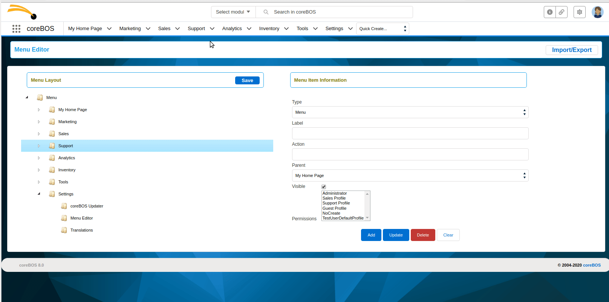
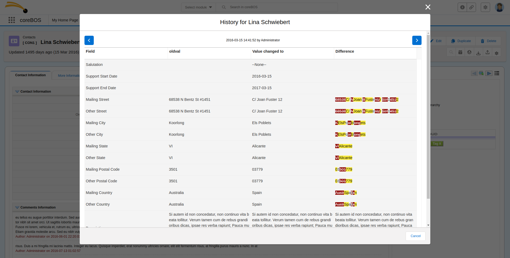
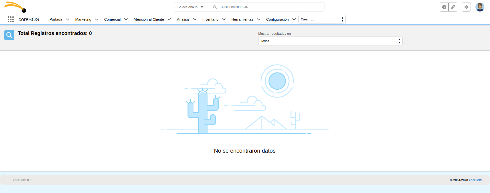
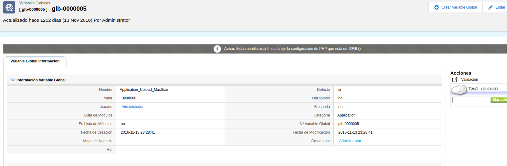
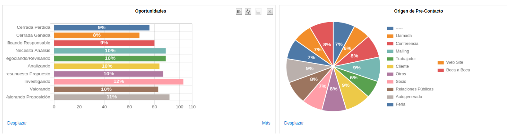
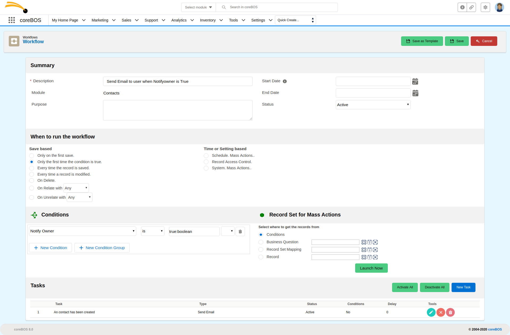
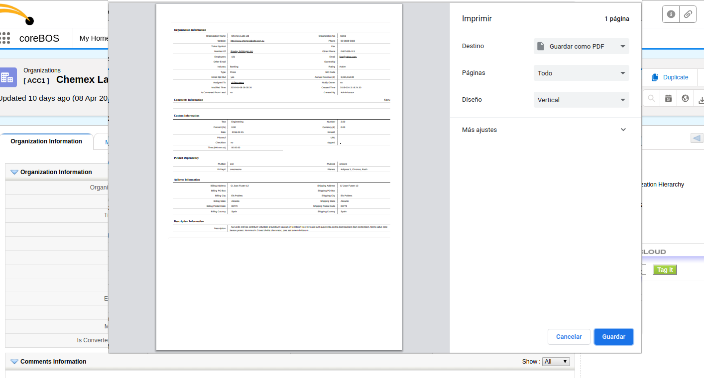
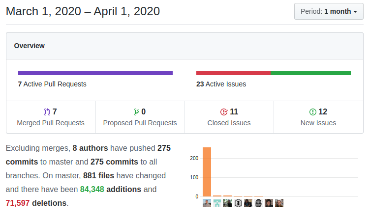

wow!

===

 ! Lightning Design System implementations

- CronTasks apply page header and LDS
- Dashboard delete old page header and format graph select box
- Date Fields change calendar icon to LDS
- Debug background-image: the new background makes it hard to see any message sent directly to the screen so we add a debug-friendly background that you can load using the Application_UI_CoverImage global variable: themes/images/content-bg-debug.png
- Export LDS and code formatting
- apply border and bigger text in GenDoc direct compile page
- migrate error alert messages to prompt component
- use LDS popups and modals in Workflow
- apply shadow to entire LDS prompt as opposed to only footer
- apply LDS formatting and modal to convert lead form
- apply LDS to save-report-as and use it both ways this task can be done
- move buttons to the page header and apply LDS styling in Workflow
- apply page header and very basic LDS to Workflow
- apply LDS to workflow condition editor and eliminate jQuery
- apply LDS to workflow form and add fields for mass actions
- fix Audit Trail and Login History LDS background
- apply LDS to Layout Editor field information popup
- apply LDS to test global variable functionality
- add HTML new line to show multiline validations errors correct in new LDS prompt
- display Settings action menu horizontally
- set all views to full width with LDS styling on the table container

<span></span>

 ! Business Question Builder

The Business Question module has been around for a while and has seen some interesting enhancements but the supported query language is complex to generate manually so we created a question builder to make it a little easier. Building on top of the workflow expression editor and the TOAST-UI data table we have been able to cover most of the requirements this project needed. We have to add some documentation on the screen (at least for the type of question properties) and test it to make sure we got most of the combinations correct. A useful addition to the coreBOS Project.

[plugin:youtube](https://youtu.be/pjRks-8txX8)

- layout and design, starting functionality
- Question Builder field editor functionality
- builder field editor
- add management fields and save as new button on Builder
- construct SQL and show in the editor
- question builder results: data table and answer
- show, copy and toggle SQL and WSQuery
- test SQL
- toggle sections by clicking on the header
- avoid block toggle on button click and make SQL editor bigger
- update fields on module change and add a message to SQL editor
- add support for getSetting and functions with quotes
- Builder order and group by
- correctly format SQL select and data columns naming
- change setype to correct name: getEntity
- set question module in the expression editor
- getAnswer with no saved record: passing in the context
- getSQL with no saved record: passing in the context.
- load chartjs CSS after library update
- load mermaid graph without document load event for cases when we load via ajax
- missing smarty class variable in executeScript
- move notification div below buttons
- support for direct SQL Query in getAnswer
- update query on limit change

<span></span>

 ! Import/Export Menu Settings

[Elifuraha Giliad](https://github.com/Egiliad) implements a very useful functionality that permits us to easily save, export, load and apply menu layouts. We can now, for example, set up a menu layout in one coreBOS and load and apply it in another one with a few clicks.



<span></span>

 ! ElasticSearch Integration

[Lorida Cito](https://github.com/loridacito) adds this month an Elastic Search integration option that will seamlessly send the information we want to our ES install every time a record is saved. You can read about it in [the documentation wiki](https://corebos.com/documentation/doku.php?id=en:integrations:elasticsearchnative&noprocess=1).

<span></span>

 ! ModTracker enhancements

[Luke](https://github.com/Luke1982) uses the ModTracker "View History" action to test the [TOAST UI Grid](https://nhn.github.io/tui.grid/latest/) component and update the view to LDS. The test turns out to work very well, both for the data table as for the LDS migration and we push it a little further adding some functionality and bug fixes. Next month also sees yet another enhancement in this section... non-stop.



- implementing LDS and Toast UI
- activate highlight always but only on text fields
- document getChangedRecords and getRecordFieldChanges and fix this last one
- method to retrieve the history of changes of a field
- correctly show owner and boolean fields
- avoid incorrect SQL with a negative offset
- do not repeat last tracker record
- eliminate warnings and format code
- rename javascript translation array to avoid conflicts because it is loaded everywhere
- separate highlight from normal difference and use field formatting class to obtain the value based on uitype
- separate postvalue and highlight in two columns for better visualization

<span></span>

 ! coreBOS Universal Unique Record Identifier (UUID)

I add a type 5 UUID for each record in the application which makes it easier to share information between different installations of coreBOS. This is really useful thinking about having various installs managing different parts of a company and syncing information as they need it.

This change required modifying the web service API to support the new record identifier.

I will write a full blog post about this and the goal of the project shortly.

- add memory limit exhaustion control to changeset for a large set of records
- return cbUUID for each reference value
- support cbUUID in all reference fields of web service
- getUUIDfromWSID and avoid warning on crmid not found
- return cbUUID in Web Service GetRelatedRecords
- correctly filter Groups from non-cbUUID supported entities
- return cbUUID in web service operations
- vtws_getReferenceValue: return correct cbUUID value for Users module and support for email parentid multivalued field
- add cbUUID as soon as possible
- add code to avoid warnings when the input parameter is empty

<span></span>

 ! Other Features and New Stuff

- show no data found message when Global Search returns no results

- inform of PHP max upload limit in Application_Upload_MaxSize global variable

- support value/percentage on home page and reports graphs. These are configurable with global variables
  - Graph_ColorScheme
  - Graph_DataLabels
  - Graph_DataLabels_Color

  - color scheme ChartJS plugin and Graph_ColorScheme global variable to choose which one to use
  - ChartJS Datalabels plugin
  - add support for labels on some dashboard graphs and disable it on all the others

<span></span>

 ! Implementor/Developer enhancements

- Debug background-image: the new background makes it hard to see any message sent directly to the screen so we add a debug-friendly background that you can load using the Application_UI_CoverImage global variable: themes/images/content-bg-debug.png
- more intelligent test record ID detection in Business Maps testMap functionality
- apply less strict cleaning process in the email body to support strange HTML (outlook)
- a better naming convention for GenDoc saved and attached documents with the **Workflow_Email_GenDoc_Attachment_Name** global variable that permits us to use the autonumber field instead of title as attachment name
- correctly detect GenDoc PDF conversion active for new docker conversion support in email workflow task
- get/set/del Settings methods for workflow expressions
- support for getSetting for URL and Auth token in RunWebserviceWorkflowTask
- support User.* fields in Autocomplete business maps
- use httpS in Google Measurement Protocol call
- support getprice hook in Issue and ReceiptCards
- setting and unsetting related list module for UIType 10 field in Layout Editor
- add module information for each Home report widget and eliminate query_result usage
- fix web service set correct actual_price on getProductServiceAutocomplete when the price is modified by the hook

- add the module name to "not found" exception in Webservice for easier debugging
- add a parameter to keep GROUP BY in stripTailCommandsFromQuery and optimize function (DatabaseUtils)
- retrieve_entity_info parameter to throw an exception instead of die on not found error permitting better control over a process where a record may have been deleted
- change the Email update web service method to accept only status fields updates
- return reference information for parentid multi-valued email field when getting the information from web service
- eliminate warning and add some helpers for relations in web service Emails
- DataTransform::sanitizeReferences correctly sanitize special email parent_id field
- load i18n javascript strings functionality. Searches for a [language.js file](https://github.com/tsolucio/corebos/blob/master/modules/ModTracker/language/en_us.js) that contains a mod_alert_arr object with translation strings.

``` js
loadJS('index.php?module=ModTracker&action=ModTrackerAjax&file=getjslanguage');
loadJS('index.php?module=cbQuestion&action=cbQuestionAjax&file=getjslanguage').then(
```

- **MemoryLimitManager** class that permits us to control if a script is consuming too much memory. We set a limit, then ask if it has been reached, permitting us to stop a process and have it restart again with a fresh memory stack. You can see an example in [the coreBOS UUID changeset.](https://github.com/tsolucio/corebos/blob/master/build/changeSets/2020/addcbuuid.php)
- [readableBytes](https://github.com/tsolucio/corebos/blob/master/include/utils/CommonUtils.php#L3618) utility function that converts a number of bytes into a readable format e.g KB, MB, GB, TB, YB
- [numberBytes](https://github.com/tsolucio/corebos/blob/master/include/utils/CommonUtils.php#L3628) utility function to convert a given numeric string with optional byte size magnitude to a number of bytes
- **vtws_getEntityName** to get Module Name from a web service module ID
- add limited support for assigned_user fields in QueryGenerator
- rewrite web service to SQL method with validation information and permission check
- fix **GetRelatedRecords** web service method to return same results for tickets comments and ModComments
- fix **GetRelatedRecords** web service method: limit/offset were in wrong order
- add a function to inform of supported SQL methods: cbexpsql_supportedFunctions
- return also user ID in getPortalUserInfo call
- enhance previousUser to permit retrieving any user in the stack
- trigger change event on popup field expression edit
- **Tests:** keep getting some love and care as we fix things and add coverage.

<span></span>

 ! coreBOS UI Components

Following Luke's lead, we create a Smarty and javascript set of UI Components to use throughout the application to make it easier to apply LDS styling and programming in general.

- setup components infrastructure, move ldsmodal and ldsprompt and globally load data table
- create a directory for Smarty components and move menu functions there
- TOAST-UI: move to components directory
- Modal: support save button action
- Prompt: support for other themes (warning, success, ...)
- add Tooltip Information Smarty component
- ButtonIcon and DateButton Components
- Smarty LDS modal component and migrate Edit/Show Cron with it
- Prompt: bigger message text
- Tooltip: convert to block-based component

<span></span>

 ! coreBOS Mass Actions

This month sees the arrival of a side project we have been working on for some time now. It isn't finished yet but we get the first visual effects of the project in the workflow system.

The Mass Actions project will bring the possibility to launch any combination of workflow tasks against a set of records, permitting us to send mass emails, web service calls, generate image fields or simply apply complex updates. Stay tuned as this functionality lands.

- add conditions option to record set selection
- expression editor on top of new fieldsets
- extract userID from WSID when creating an entity if it is the case
- hide mass action recordset if not needed
- hide record set tab in tasks
- limit access for non-admin users
- migrate tooltips to new component format
- retrieve correct current user in workflows
- we have to manually launch all click events now that the save button is outside the form (page header)



<span></span>

 ! coreBOS Standard Code Formatting, Security, and Optimizations

- coreBOS Standard code Formatting: Application, Calendar, Charts and Chart Reports, CRMEntity, Dashboard, Elastic Search, Emails, GenDoc, Global Variable, Inventory, Mobile, ModTracker, LDSComponents, Reports, QueryGenerator, Webservice, Settings, export, Workflow
- eliminate warnings in Recycle Bin and PBX Manager
- avoid warning in user privileges by adding isAdmin check on hasGlobalViewPermission
- avoid warning when trying to show empty related fields in Tooltip
- add Memory Limit Manager library to CI checks
- update ChartJS library to 2.9.3, load latest CSS and avoid bundle which is discontinued
- update LDS to 2.11.6 Spring ’20
- optimization eliminates loop for a direct database query in Create
- optimization ElasticSearch: only execute handler and load dependencies if an index exists for module launching handler
- optimization eliminates unused variable in HelpDesk
- optimization eliminates obsolete Calendar reference and unused code in ModTracker
- optimization reduce SQL results and eliminate warning in ModTracker
- optimization simplify evaluation and eliminate query_result in vtlib_isEntityModule
- optimization move Workflow javascript to script so it gets cached
- optimize DataTransform::sanitizeReferences
- eliminate old Calendar support from Webservice
- delete old Calendar Workflows and Tasks
- eliminate obsolete Events module and it's references
- avoid loading already loaded library and apply cbSR to Global Search
- I set up and try phpDocumentor
  - create a configuration file
  - eliminate incorrect TODO in modules that create false positives in phpDocumentor
  - the results are not very good
- PHP 7.4 changes in ModTracker and Calendar
- security: do not send ModTracker history data if the user does not have permission
- security: clean input variables and apply cbSR in Retrieve

<span></span>

 ! Others

- eliminate redundant parenthesis in Workflow
- fix a very long-standing error to support filters on graphs section/bar navigation. When you click on a section in a graph it will now take you to the correctly filtered set of records.
- correct response time calculation in the footer
- fix special characters support when creating document folders
- convert input-image to image to avoid click on enter
- fix PageHeader by converting cancel button to a button not a submit
- avoid warning in Workflow expression editor if called from outside the workflow environment
- eliminate duplicate HTML IDs in Workflow
- eliminate absolute radio CSS in tui-grid
- hide page header and tabs in print mode

- eliminate advertising.svg from service worker as it trashes it when adblocking is active
- fix Reports: avoid inserting empty date filter row if no filter is present
- fix Reports: error getting the number of elements of an array using num_rows
- set correct Calendar reminder state value
- avoid sending HelpDesk notification emails when no related account/contact exist
- hide create button in Integrations page header
- Leads Conversion: add block screen on conversion and adapt conversion check when accounts and/or contacts are inactive
- eliminate totals row from Global Search results to correctly detect when we find only one record
- automatically recalculate and set the sequence of Cron Tasks on load. orderTasks method
- send module name not translated label to Export validation settings check
- move status div into the body so we can block screen in the popup edit
- add minimal page header when in a popup view
- add initial coreBOS Updater support for manual updates. Add new field appcs for this purpose. This functionality should be available soon.
- Mobile fixes
  - add a missing parameter to avoid warning
  - change http protocol to httpS
  - set default language to the default language of the application (config.inc)
- constant translation effort:
  - Ranieri from Slemernet spends a lot of time translating the pt_br files and catching a lot of hardcoded strings we still had around. Thank you very much!
    - Accounts, Messges, Potentials, Service Contracts, Main application, Business Maps, Contacts, Cron Tasks, Elastic Search, Filter Management, Mobile, Picklist, Utilities, Settings, Workflow, SMS
  - Components: ldsmodal and ldsprompt support for i18n
  - add "failed" label to List View
  - translate Import/Export functionality in Menu
  - translate hardcoded strings in Mobile and Utilities
  - translate new functionality in ModTracker. Dutch translations
  - use the correct label for translation in Workflow
  - recover removed translations and remove some duplicate translations from Utilities

<span></span>



**<span style="font-size:large">Thanks for reading.</span>**
