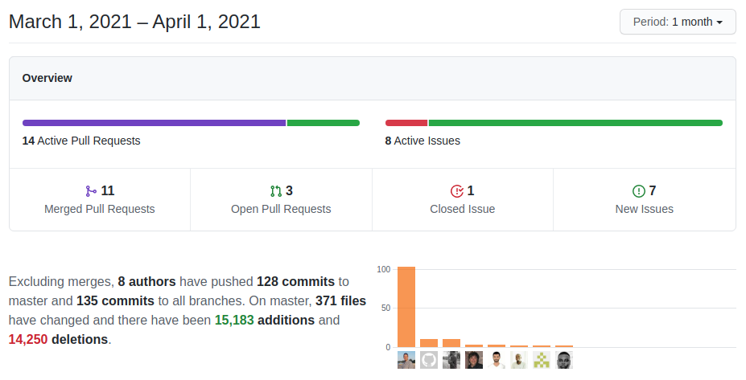

A normal maintenance month as we continue to work on security, speed, and stability. Enjoy!

===

 ! Features and Implementor/Developer enhancements

- add support for "testrecord" in Business Map Webservice testMap call: send fields in the URL
- add "entity field" to module Users. This is a future optimization, we add a calculated field on the user module that contains the concatenation of first and last name so we can now modify all the queries where we do that concatenation in SQL to just retrieve the field.
- Import SendGrid email templates to MsgTemplate. SendGrid released a set of email templates for free and we added them into coreBOS
- merge Email template with inventory modules when sending from them
- function to check if GenDoc PDF conversion is configured
- set two-factor authentication in function of application and user name. This way we can use Google Authenticator with many coreBOS installs or the same coreBOS install with different users
- add cache integration for assign picklist values to role and for the pickList base functionality
- permit overriding SinglePane global variable setting for single pane value in code
- SMSNotifier
  - **SMSNotifier_SendCopyToUser** global variable. when an SMS message is sent to a client, the user sending the message will receive a copy if they have a cell phone defined in their preferences. This variable will permit us to control this functionality
  - test provider driver which will permit us to simulate the SMS functionality
- **Denormalization Project validation and fixes**
  - support for Documents module
  - eliminate SQL alias in Documents module Web Service query
  - use FQN for aliased fields when Products, Services, and InventoryDetails are denormalized
  - use FQN in SQL queries on denormalized modules
  - correct related lists of denormalized modules
  - avoid SQL error on activation for modules that already have a description field
  - product component related lists swap column order to support denormalized product table
  - correct elimination of denormalized modules in the RecycleBin
- **Deduplication**
  - increment default number of merge records and convert it into a global variable: **Application_Merge_Record_Limit**
- **Web Service Enhancements**
  - support for returning document attachment in GetRelatedRecords
  - support search and upsert in Mass Create: **Mass Upsert**
  - avoid access to reference field if the user does not have permission on it
  - support for new log levels in Log Javascript endpoint
- **Workflow Enhancements**
  - do not verify SSL certificates in web service calls
  - support getContext and getSetting in all web service call headers, not just authorization and token
  - correctly save record from inside Run web service task
  - process XML responses in SOAP calls, avoid JSON decode on objects and send HTTP parameters for Content-type:text/plain
  - **randomstring** expression function
  - show now datetime in evalwf script to get better context of relative date conditions
  - support for **linkmodeid** virtual field to set m:m relations in Upsert task
  - support images and document attachments in Upsert task
  - ignore validation issue for fieldname and expression in Upsert task
  - unset createmode from global REQUEST data in Upsert task
  - add control to handle send email if generated file is empty
  - resolve array to string conversion notice if value is array
  - uncomment the codes for field data validation in editor field mapping
  - avoid javascript error when condition fields are hidden
  - escape javascript translation strings to avoid incorrect javascript code
  - change the way email template UI works in Email task
  - hide SendGrid template selection if SendGrid is not active in email task
  - make email subject non-mandatory so we can save with linked email template
  - set callback function in email template selection with icon button in Email Task
  - use GenDoc PDFConversionActive to detect PDF conversion in Email task
  - support document folder field in upsert and update related tasks
  - support for both string and encoded context parameter in Question Answer method

 ! coreBOS Standard Code Formatting, Security, Optimizations, and Tests

- coreBOS Standard Formatting
  - corebos_cache, Business Rule, Emails, workflow, SMSNotifier, Business Question, changeSets, Decision Table, Web Service: format, change quotes and eliminate spaces and warnings
- Debug Message Reduction: eliminate the usage of print_r, either deleting it or using monolog syntax to send array directly
- Continuous Integration check: SlackRecord.php no longer executable
- Documentation
  - function headers, comments, and change quotes
  - add another example of **getIDof** workflow expression function
- Optimizations
  - switch print_r to JSON encode throughout the application, for consistency and speed
  - directly return result and eliminate warning in Business Question when no question properties context are given
  - return only one record in Business Rule cache check query and flatten array to construct key
  - use monolog format in Database communication layer for better log message
  - reduce SQL whitespace, reduce debug messages, change quotes in Database communication layer and Business Actions
  - directly return result in workflow list
  - Web Service
    - reduce SQL fields in query, reduce whitespace and eliminate variable for direct string in Documents Web Service
    - change regex for faster trim and use condition short circuit in Mass Create
    - eliminate require, change "for" loop to "while" to reduce query_result, use pquery and return only active sequences for uitype 4 fields getEntityNum endpoint
- Security
  - SQL injection in Business Question query context parameters
  - apply Customer Portal permission access restrictions to Business Question execution
  - change Customer Portal user password
  - **Security_ImageCheck** global variable to strictly or loosely check security issues of uploaded image files
  - [migrate logging subsystem to monolog](../monolog) and delete the deprecated log4php
    - add ALERT support for completeness
    - support for additional logging handlers
    - limited support for objects in the message
    - set enabled value for alias logging levels
    - set log file write permission to group also
  - possible SQL injection in getDenormalizedModules. fix header documentation
  - Web Service
    - add permission checks for execute workflow
    - empty cache, path traversal check and deactivate GenDoc Conversion service by default
    - restrict field uitype information based on profile
    - SQL injection in upsert method
- Unit Tests: keeps getting more and more assertions

 ! Others

- do not process empty FILES array on save (Attachments)
- Business Map
  - initialize variable error in Run Web Service call map
  - fix wrong extended base class in Run Web Service call business map
- Business Question
  - add permission check on context question
  - check if params array is not empty
  - missing global variable
  - support repeated parameters in different order with MySQL user-defined variables
  - enable SQL content copying in Business Question builder
- fix changeSets method visibility
- break long URLs in DetailView
- align "select related document" button to the right and return to single pane view in Documents related list
- ignore CKEditor error in case the Email textarea is not visible in Email workflow task
- retain base parent ID for relation when its email address is erased
- set language for email tracking call
- order Export columns by the selected filter when exporting based on one
- replace \r\n to line-break in GenDoc
- only apply Inventory_Tax_FillInMode global variable when Inventory modules are in Create mode. Do not apply Inventory_Tax_FillInMode when converting from other records
- calculate Inventory Details cost_gross with correctly formatted numbers
- eliminate warning on Inventory Details cost price calculation when field is hidden
- avoid Products error when Product Component is deactivated
- correct and optimize RecycleBin loop to delete files in storage when Documents is emptied
- flatten query parameter array in Reports SQL
- return empty column if field cannot be found in Reports
- convert strings to numbers for Stock comparison in javascript
- move Stock calculation global variable so it doesn't get reset by web service call
- eliminate warning in validateImageFile if no image is given
- **[WooCommerce integration.](../woocommerce)**
  - update composer autoload
  - fill taxtype correctly
- Translations
  - define Application Merge Record Limit global variable labels
  - translate new Security_ImageCheck global variable
  - change label of maximum number of record to merge
  - load default language for 2FA login screen instead of hardcoded EN

**Thanks for following.**
