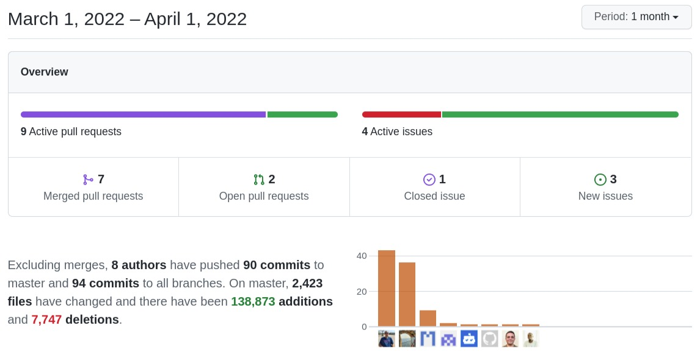

Our 8th birthday seems to have brought a whole bunch of new integrations and a long-standing request in the documents module. Don't know what surprises me more, the number of new features you can put in a month or the big mix of people who have participated in them. Thanks!!

===

 ! Features and Implementor/Developer enhancements

- **Documents Folder:** Continues and finishes this month. Not only do we have a whole new functionality inside the application but Denald and Xhilda update the WebDAV interface to work with the folders also. Incredible work. My compliments!
  - apply filters in the tree view
- **Apache Tika:** integration. Document Full Text Search!
  - create vtiger_documentsearchinfo table
  - regsiter ApacheTika cron service
  - detect SearchDocuments mode for Documents module and use another query
  - search into Documents in tuigrid mode
  - enhance the search in Global Search too. When we select the Documents module and the global variable is enabled
  - show Search Documents button in UI when global variable is enabled
  - send errors from Apache Tika in Message Queue
  - create **Apache_Tika_URL** global variable
- **LDS Styles:** we continue to apply LDS everywhere. Thanks Egi!
  - fix Settings icons
  - change TagCloud Input UI
  - change List View Buttons
  - update Settings Panel Icons
- **ClickHouse**
  - basic integration
  - library
  - update LDS and change layout
  - integration infrastructure tested and ready to be used
  - test query functionality
- **Pivot**
  - validate new Pivot map format
  - add multifact pivot table library
  - add multiple aggregators in pivot table
  - save last configuration of pivot after reload of the page
  - show aggregations fields by default at top of the table
- **Upgrade from vtiger CRM 5.x**
  - eliminate install addons dependency
  - fine-tuning upgrade process
  - from vtiger CRM 5.x scripts
- **Mautic Integration**
  - initial (basic) integration
  - validation and documentation
  - testing contacts
- add **Application_MassAction_Multipage** global variable: define if we want to mass edit records that we select on many pages or on current page
- refresh the List View grid after the inline edit action
- support uitype 10 fields in tuigrid mode (nice!!)
- support Rules Condition Expression without record context
- Web Service
  - support Field Dependency maps in ProcessMap
  - add profileid information in the response of getPortalUserInfo webservice
  - support condition expression in MassCreate/Upsert
  - **Webservice_LogCallsToQueue** global variable
- Workflow
  - add expression workflow for return date time from given year, weeks and day of week
  - case insensitive search for expression functions
  - logarithm function
  - support returning full web service call response with the dot (.) field name

 ! coreBOS Standard Code Formatting, Security, Optimizations, and Tests

- coreBOS Standard Formatting: eliminate warnings eliminate useless code, variables and comments, format code
- Documentation:
  - aggregation workflow expression
  - function headers, and comments
  - non-stop wiki enhancements
- Optimizations
  - eliminate obsolete unsupported database driver code
  - eliminate undefined variable, reduce whitespace and debug message in database abstraction layer
- Security
  - protect .git directory contents
  - Mautic execution bit
  - protect SAML certificate directory CWE-403
  - better non-process rules and eliminate unnecessary file in storage directory
- Updates
  - LDS
  - composer libraries
  - add Mautic API
  - add php-tika library
  - add ClickHouse library
- **Unit Tests:** keeps getting more and more assertions

 ! Others

- use coreBOS logo if none given
- Colorizer quotes issue on JSON response from the database
- respect Inbucket Email configuration to permit sending emails
- show Approve/Deny option in filters for TUI grid mode
- ListView
  - check for both columname and fieldname linkfield in listview
  - hide actions if a record is a folder in Documents module
  - prevent buttons from submitting forms
  - support more than one condition in the same field for Colorizer
  - trigger workflows in inline edit action
- Mobile
  - increment index to get all values from related search
  - refresh previous results when using autocomplete, because index is not refreshing
- load notification script after validations
- give PortalLogin contact user access to business maps as per application rules
- show images correctly in Related/Popup views
- fix empty date export issue in Reports excel format
- return 0x0 in vtws_getWSID when we cannot find the UUID string
- add support on cbQuestionAnswer for multiple ids
- Workflow
  - add record_id for expression context
  - correct SQL parameters for insert
  - if currentModule is empty set currentModule with the value of related moduleName
- vtlib library
  - add presence field
  - better checks for Cron next sequence insert
  - update Calendar module name in Cron task
- Translations
  - Global Variable to es_es
  - ListView
  - TagCloud
  - Tika
  - Workflow getISODate expression function

**Thanks for reading and Happy Easter.**
