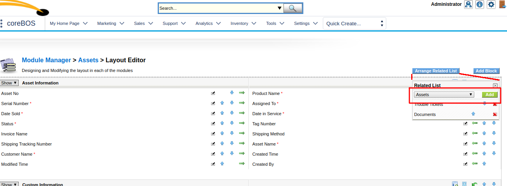

This month coreBOS gets a plethora of new functionality and configuration potential as we start leveraging the power of business maps and continue to use the flexibility of global variables, and all that without stopping to stomp bugs and clean up the code base.

===

 ! Business Maps

 - [List column mapping](http://corebos.org/documentation/doku.php?noprocess=1&id=en:adminmanual:businessmappings:list_columns)
 - [Record Access Control](http://corebos.org/documentation/doku.php?noprocess=1&id=en:adminmanual:businessmappings:record_access_control) support for condition expression
 - Support for calling internal application functions

 

 ! Layout editor m:m relations

We can now add many to many relations between modules from the layout editor.

 ! Reports

 - Totals when inventory lines are present
 - Fixes and enhancements
 - Send empty reports Global Variable

 

 ! Inline blocks

Another developer enhancement that permits us to add blocks in Detail and Edit view with any contents very easily. Simply naming a template in the right directory and you can put anything you need to inside. Read the tutorial [How to add a special block to a module using templates](http://corebos.org/documentation/doku.php?noprocess=1&id=en:devel:add_editdetail_block) to learn how this works.

 ! coreBOS Mobile Interface

This month we start another long-running project whose goal is to create a flexible and powerful mobile interface for coreBOS.

We start this project by incorporating the work done by CRMNow (thanks!!) upon the existing project and defining the set of goals and tasks we want to accomplish.

 ! Developer enhancements

 - **getFieldValuesFromRecord** API call permits developers to retrieve the value of any field from a record ID, for example, given an Invoice ID we can get any field on the invoice and from the account related to the invoice.
 - **getFieldValuesFromRecord** API call permits developers to get the values of an email template in the browser
 - **getFieldFromBlockArray** permits us to get a direct reference to a field that is in the getBlocks() array structure which is very useful for dynamic changes to field in Detail and Edit view
 - Add [list view render hook](http://corebos.org/documentation/doku.php?noprocess=1&id=en:devel:corebos_hooks) to related lists so we give developers the possibility to modify the rows in the related lists before they are shown, making it possible to create extensions like [Color and Condition Fields and Blocks Extension](http://corebos.org/documentation/doku.php?noprocess=1&id=en:extensions:extensions:cbcolorizer).

 

 ! Global Variables

 - Standardize global variables naming
 - **Application_OpenRecordInNewXOnRelatedList and Application_OpenRecordInNewXOnListView** to open links in a new tab by default
 - **Product_Show_Subproducts_Popup, Product_Permit_Relate_Bundle_Parent, Product_Permit_Subproduct_Be_Parent** to control the relation between products
 - **Product_Copy_Bundle_OnDuplicate**
 - **Report_Send_Scheduled_ifEmpty**
 - **Application_Storage_Directory and Application_Storage_SaveStrategy** to define where and how to save document attachments
 - **Users_Default_Send_Email_Template** which loads a default template in the email send screen
 - **Application_MaxFailedLoginAttempts**

 

 ! Quick related list widget

This detail view widget gives you a quick action list to access the related lists. Have a look at the next video to see how to activate it.

[plugin:youtube](https://youtu.be/NVtecNxEBlk)

 ! Block login attempts

To enhance security we now count consecutive failed login attempts and block the user's login if Application_MaxFailedLoginAttempts (global variable) is reached.

 ! Validation per module

We add support for developers to add their own custom validations to each module by defining a file with a certain behavior. Although at the moment that I am writing this post, this method has been deprecated by the more powerful [Validations Busines Map](http://corebos.org/documentation/doku.php?noprocess=1&id=en:adminmanual:businessmappings:validations) this method is still valid and supported. You can [read all about it here](http://corebos.org/documentation/doku.php?noprocess=1&id=en:devel:corebos_validation).

 ! Some others:

 - Update ckeditor and kcfinder libraries
 - Do not recalculate sharing privileges on save of existing user and avoid calling twice the same function to generate the user file
 - Native support for CRMNow's outlook plugin
 - Support for custom fields on related lists
 - Default values and user assignment fix for WebForm extension
 - Second and third week repeat for calendar events
 - Helper scripts to update tabdata (update_tabdata) and create user files (createuserfiles)
 - Helper script to import calendar events
 - Fix calendar quick create screen
 - Fill in account on invoice selection in Assets
 - Eliminate warnings, notice, MySQL strict and code cleanup (this one is a constant every month, even today).
 - Translation. Notice warnings, eliminate unused code, cleanup

**Thanks for reading.**

