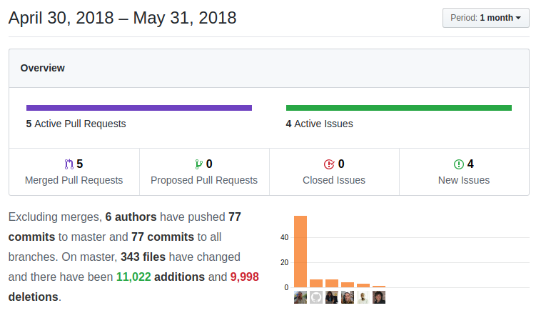

This May turned out to be what I expect to be a turning point in coreBOS future. I spent the first two weeks of the month traveling, visiting clients and the developer team in Albania, the conversations, mind-shifts, projects and ideas (not all pleasant) that I lived may very well take the coreBOS project and community into a whole new league. Time and our combined effort will tell. In the meantime here you have the things that happened to coreBOS in May. Enjoy!

===

! coreBOS Standard Code Formatting, Security, PHP7.2, and Optimizations

We continue this long-running project and eliminate warnings, a lot of lines of obsolete code, fix bugs, optimize and apply coreBOS standard code formatting all through the application.

We also try the very interesting [PHAN project](https://github.com/phan/phan) and upload an initial version of a [phan.config file](https://github.com/tsolucio/corebos/blob/master/build/cbSR/phanconfig.php).

In the **security category** we update the ADOdb library and catch an XSS possibility in ModComments

Besides updating ADOdb for the security issues we also get support for **PHP7.2**, so we also update the libraries: antlr, iCal, log4php and tcpdf which all takes us a lot closer to running on PHP7.2

 

 ! Developer
 - rename method from getWeekName to getDayOfWeekName in Translation extension
 - refactor editworkflow file
 - upload a [composer perspective example](https://github.com/tsolucio/corebos/blob/master/build/HelperScripts/Perspective_composer.json)
 - sort fields also by Block order to return correct order in Describe web service call
 - enhance web service translation to get better results according to labels in the application
 - method to check if the user has create permission for documents in Mail Manager

 

 ! Features

 - mark mandatory fields in red in Import field mapping in order to make them easier to find
 - emit an error message when failing to create related records during the import process
 - we change the way Mass Edit works, moving the code to [Server Side Events](https://developer.mozilla.org/en-US/docs/Web/API/Server-sent_events/Using_server-sent_events). This way the process continues in the background and sends messages of progress to the browser making the whole process more resistant and less error-prone.
 - deactivate Report export options if the user does not have export permissions

 

 ! Others

 - deduplication now correctly moves emails to the base record
 - stop inline edit when clicking on phone number link in detail view
 - calendar: fix action permission in profile
 - show field label on lead conversion missing mandatory field error message
 - fix vendor validation
 - vtiger crm 6.x migration scripts fixes
 - check document create permission instead of edit permission when creating attachment in MailManager
 - sum uitype 71 currency columns in ListView
 - use the internal function textlength_check to avoid MySQL Strict error when cutting long strings in ModTracker
 - as usual, we keep translating and fixing internalization issues: a lot of changes in Portuguese (Thanks Ranieri), Workflow, Validation, MassEdit and Import

**Thanks for reading.**

