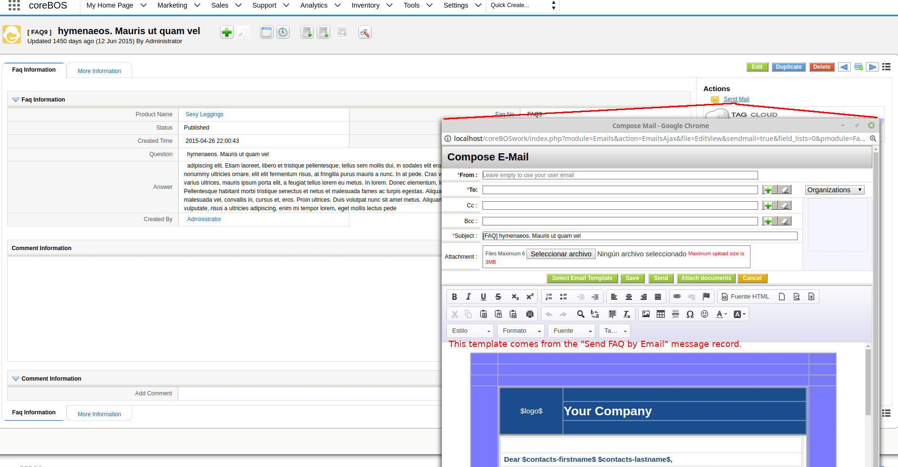
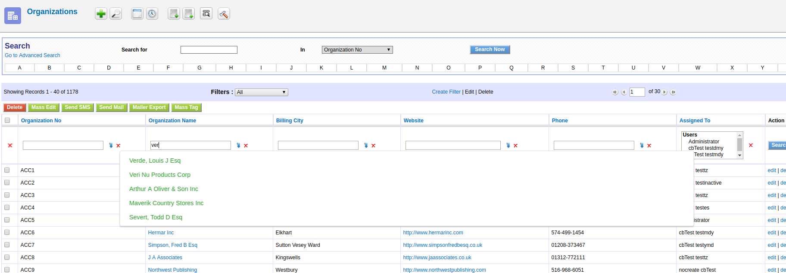
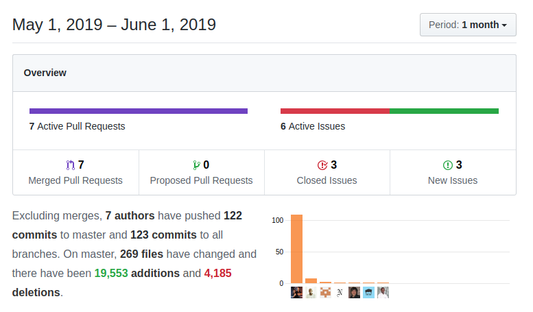

This month finds the whole team very busy on other projects so it turns out to be a slow month. Even so, coreBOS gets a set of fixes and enhancements while it proves to be more and more powerful as that backbone that permits us to implement stable and useful solutions for the companies using it.

===

 ! Features/Implementor

 - directly merge EMail template if only sending to one email
 - always merge email templates using workflow syntax and with related Account and Company module if the user has permission on those modules
 - migrate **mass tag** functionality from coreBOSCRM
 - add **add_workdays** Workflow method
 - send **FAQ** by email template and action

 - add autocomplete to List View column search fields

 ! Developer

 - add **PRESAVE** Business Actions support so we can now create actions that will be launched before saving and permit us to interact with the user and even stop the save if necessary
 - **pdfUtil:** add FPDF and FPDIProtection libraries for easier PDF manipulation
 - **pdfUtil:** implement PDFProtect, PDFFlateDecode2File, PDFDecrypt2File (using qpdf) and PDFIdentifyByNIF methods
 - Field Dependencies now correctly fill in RTE fields
 - Field Dependencies correctly merge individual field entries for picklist dependency so they don't get overwritten by the settings in the map: in other words, you can now combine dependencies defined in Settings with dependencies defined in the business map
 - we take another step towards implement **Filter Management module** by adding a field, a workflow and returning all possible views by module
 - permit sending **templatename** to load via URL when loading EMails window
 - add helper function **sendmailtemplate** to use the functionality load template functionality when opening email window
 - execute javascript code on List View filter change
 - return web service query language conditions for filters in GetViewsByModule web service method
 - return all picklist values accessible to the user including subordinate roles in Webservice Describe
 - permit creating records right after installing to avoid errors in changesets
 - QueryGenerator: eliminate duplicate columns in the query
 - force email sending on FAQ module
 - change TagCloud visibility function to return real boolean

 ! coreBOS Standard Code Formatting, Security, Optimizations and Clean Up

 - application: Quotes, EditView, Picklist, Reports, Users
 - eliminate duplicate line and warning
 - eliminate warnings on Inventory autocomplete search
 - delete unused templates
 - eliminate warning and temporary variable in favor of using direct value
 - formatting and PHP 7.3 continue/switch error
 - delete unused URL parameters in DetailView
 - eliminate redundant include in ExecuteFunctions
 - eliminate obsolete spinner code in Header
 - eliminate unused and inexistent modules from install
 - correct function comments in Picklist retrieve values function
 - eliminate unused code inherited from vtiger crm in Webservice list types
 - correctly detect PHP syntax errors in **continuous integration** command

 ! Others
 - Decision Table fixes and enhancements
 - make Emails window bigger
 - change default icon to ENTITY and add icons for Utilities, RecycleBin, Rss, Sites
 - add a warning about dependencies when adding, editing, and deleting picklist values
 - set new recurring invoice to AutoCreated status if no status is given
 - eliminate the usage of **TabData** cache file
 - set displaytype 3 fields that are not sent on edit in Account, Contact, Potential, and HelpDesk
 - get activate state from settings, not file which is not used anymore to register filter status change
 - avoid double slash in the backup file name
 - add profile fields of Company in install DB
 - update install database with latest changesets
 - respect field mapping map when capturing SO on invoice
 - center Workflow expression editor using LDS
 - set ajaxaction to Workflow on Creating a new Event.
 - better header formatting for OurSites
 - use correct module name when executing vtlib_handler from settings
 - correctly escape alias names in Reports totals to support all set of characters
 - recover TagCloud missing functions lost during Business Actions cleanup
 - do not block User editing on username error
 - write UserPrivileges sharing rules by role
 - calculate Users sharing privileges on user create and privileges change
 - respect home page components definitions on user creation
 - fix error in mkTotQuery and refactor functions after adding unit tests
 - decode input before cutting output with textlengthcheck
 - **Continuous translation effort:**
  - Application: pt_br and it_it
  - Contacts: template language picklist label
  - HelpDesk

**Thanks for reading.**
