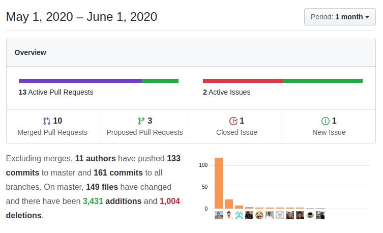

This month looks like it is all about infrastructure, as we use more and more coreBOS as that powerful backend business operating system that it is, we add functionality and features to make it easier to develop with. A new business map, more workflow and web service enhancements, and internal functions make for another interesting month!

===

 ! Features and Implementor/Developer enhancements

- support for saving seconds in DateTime fields if they are given (web service, for example). This is still not supported in the UI
- add new Business Map of type [Information Map](https://corebos.com/documentation/doku.php?noprocess=1&id=en:adminmanual:businessmappings:infomap)
- export only visible columns option in the Export process. We can now export only the columns visible on the selected filter.
- [import from the command line](https://corebos.com/documentation/doku.php?noprocess=1&id=en:adminmanual:businessmappings:import#corebos_based_import_process)
- save import default values in import mapping. The coreBOS import process permits you to save the relation of columns between your CSV file and the modules' fields. Now, this relation also saves (and recovers) the default values set during the mapping process. Thanks [Denald](https://github.com/denaldhushi)
- add Clickatell notification driver to SMSNotifier. Nice development that permits us to get live feedback of our SMS messages sent through Clickatell. Thanks [Fatjola](https://github.com/fatjola)
- SMS TextAnywhere provider
- correctly save, close and reload Email screens depending on where we are editing the email from
- [Launch Business Actions from ListView](https://corebos.com/documentation/doku.php?noprocess=1&id=en:adminmanual:businessactions#business_actionlaunch_script) runBAScriptFromListView
- functions to convert filter query syntax to Extended VQL syntax: getCVStdFilterEVQL and getCVAdvFilterEVQL, we also add a [mapping of operators between both syntaxs](https://github.com/tsolucio/corebos/blob/master/modules/CustomView/CustomView.php#L32)
- add **afterImportRecord** method that permits doing actions on each record right after import. This hook is very similar to the aftersave event with the only difference being that aftersave will be called on all save events, no matter where they come from while afterImportRecord will be launched only after the import save event.
- MassRetrieve
  - support users module
  - add cbuuid to mass retrieve
- support for uitype 10 fields in Decision Table Maps
- Updater
  - add support for normal import and export process, so we can easily share manual updates between systems
  - support undoing manual changesets
- **Tests:** keep getting some love and care as we fix things and add coverage.

<span></span>

 ! Web Service

- add possibility to return more information in web service call: [wsmoreinfo](https://github.com/tsolucio/corebos/blob/master/include/Webservices/Query.php#L67)
``` php
	return array(
		'wsresult' => normal result information as standard in coreBOS,
		'wsmoreinfo' => array(
			any additional => information you need to send back,
		),
	);
```
- Query total rows
  - using the new wsmoreinfo functionality we now return the total number of rows of a query through web service, inside the application the function stays the same
  - return controlled query totals when the query fails
  - add getQueryTotalRows to VtigerActorOperation
- getActorModules function in utils
- **getModulePermissionQuery** get SQL joins for a module to obtain the correct set of records for the user as per the permission system
- enhance **getViewsByModule**
  - add Extended VQL syntax for query conditions to response
  - add field information
  - add support for Users module
- mass retrieve (actor modules included) and mass update methods: **MassRetrieve** and **MassUpdate**
- unserialized global search method **GlobalSearchArray** and document both methods
- update Global Search to support latest ListView code, add support for ListColumn map based on Home module, and strip tags from results
- permit using file fields as normal fields
- avoid attachments in related records queries
- check if filename is an array on Document create/update
- better support for group/order/limit clauses in Extended VQL
- eliminate invalid fields from orderby clause
- return FQN in orderby fields and support special ID field
- add join for reference fields used only in the orderby clause
- correct detection of the admin user and eliminate an unused parameter
- correct type for ModulePermissionQuery
- do not add additional parenthesis in web service filter query
- fix error balancing parenthesis with IN operator
- partial support superfluous parenthesis on individual conditions
- return inventorydetails master-detail business mapped fields in product lines
- set product line comment to empty if not given
- return Business Question filter column decoded

<span></span>

 ! Workflow

- new workflow methods:
  - holidays difference
  - network days
  - [evaluate rule (business map)](../WFEvaluateRules) workflow task
  - [execute expression](../WFEvaluateRules) workflow task
  - send and read a message from coreBOS queue
- support information business map as a parameter for "holiday" parameter in all methods that use it
- support for getSetting (anywhere in the URL) for Token header in RunWebserviceWorkflowTask
- support GROUP_CONCAT aggregation
- fix Workflow: set active by default when creating

<span></span>

 ! coreBOS Standard Code Formatting, Security, and Optimizations

- coreBOS Standard code Formatting: Calendar, CRMEntity, Import, OOMerge, QueryGenerator, Search, Workflow, SMTP, Webservice, SMS
- eliminate old Calendar support
- eliminate obsolete uitype 62 code
- optimize SMTP check queries
- optimization delete an unused variable
- optimization change input parameter to avoid function call
- optimization use object we already have instead of calling function
- change implode for PHP7.4 support in OOMerge and Utils
- security in modules: set sharing to none if none are set
- security set not found field conditions to false instead of true in QueryGenerator to avoid data leaking
- documentation correct utility function header and the default value of variable according to the header documentation
- documentation correct Search function documentation and eliminate a warning

<span></span>

 ! Others

- update install database
- cleanup Webservice files and add license
- convert Workflow conditionMapping to public class property in case we need it elsewhere
- tweak PageHeader movement
- fix Time Control total time in XLS and HTML reports
- fix Business Question changeset which had "mark applied" in the wrong place
- do not execute sendreminder if Calendar is not active
- update List Column Business Map XSD for popup element
- update Business Map type of element value
- update Import Bussiness Map XSD to accept mapname
- change incorrect variable names for warehouse support in Edit View
- use columnname instead of fieldname in Emails to support when they are different
- Mobile: links and script defined on config.tpl are loaded
- permit access to filter when exporting
- respect column order when getting Export columns to view from the filter
- change inequality operator in Filters to reduce HTML conflicts (from <> to !=)
- change column type in Import table
- set current_language to user language in Import, if it is empty
- set Inventory shipping and handling to 0 if not given
- sync list_field and list_fieldsname when setting columns from the filter in List View
- increment field columnname metadata size
- send correct file name from GenDoc to OOMerge
- support cbuuid on direct insert in table for PBXManager
- make picklist_translations an Application changeset so we can apply repeatedly when we need to
- correctly convert to Invoice, SO and Quote from potentials with no product
- select block field value correctly for non-admin users in reports
- List View button error display (recently used div)
- correct variable name in SMS:clickatell driver
- SMTP per user: change array to normal variable and eliminate unused parameter that was throwing off the status save
- add missing variable initialization in Users
- uncomment delete field code left by mistake while adding delete usage checks
- constant translation effort:
  - Import: delete duplicate label in nl_nl
  - Workflow: pt_br
  - General: fr_fr

<span></span>



**<span style="font-size:large">Thanks for reading.</span>**
