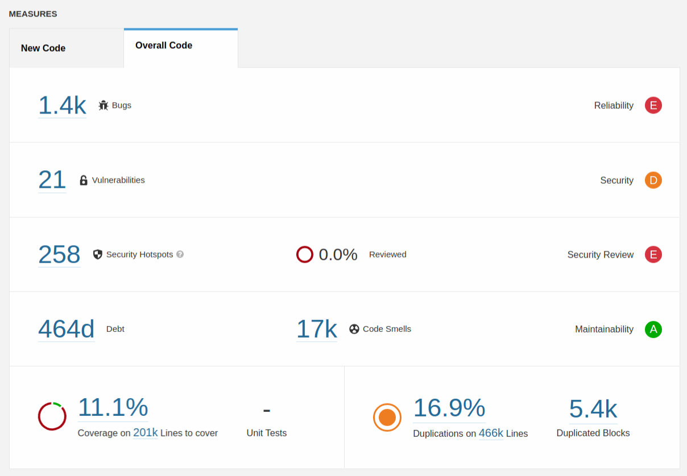
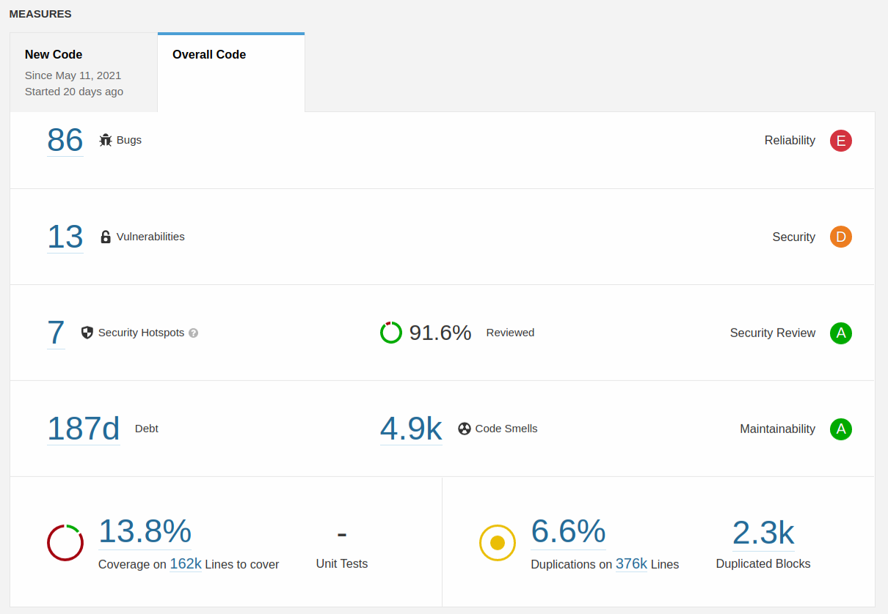
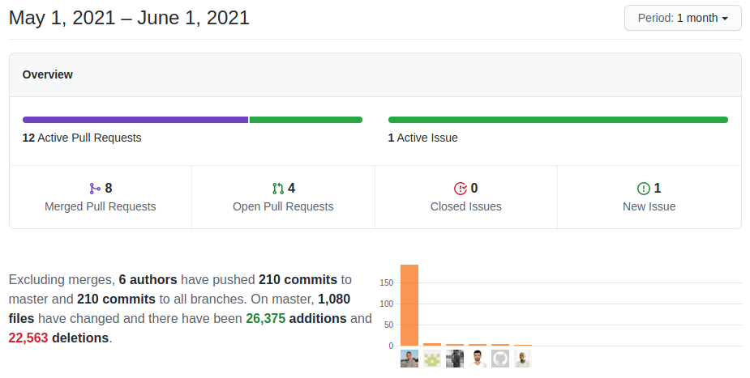

**Static Analysis month!** This month sees a set of master-detail related enhancements along with the typical set of changes.

===

 ! Features and Implementor/Developer enhancements

- add field "generatedtype" to field information cache
- add support for choosing the color of module records in the Calendar
- Fields meta-information: arrays grouping uitypes and helper methods to determine field types
- **Boolean field** class
- Add **Comments inline edit and copy**. Add permissions on comment edit and create. This is activated using the **ModComments_Edit_Inline** Global Variable
- Add **gcbpageisdirty** and **gcbpagewhyisdirty** javascript global variables to start a project to control the modified state of the page. Fill in the variables on CSRF detection and change CSRF message formatting
- make tax fields numeric
- **TerminateExecution** class to control calls to die in the code: permit unit testing on those functions
- protect Business Map conversion code if no map is given
- **Master-Detail Editor Project**
  - See our [previous post for more information.](../MasterDetailEditor)
  - don't save non-visible fields if the target module is different from the current module
  - filter map fields only on the target module
  - read link field from the target field in map
  - set widget name to protected
  - use correct values in inline edit and relate with origin module
- **DetailView Layout Map**
  - add CodeWithHeader/CodeWithoutHeader support, add a missing field in Widget and eliminate loadcode and handler_path from DetailViewLayout map
  - check field access permissions and add more information to fieldlist option in DetailViewLayout map
  - eliminate remnant loadcode from DetailViewLayout map
  - support for RealtedLists directive
  - support for sorting on layout editor
  - add handleToggle to the global scope so it works also in the right action panel
  - eliminate loadcode and handlerpath, fix things detected by formatting rules, apply typical micro-optimizations
  - icon paths and whitespace
  - support for FieldList
  - support for Widget and Code
  - use the map to get fields and information to show
  - add support for related list
  - more information on ApplicationFields option
- **Web Service Enhancements**
  - add querySQLResults to actor and ModTracker operations so they work with Business Question
  - get mass editable property
  - initialize language if not given
- **Workflow Enhancements**
  - implement add hours delay on workflow tasks
  - **getCRMIDFromWSID workflow expression function**: unit test adjustments and map getCRMIDFromWSID function name
  - **average workflow expression function**: format definition, move function to math file and implement SQL version
  - support HTML in expression values
  - add contain/doesn't contain operation on picklist type of fields

 ! coreBOS Standard Code Formatting, Security, Optimizations, and Tests

This month we start using [Sonarqube](https://www.sonarqube.org/) to analyze and guide the code. We integrate it with our unit tests to start putting the code coverage measure in sight and decide to keep using the sonarqube measures on a regular basis going forward.

The results of the initial effort of looking into the code smells uncovered by sonarqube are very visible. The two images below show the measures of the first run of the analysis versus the last run of May. Many of the changes listed in this month's blog post are directly related to the issues uncovered. Not only have we cleaned up and structured the code considerably, but we have also fixed another batch of errors and potential security issues. This is only going to get better and better as we go forward.

| First Run | Last Run May |
| --------- | ------------ |
|  |  |

- coreBOS Standard Formatting: eliminate warnings initializing vars, eliminate useless code and comments, format code
- Eliminate technical debt
  - delete useless comments (sonarqube)
  - eliminate commented code (sonarqube)
  - eliminate unused code and variables
  - initialize variables, rename variables to avoid conflicts, eliminate unused variables, fix comments, formatting
  - remove unnecessary boolean literal (sonarqube)
  - return consistent result in function
  - immediately return expression and eliminate some variables for constants
  - direct return value, eliminate redundant include, merge switch conditions
  - collapse IFs and restructure code to make it easier to understand
  - convert nested ternary operation to an independent statement (sonarqube)
  - eliminate obsolete uitype 67 code
  - rename variable to avoid collision
  - delete obsolete company files
  - eliminate unnecessary parenthesis and empty constructor methods
  - eliminate unused variables
  - eliminate unused/unreachable code (sonarqube)
  - unnecessary HTML
  - define javascript variables, optimize and eliminate assignments
  - eliminate console.log, unused variable and format code
  - eliminate some obsolete parenttab references that were causing warnings in new code
  - defensive programming, eliminate unused variables, reduce SQL columns
  - update deprecated HTML and CSS
  - javascript inline code formatting
  - throw dedicated exceptions instead of generic ones
- Refactor and duplicates
  - Field_Metadata::getBooleanDisplayValue. reduce duplicate code
  - reduce complexity and redundant code in Business Question builder function
  - call function instead of repeating code
  - use CONST for doesnotpass Decision Table result instead of repeating the code
  - Documents
    - constant instead of duplicate string
    - file icon duplicate code
    - file size duplicate code
  - getImageListBody, eliminate redundant code
  - refactor Popup switch to reduce duplicate code
  - use vtws_getEntityId instead of duplicating the code
  - move duplicate getListLeadMapping function and optimize it
  - remove javascript from Master-Detail grid header
  - eliminate unused variable and change name of a conflicting variable in Reports
  - merge duplicate translation code into one file
  - reduce duplicate Web Service code creating common function
  - rename potentially conflicting variable names in Web Service
  - convert duplicate workflow code into a common function
- apply LDS and standard protection to PHP version check
- add generate business maps javascript files to service worker cache
- PHP support: change deprecated curly brace indexes in graphs
- Continuous Integration:
  - exclude language files from sonarqube config
  - update files list and add sonarqube configuration file
- Documentation:
  - function headers, and comments (Filter/Utils)
  - non-stop wiki enhancements
- Optimizations
  - direct return results, merge IF conditions
  - eliminate intermediate variables for direct result usage
  - eliminate color picker polyfill in favor of native HTML color type input
  - eliminate commented code and unused variables
  - eliminate obsolete parenttab
  - eliminate redundant parenthesis (sonarqube)
  - eliminate unused variables and direct return results
  - eliminate useless code flow change
  - merge IF structures
  - simply IFs
  - remove literal boolean value (sonarqube)
  - replace if-then-else with return and eliminate unused variables for constants
  - reorganize IF for better maintainability in Calendar and Settings
  - return consistent result
  - use empty instead of count on array check
  - useless code and direct return values
  - eliminate duplicate code
  - simplify AutoNumber HTML, change table to div
  - use cached field information instead of database and search on column names in case they give us those in the ListColumns map (Business Map)
  - change HTML table to div in Calendar
  - delete unused/duplicated function
  - change GenDoc single switch statement to IF
  - eliminate unused parameter image_path
  - eliminate obsolete PostgreSQL support and use/return direct results
  - change IN for equal in Reports SQL
  - eliminate obsolete and unused create custom field code (Settings)
  - change variable for direct usage of value, eliminate redundant includes
  - eliminate unused useless function getCustomFieldTrans
  - substitute variable for a class property. eliminate unused variables
  - reduce SQL columns and use direct access to retrieve result instead of loop
- Security
  - merge IF statement with enclosing one (sonarqube)
  - rel noopener on external links
  - using http protocol is insecure. Use https instead (sonarqube)
  - eliminate/reduce the usage of eval in javascript: apply plus sign to make sure javascript is doing a mathematical sum and not a concatenation
  - cleanup changesets
  - set cookie to http_only in install process
  - do not force error_reporting nor display_errors in WebDAV
  - change executable bit on Zendesk PHP files
- Unit Tests: keeps getting more and more assertions

 ! Others

- substitute bunnyjs for TUIGrid in AuditTrail. LoginHistory is next!! anyone up for it?
- review whole Workflow system and all tasks to make sure they have LDS styling
- return empty Business Action link for Users module if the user is inactive
- render Business Actions template using correct module when on Users
- do not create Business Question Materialized View workflows if they already exist
- change Business Questions comparison for assignment
- error obtaining Business Questions getAnswer SQL with querySQLResults
- correctly show Calendar relation fields on related modules
- field visibility in Layout Editor for blocks that are not labeled
- set Currencies table minimum height so delete/transfer modal can be fully seen on screen
- (Currencies/Picklist) eliminate warning due to missing variable and standard module structure file
- support 'next 7 days' in filter and reports
- correct 'total' query stripping due to case and search from end (unit test)
- correct parenthesis in create folder name
- apply LDS to Documents storage configuration screen
- apply LDS to Payments block paid payments screen
- apply LDS to KeyMetrics/Home table and add background for standalone key metrics
- retrieve ename from Users when sending emails
- initialize property and eliminate inexistent field type from switch in Events
- correct number of parameters in function call of Filter/Report
- add missing mandatory module property in GenDoc class
- eliminate unreachable GenDoc code
- add missing HTML attributes in GenDoc and Photo capture
- correct HelpDesk variable name > missing dollar sign
- mark import as running to avoid starting it again when viewing status page and scheduled or manual launches
- skip undefined merge fields from merge query
- change external file src to local one in Install
- change incorrect function call for property check in (tcpdf) PDF header output
- assign lineitem_id to products on webservice
- set default font in MailManager CSS
- correct missing semicolon to separate instructions
- set Mobile current_language to eliminate error messages in log file
- change memcached function profile in Message Queue
- incorrect denormalize code inside ProductComponent static method
- handle boolean field translation during query generating
- employee field validation was broken in QuickCreate due to incorrect conditional
- protect is_admin functions from invalid parameter values while unit testing
- set correct parameters for getValidDBInsertDateTimeValue and vtws_addModuleTypeWebserviceEntity, use direct values and eliminate useless return
- sort related field response by sequence for capture fields
- multiselect picklists were not validating on the correct value to be saved
- set Version URL to httpS
- correct WooCommerce variable name. copy/paste error
- Translations
  - missing translation of block labels in Mobile
  - AuditTrail pt_br
  - Currencies translate hardcoded labels
  - DetailViewLayout
  - Settings new label and eliminate some whitespace
  - Users password changing message in ES
  - Workflow delay hours

**Thanks for following.**
