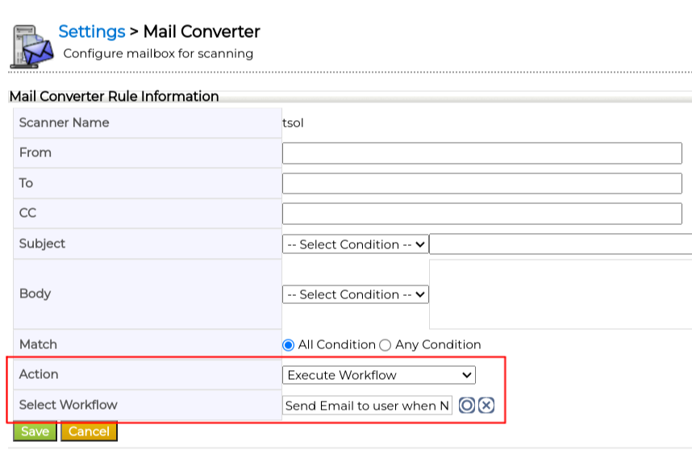
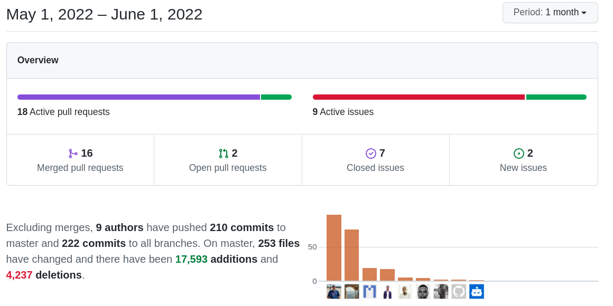

Another wow! month. New features, enhancements, and fixes to previous functionality. Just amazing.

===

 ! Features and Implementor/Developer enhancements

- **Mass Create Grid:** gets its' final touches and its own business map!
  - check and disable all fields
  - masscreate records if not exist
  - match only active fields in grid
  - show desert view if the map is not defined
  - show mandatory fields of the related module in grid
  - show match fields for selection
  - check if selected module is not false value
  - sort fields A-Z and do not save fields in map related modules are empty
  - use fieldnames instead of columnname for searchon paramter
  - use columnnames instead of fieldnames to find field types
  - validate all field values before save
  - create MassUpsertGridView map
  - add MassUpsertGridView map type
  - validate MassUpsertGrid map
  - add template file for map generator
  - allow users to select from the list of modules in fields related to more than one module
  - save match block for MassUpsertGridView
  - validate MassUpsertGridView map
  - delete ListColumns functions because we added another map type for masscreategrid
- **Paint2Document** add drawings and modify images before uploading them to coreBOS
- **External Links Documents** easily create documents from links using this [coreBOS Widget](../coreBOSWidgets)
  - create dropzone action that allows creating external documents
  - make dropzone widget a little smaller and translate correctly in ES
  - check for valid URL before save
- **Enhance Mail Converter** to support launching a workflow when an email arrives
  - add field for saving workflow in vtiger_mailscanner_rules
  - add fields on UI
  - add function to trigger webservice
  - change passed CRMID, and extract workflowid from mailscannerrule
  - pass correct crmId on worflow Excute function
  - show workflow action on detailview

- **Business Question** gets some attention as we fix issues creating and executing the query
  - only unset variable if params is an array
  - unset array context variable once it is flattened
  - use correct query variable
  - change Global Variable used for pagination and id var name to contextid
  - get current recordid for Grid type
  - remove JSON value check
  - remove limit from query
  - remove unused function and update default value
  - use query builder to add condition field
  - apply user permission restriction on query
  - remove duplicate check
- Business Map
  - add filter handling via Condition Expression business map
  - postProcess Web Service and Field mappings
  - add support on process map for mode and position tags Detail View Layout Mapping
  - FieldDependency support multiple condition search with **fieldDep_GetFieldSearch**
- Execute Function
  - **getFieldValuesFromSearch** with support for multiple condition array and related fields with workflow syntax
  - **getEntityName**
- **doNothing** PHP function
- create **Notifications_Enabled** global variable to block access to Notifications entry point
- use server side sorting for MasterDetail blocks
- Web Service
  - MassCreate support per-record validations using the validate meta-information directive
  - MassUpdate support per-record validations using the DORECORDVALIDATION meta-information directive
  - Get PDF name with CRMID
  - permit putting some operations on the queue. web service now supports a **cbwsOptions** array to configure the call. This options array supports the directive **launchfromqueue** and **queuedelay** that permit us to put the operation in the queue.
- Workflow
  - add expression function for return array of related record getRelatedRecordCreateArrayConverting
  - add condition when related module doesn't exist on corebos do map
  - add log message to setManyToMany task
  - add previous record values to context **previous_fieldname**, useful for saving or notifying about changes
  - add **randomnumber** expression
  - add reactadmin portal detail view URL to email templates
  - add support for context in template rendering
  - add JSON numeric check on json_encode method in the web service call task
  - format date uses today if no date is given
  - **mass activate/deactivate workflows**
  - **make all tasks optionally queueable** almost all tasks can now be launched from the queue by simply setting a delay
  - support minute delays. important now that we can put anything on the queue

 ! coreBOS Standard Code Formatting, Security, Optimizations, and Tests

- coreBOS Standard Formatting: eliminate warnings, eliminate useless code, variables, and comments, format code
- Mobile: eliminate MSDOS EOL
- Continuous Integration set docker container to alpine 3.15
- Documentation:
  - function headers, and comments
  - non-stop wiki enhancements (working a lot on this)
- Optimizations
  - use spreading to copy array in Field Dependency
  - faster and less memory intense action check in the index
  - reduce whitespace and concatenation operation in index
  - delete pricelist RelatedLists script
  - delete unused variables and whitespace in workflow
  - whatsapp workflow use direct values inside loop and return error message
  - add parameters in Web Service to support three types of output response
  - move Web Service functions to Utils file so we can call them in other places
- Security
  - get the purified list of modules in Layout Editor
- Updates
  - Toast tuiGrid library to latest version
  - Calendar change deprecated function
  - DOMPurify update to 2.3.7
- **Unit Tests:** keeps getting more and more assertions

 ! Others

- search in columns in advance filter
- DetailViewLayoutMapping empty check and XSD definition
- get fields from database if cache is empty in business map
- Field Dependency: support HTML input field values
- correctly assign relation and checkbox fields in Dependency Map
- avoid accessing undefined index defaultcompany
- block inline edit save (lost in previous commit)
- check if image exists before loading details
- use dataset uitype for 1025 fields
- Filter: add soundex and regexp in advanced filter
- Filter: use keys to move up and down in filter options
- Grid tooltip is missing when Application_ListView_SearchColumns is enabled
- use array value instead of yet undefined variable for module name in Grid
- Import: get Id of selected wf
- check if given ID belongs to the Account/Contact module to get address in Inventory modules
- Kanban: module not found error
- Layout Editor support for more than one relation with the same module
- List View
  - disable editor for 1024 field in listview
  - do not translate values in tuigrid listview
  - inline edits do not respect validations
  - select checkbox in massedit for uitype 1025
  - set default language if it is not supported in tuigrid
  - show actions in Calendar ListView
  - show correct values in listview for uitype 1024 and 1025
  - show group name in listview if a record is assigned to groups
  - use correct filter in tuiGrid mode for non-admin users
- Mass Edit: clear the field when changing the selected module for field 1025
- Mail Manager: correct ISO 8859 spelling
- Master Detail
  - dropdown entries are not translated
  - inline edits do not respect validations
- ModTracker
  - get microtime in float which is needed by number_format
  - updating changedon datatype, saving modifiedtime with microsends
  - use formatted value in ModTracker for uitype 1025
  - formatting the code
- ModuleBuilder
  - add get_attachments relation for Documents module
  - do not allow duplicated module blocks
  - eliminates spaces when creating a module
  - hide warnings in case the block has not created fields
- use fieldname instead of columnname for RelatedList dependents list
- prevent buttons from submitting forms in RelatedPanes
- complete support for multicurrency fields in Reports
- eliminate 100 character limit on URLs
- import/export condition map business action function
- vtlibPurify apply string operation only on string variable
- Web Service
  - directly return parameter if it is already an array
  - move params operation outside loop and correctly set the value in call
  - picklist default value was not setting from layout editor
  - recursive add and strip slashes for complex array structures
  - use GenDoc_Default_Compile_Language in getmergedtemplate
  - fix module label translation issue in Describe
  - last record is lost if there are more than one reference fields
  - returning JSON response
  - adding values to the body when not declared on URL
- Workflow
  - correctly select the action in setManyToMany task
  - infinite loop in upsert task if we create the record in the same module
  - remove condition for checking module existence
  - return only mapped fields
  - Using current login user details
  - change varchar length for wf name
- Translations
  - translate incorrect label in Header
  - add Show More label
  - update pt_br and es_es files
  - Calendar/PurchaseOrder/SalesOrder: eliminate HTML entities in favor of UTF8
  - Business Map
  - Document Folders
  - Dropzone
  - MassCreateGrid
  - ModuleBuilder
  - Notifications
  - Paint2Documents
  - TUIGrid: use coreBOS user language in Grid
  - TUIGrid: pt

**Thanks for reading.**
