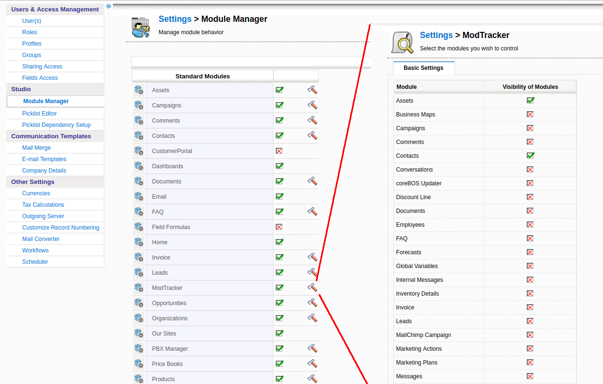

A set of long running projects, Google Calendar Sync changes and [MiBew integration](https://mibew.org) have us occupied, so there aren't that many changes in the base coreBOS applications this month, but still, some interesting changes make it in.

===

 ! Move to jQuery

This long running project that landed last month and which has a very big impact in the code keeps us busy this month also while we finish eliminating all the prototype references.

 ! Import Enhancement to search users on any field

In [April 2014](../March-June2014) we enhance the import process so you can search related entities on any field. This month we do the same for user fields, so you can search for users in any field of the user module.

You can [read all about this functionality on the wiki](http://corebos.org/documentation/doku.php?noprocess=1&id=en:import_special).

 ! Settings Clean Up

Another long running project we have is to reduce or completely eliminate the settings section. The goal is to permit any user who needs to access some settings to be able to do so. Instead of having one hard coded rule of access to the settings section, whereas you are an admin or not, when we convert a settings section to an extension or module you can define access rules for it like any other module, so you can have different groups of users with access to configuration options without giving them full admin rights.

Another goal of this project is to create a consistent user experience. Instead of having a configuration settings section specifically targeted at the functionality of one module/extension we move those settings to the module manager settings that each module already has.

This month we directly eliminate the proxy section, which was useless, and move the modifications tracker to module manager settings.

 ! Google Calendar Integration

Google changes their Calendar API and makes the previous version obsolete and discontinued, so we have to update our code to keep the calendar events synced with Google Calendar.

 ! Some others:

 - Support for capture/reference fields (uitype 10) in any form
 - Copy contact to invoice on quote conversion
 - Debug_Report_Query Global Variable
 - [Asterisk integration](http://www.asterisk.org/) enhancements: better default values
 - Mail export fix for apostrophe
 - Mail converter enhancements from scanner field on ticket for work flows and select assigned user
 - vtlib API: protect field creation. The API will not duplicate fields that already exist
 - Eliminate warnings, notice, MySQL strict and code cleanup (this one is a constant every month, even today).
 - Translation. Notice warnings, eliminate unused code, cleanup

**Thanks for reading.**

