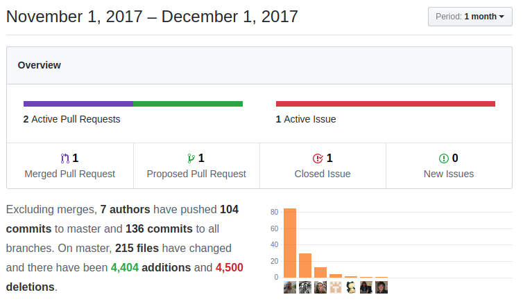

Another month-full of changes, enhancements, optimizations and security revisions. We set the path to **PHP 7.2**, add more functionality to the workflow system and knock off a couple of long-standing issues in our endless To-Do list while we continue to migrate to the new calendar and reporting system.

===

 ! Calendar

 - close action on calendar and list views to easily mark tasks as done
 - eliminate code for the special CLOSE column in the old calendar
 - detail view link on the subject for quick access to full event details
 - permit ordering the calendar view left panel contents via a hardcoded array. Some users think that the modules menu should be at the end of the four blocks while others want yet some other order for the blocks so we add a hardcoded array to indicate the order of the blocks. If we get enough requests we will implement a global variable or business map so we don't have to modify the code.
 - filter out emails from activity related list
 - make calendar Completed status non-editable as it is used in the code
 - only insert activity reminder if it isn't already present
 - set Accounts as default module in related to capture field of the calendar
 - set correct conditions for Notify when a task is delayed beyond 24 hrs
 - translate old calendar date time fields to indicate that now they show the system date time, in other words, the start and end date/time fields will always be shown in the timezone of the user accessing them even though we save them internally in UTC, but the native date/time fields will be shown in UTC.

<br/>

 ! Invoicing Records

It is a common use case to want to create an invoice from any record in the system. The way coreBOS proposes that you do this is by adding an Account and a Contact relation to the module you want to invoice and then two many to many related lists, one to products and another to services. Once you have that (which can all be done from the inside the application) you add an action link which calls the EditView script on the Invoice and pass in the variable **convertfromid** with the crmid of the record. coreBOS will open a new invoice and fill in the account, contact, address and inventory lines from the products and services in the related lists.

 ! Not Accessible Picklist values

We eliminate NOT ACCESSIBLE message for role-based picklists, now values are always visible. Even though the user cannot set values she does not have permission to access, she can still see the value set in the field

 ! Webservice

- make extended query double quote work like standard VQL
```
select * from Contacts where firstname='M''gann M''orzz'
```
- throw an exception if no id is given in revise endpoint

<br/>

 ! Optimizations and Security

 - reducing usage of 'select *'. this optimization really surprised me, I expected the minor memory reduction that happened but the speed enhancement was a nice find
 - we add session cache for ispermitted calculations. the **ispermitted** function is one of the heavyweights in the application as it has to decide if any given user can execute some action on a record. The result usually does not change for a user so we save this result in the users' session, bringing a significant enhancement to the daily work of the user. Note that it was already mandatory for a user to log out when the profile permissions changed but now the results will be completely wrong if he doesn't.
 - reduce picklist SQL to retrieve less information and not sort
 - use isInsideApplication to verify changesets location in coreBOS Updater
 - php 7.1: review all 7.0 to 7.1 migration changes and bump supported PHP version
 - php 7.2: eliminate the use of obsolete each in Accounts MailerExporter
 - php 7.2: eliminate get_magic_quotes_gpc which is obsolete and probably will be eliminated in PHP 8
 - php 7.2: eliminate the use of obsolete create_function in OOMerge

<br/>

 ! Workflow

- add new function **aggregation_operation**. This function permits to add operations between fields directly to the query so we can do calculations like this:
```
aggregation_fields_operation('sum','InventoryDetails','listprice*quantity')
```
- add new get image URL workflow function
- add new power/exponentiation expression function
- generic support for expression functions with workflow record context via environment parameter. __needscontext__ in database
- add new Global Variable to set a [personal nominatim server](https://nominatim.openstreetmap.org/) to get coordinates from addresses
- refactor getGEODistance to save 1 call
- now we use Workflow_GeoDistance_Country_Default global variable to define country code: es,fr,gb,de,.. if we have this set we pass this as the countrycodes parameter to nominatim server to reduce errors
- compare birthday fields using month and day in today expression
- no more Calendar and Events workflows: use cbCalendar
- vtGetModulesAndExtensions correct SQL to get all installed modules and extensions

<br/>

 ! Developer and Implmentor
 
 - enhance QueryGenerator with support for asterisk field to get all fields
```
$queryGenerator = new QueryGenerator('Accounts', $current_user);
$queryGenerator->setFields(array('*'));
$query = $queryGenerator->getQuery();
// will return all fields the user has access to
```
 - add [deleteStartsWith](https://github.com/tsolucio/corebos/blob/master/include/utils/Session.php#L283) method to coreBOS session control class which permits us to mass delete all session variables that start with a given prefix
 - add [updateLink](https://github.com/tsolucio/corebos/blob/master/vtlib/Vtiger/Link.php#L281) API method to the Links endpoint
 - make creating modules easier by setting replacement text for main class names that change
 - set default value for displaytype in coreBOS Updater mass create fields
 - translate Validations custom labels locally first
 - support for importing custom validations in same file in same map

<br/>

 ! Others

 - We start applying the coreBOS code recommendations both in new and existing code, cleaning calendar, filter, home, menu, picklist, base code (for new modules), and workflows among others.
 - eliminate obsolete change status/owner code
 - delete an unused file in Settings
 - eliminate deprecated workflow function: use VTWorkflowUtils::vtGetModules()
 - convertTextFieldToMultiPicklist script, to convert uitype 1 in uitype 33
 - move all cache usage from test to the cache directory
 - the Mobile extension gets a new Global Variable called **Calendar_Show_Only_My_Events** that will hide all events that are not directly related to you, so you only see your assigned, shared and invited  events
 - icon to mark an email as sent or received in Emails related list
 - change the way we decide if an email is sent or not
 - fix incorrect email list query for non-admin users
 - Home: eliminate calendar specific code and apply cbSR formatting
 - Home: migrate calendar widgets to new calendar module
 - Home: some default widgets were not showing contents due to incorrect if block
 - correct file path method in the Backup code
 - define start step on import more button
 - incorrect contact zip code field names in potential conversion to Invoice
 - JSCalendar: always set next month date to the first day of month so calendar field dependencies work correctly
 - Picklist: eliminate old calendar module from picklists
 - Picklists: avoid adding empty entry on create
 - send Email with PDF doesn't retrieve correct PDF filename in PurchaseOrder
 - correctly return email module for special -1 user encoding in getModuleForField
 - A lot of translations happen this month, menu editor, dashboard, global variable... It is surprising that so much time still has to be invested in this after all this time
 - eliminate warnings, notice, MySQL strict and code cleanup (this one is a constant every month, even today)



**<span style="font-size:large">Thanks for reading.</span>**

