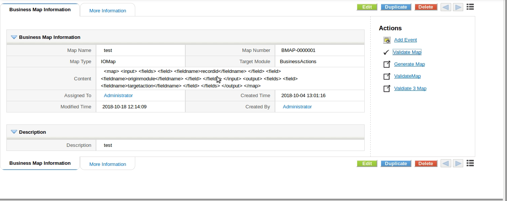
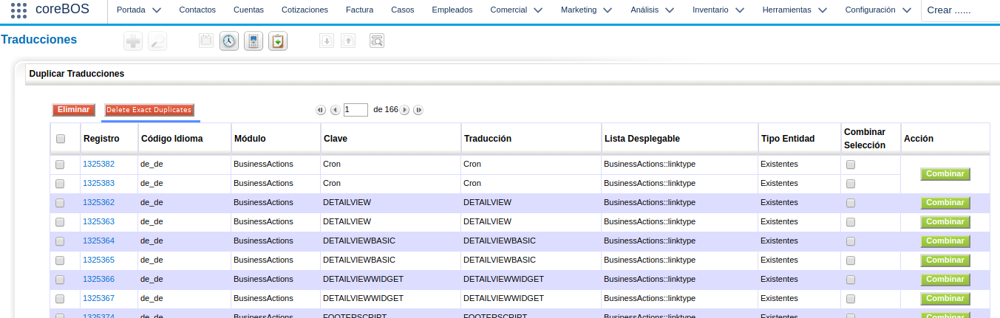
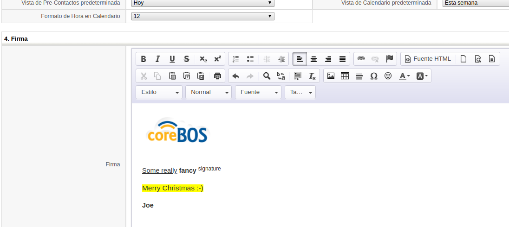
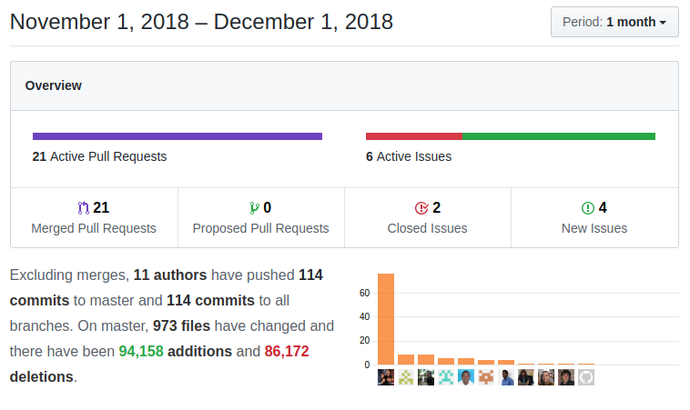

Another frenetic month of new features and enhancements. We add some really important functionality to Scheduled workflows and make coreBOS PHP 7.3 compliant (waiting on some external libraries to be updated). All that with our continuous optimization efforts and bug fixes. Another incredible month!

===

 ! Security, Optimizations and PHP support

- eliminate unnecessary if-else in EditView
- delete obsolete code in Emails
- eliminate unused Contacts image code
- eliminate an unused variable in the Products image carousel
- refactor Workflow aggregation get Query function
- replace is_array..array construct for more performant array cast
- add static cache to PickListUtils
- use stored variable instead of a function to get values in profile calculation
- optimize get Role and Subordinate Users
- eliminate execution bit
- update Smarty library to latest release 3.1.33 for security
- upgrade deny to apache 2.4 as suggested in [Nextcloud Issue](https://github.com/nextcloud/news/issues/340) for Web server security
- PHP 7.2 and 7.3 support
 - change each in KCFinder
 - eliminate obsolete and unsupported library PHPExcel
 - add new Excel export library PHPSpreadsheet
 - update Reports excel export to new phpspreadsheet library
 - avoid warning restarting initialized session and support strict session starting
 - update PEAR library
 - eliminate warnings

 ! Features and New Stuff
- Validate Business Maps: Business Maps are a fundamental customization feature in coreBOS permitting us to activate all sorts of special functionality but their XML based syntax makes it difficult to make them work. This month [Besart](https://github.com/besartmarku) adds a validation functionality that helps us construct correct XML maps. If all goes as expected Santa will bring us a graphical editor for the business maps.

- Migrate Vtiger Links into BusinessAction Entities. A few months ago we added the **Business Actions** module and this month [Kliv](https://github.com/klivstudiosynthesis) finished implementing all the internal changes to effectively move all the action links and button functionality in the application to this module. He not only migrated all the existing actions but he also replaced all the vtlib action API to work with new action module so all the previously existing code should just work. A very good job!
- Email WorkFlow comments meta variable now supports TABLE format. This necessity appears due to the lack of CSS styling of lists in Microsoft Outlook. The idea is really simple, instead of UL and LI HTML elements you can now get TABLE, TR, and TD
- This month sees the arrival of another module: **Business Questions** which will be a pivotal analytical module in early 2019. More to come :-)
- DeDuplication now supports Delete Exact Record Duplicates action with which we will be able to massively delete all the records with the exact same values in all the search fields

- always merge email against related account if it exists no matter what module we send email from, this way Account variables will always be converted
- **Product Component** module arrives and will be replacing the product bundle functionality next month. Instead of having a very poor Product-Subproduct functionality we will have full control of this relationship through this module permitting us to indicate the number of subproducts and any other custom fields your business may require
- activate RTE on User EMail Signature field in preferences

- Field Preview type on a profile. Each field now has an additional property assigned per profile. This property, called **Preview** has 4 values, Title, Header, Body, None and represents where that field should appear for this profile in the Summary view. We still don't have a summary view mode but we are working on it ;-)
- eliminate unused substitution and use http**S** as the default value in DetailView URL field
- add correct HTML headers in email if missing to reduce spam count
- add **time_to_sec** aggregation function in Workflow
- A very important workflow enhancement lands this month in the form of a whole new range of supported functions for the **Scheduled Workflow conditions**. Before this change, the set of supported conditions was limited mostly to time-based and very basic comparisons. Now we support almost the full range of workflow expressions constructing the correct SQL in each case. From an administrator point of view, it basically means that you can now create very complex scheduled workflow conditions, from a developer point of view it means that we can now use the workflow query engine to generate very complex analytical queries.

 ! Developer enhancements
- QueryGenerator: add **setReferenceFieldsManually** method that permits forcing JOINs
- permit using Related Records web service method from inside the application
- change phan exclusion on PHP export library
- delete incorrect template string in base module file: ModuleFile.php
- incorrect variable check on SQL insert helper in Database class
- **vtws_getAssignedGroupList** internal group retrieving function
- add the response of getRelatedModulesInformation to Describe thus avoiding extra calls to the backend
- add possible user and group options to uitype owner field in Describe thus giving the frontend developer information they need to create the selection without having to call the backend again

[plugin:youtube](https://youtu.be/VmimEXQmOOI)

- add support for queries using workflow conditions in Webservice. Based on the new functionality in the Scheduled Workflow engine we create yet another web service query dialect with which we can construct very complex analytical queries and there is still more magic to come in the next month. This query dialect is thought to be machine designed, not created manually. To get an idea of the syntax, the power and the SQL generated have a look at [our unit tests](https://github.com/tsolucio/coreBOSTests/blob/master/modules/com_vtiger_workflow/WorkFlowSchedulerQueryTest.php).

 ! Fixes and changes
- Allow list price in Purchase Orders to be filled with the cost price when selecting a product and always set the list price to cost price when the current module is Purchase Order
- add support for custom image fields in Mobile UI
- align currency numbers to right in Related Lists
- fix a problem when Google token comes as an array in Calendar
- change uitype of Payment currency fields so they get supported in the list view aggregation
- eliminate LDS external rawgit dependency
- make sure GlobalVariable and Menu are activated always during initial load
- increment size of the Document Title field
- correct if condition in SalesOrder to correctly capture account/contact address
- do not add custom fields in DeDuplication query as it was breaking this functionality on custom modules
- remove data-prefetch to not load always DeleteConfirmation screen in Mobile UI
- check if Payment related entity exists before calculating amount due totals
- support for images with the same name in different positions as Company logos
- CronTask watcher get global variables with admin user ID
- missing record update when clicking select all option in MassEdit
- round MassEdit progress for better output

 ! Others
- coreBOS code formatting and eliminate warnings
- eliminate library reference we do not use anymore from Licence 
- translations (i18n)
  - Better Dutch translation for reorderlever in Products
  - Correct location to set inventory header price label
  - Improve units del/rec Dutch translation
  - Rename price column in PurchaseOrders
  - Update InventoryDetails Dutch language missing translations
  - Business Actions
  - cbMap: validation functionality
  - Company pt_br
  - DeDuplication Delete Exact Duplicates
  - Update Dutch lang JS file

**Thanks for reading.**
