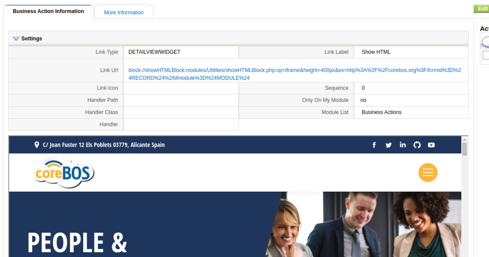
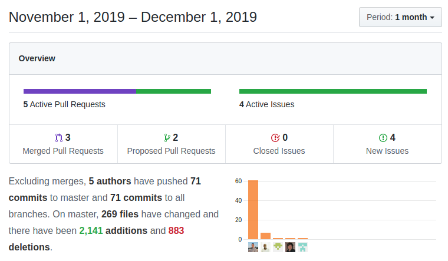

A normal month of steady fixes and changes mostly coming from external projects that need coreBOS to do some new things or find some error in the functionality. The workflow system gets a lot of attention on it's way to another uphaul. Also preparing our way to PHP 7.4 which will be released soon. Enjoy!

===

 ! Features/Implementor

- support for evaluation of Condition Expression Business Maps with context variables and no CRMID (useful for "create record" validations for example)
- functions to help with the execution of Business Actions and Workflows from inside the application
  - [Business Action::Launch script](https://corebos.com/documentation/doku.php?noprocess=1&id=en:adminmanual:businessactions#business_actionlaunch_script)
  - [Business Action::Launch workflow](https://corebos.com/documentation/doku.php?noprocess=1&id=en:adminmanual:businessactions#business_actionlaunch_workflow)
- Question module gets a new Business Action that permits the execution of an external (Python) script, passing it the information of the Question and database access details. This facilitates sharing coreBOS information with [Apache Spark](https://spark.apache.org/), [Superset](https://superset.incubator.apache.org/) and/or other external data analysis tools. To permit the script to be executed you must manually add it to the `authorized scripts` database table (this is a security measure).
- The new `showHTML` Developer Block which permits to load a URL in an iframe inside a block, also supports `$RECORD$` and `$MODULE$` context variables. something like this:
```
block://showHTMLBlock:modules/Utilities/showHTMLBlock.php:op=iframe&height=400px&ex=http%3A%2F%2Fcorebos.org%3Fifcrmid%3D%24RECORD%24%26ifmodule%3D%24MODULE%24
```

- the coreBOS validation engine only validates non-empty fields or the empty ones that are required with other fields. We enhance this so that empty fields with an `expression` validation are always validated because the expression rules can evaluate any sort of conditions even when the field is empty.
- we change **Validation Map Names** to follow the same convention as other business maps: they are applied by name and ending in `_Validations`. This permits us to have validation maps which are not automatically applied. and makes the configuration more consistent.

<span></span>

 ! Developer enhancements

- pass cbcustompopupinfo fields to add_related_list also in Popup. Useful to pass custom information from the related list to the popup and back to the set relation code. I used it this month to set two related lists in the same module and be able to distinguish which one I was working with as both had the same related module.
- permit deactivating advanced search in Popup with the Smarty variable: NOADVANCEDSEARCH
- coreBOS Related List event filters for `corebos.relatedlist.editlink` and `corebos.relatedlist.dellink`. Especially useful for related list custom actions but also can come in handy when customizing the existing actions.
- refactor Detail View common hidden inputs reducing the logic of these fields and adding HTML IDs to make it easier to work with the hidden fields
- have a look below at the Workflow Enhancements as there have been some developer features there

<span></span>

 ! coreBOS Standard Code Formatting, Security, and Optimizations

- Standard Formatting and warnings in Custom View, vtiger crm 6 migration, workflow and application
- correct function comment and eliminate an unused variable
- optimize GenDoc "enletras" directive
- refactor Custom View advanced filter definitions and options
- eliminate obsolete hardcoded Calendar module references
- refactor Detail View common hidden inputs and eliminate calendar module reference
- PHP 7.4 changes in reports, custom view, and tags among others
- update ADODB to the latest release for PHP 7.4 and security
- update HTMLPurifier to the latest release for PHP 7.4 and security
- update FreeTags for PHP 7.4 support

<span></span>

 ! Workflow Enhancements

This month has seen a lot of enhancements in the workflow system, not only because, as you all know, it is one of the fundamental stepping stones of coreBOS functionality, but because we are preparing a `Mass Actions` functionality release based on them. Stay tuned!

- set CronTasks module permission to module settings, not hardcoded admin. So now any user with profile permission can access and manage
- set Workflow access to the CronTasks module so now anyone with access to CronTasks module can also access workflows, not only admin users
- eliminate `Settings` sidebar menu in scheduler editor and workflow editor
- permit defining custom workflow methods for all modules with a star (*). When we register a workflow custom function we must indicate which modules it applies to, now we can use start to create functions that will apply to all modules
- permit setting data array from outside the class (for validations). The VTWorkflow class is used to give context to execute workflow tests and launch workflow tasks. This class gets its values from a CRMID (a record). Now we can load an array of the values with no CRMID which permits us to evaluate workflow expressions and launch tasks only with data.
- we also enhance workflow environment stub (cbexpsql) with more functionality like the main class so we can use it in the evaluation of expressions with no crmid
- permit the selection of workflows in capture fields (uitype 10) and related lists
- add index and listview for standard module access
- do not fail complete workflow when one task fails, write errors to log and exception if called from web service. we add another level of control to workflow execution, now when a task fails with a catchable error we will capture and log the error and continue to execute other tasks and workflows
- **Workflow Context** this very important enhancement permits sharing information between all workflow tasks and workflows themselves during the execution of a set of workflows, but what is even more important is that the context array can be set when launching the workflows with any values we may need (using field mapping business map) and can then be consumed by any workflow task. Imagine that we modify the workflow `send email` task to look first in the workflow context for the recipient of the email, we could easily override the default behavior with any external logic we may need.
  - shared workflow context among tasks and method and expression functions (`getFromContext` and `setToContext`)to get and set it
  - send back context so it can be shared between workflows if needed
  - set context when calling from ExecuteFunction and Webservice APIs
- start and end events for each task: `corebos.filter.WorkflowTask.start` and `corebos.action.WorkflowTask.end` you can combine these events with the shared context to do all types of ad hoc customizations
- support for normal CRMIDs when creating a workflow entity
- use the start/end workflow task methods to make sure all tasks are run in the context of from_wf
- add missing expression functions to frontend
- add ScanBarCode metavariable for emails
- activate/deactivate all workflow tasks

<span></span>

 ! User changes and fixes

- Business Actions execution workflow: use web service user instead of current_user and apply some license adjustments
- sort Business Maps picklist
- merge existing values with array context, mainly to respect ID field, when evaluating Condition Expression maps
- GenDoc: correctly detect workflow expression and obtain compile without formatting
- GenDoc: pass around `applyformat` parameter in retrieve_from_db and add it as an option in compile
- show error in Home widgets when a module is inactive or the user has no permission
- emit error message on incorrect table creation when installing modules
- Layout Editor uitype 10 enhancement is breaking some other actions
- add loginhistory table if not exists and add new columns to workflow and profile for migration from vtiger crm 6
- call expression validations directly with context when creating new records as coreBOSRule requires a CRMID context which we do not have
- in condition expression validations when creating a new record we now send the screen values as context instead of ID (which was getting the database values, not the screen ones)
- trim spaces in web service related query dialect columns so we can match them correctly with permitted columns
- simplify header structure for CronTasks and Workflow and apply some LDS
- **Continuous translation effort:**
  - Documents: pt_br internal/external
  - Workflow: activate/deactivate all tasks
  - Business Maps: add missing translations



**<span style="font-size:large">Thanks for reading.</span>**
