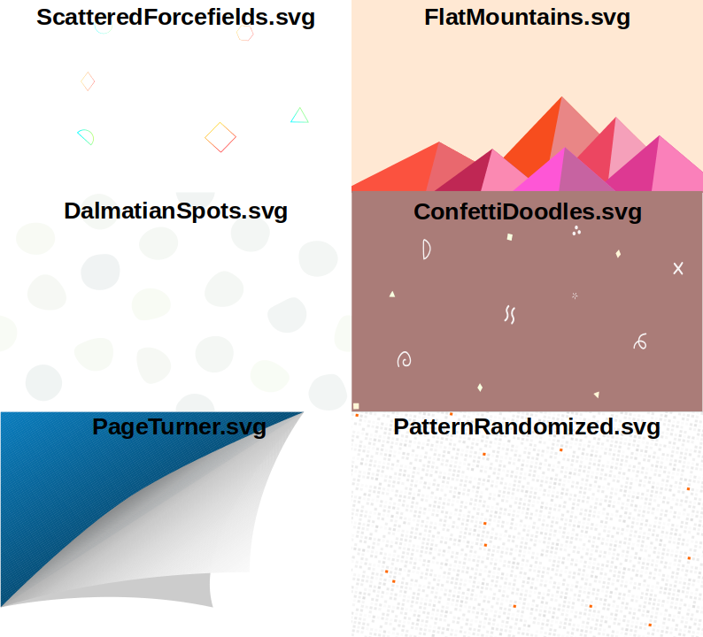
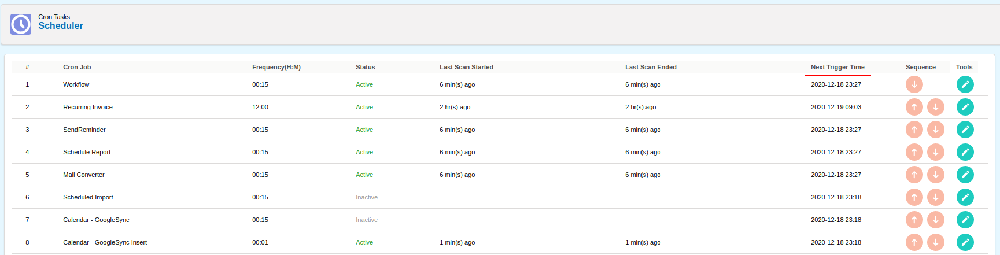
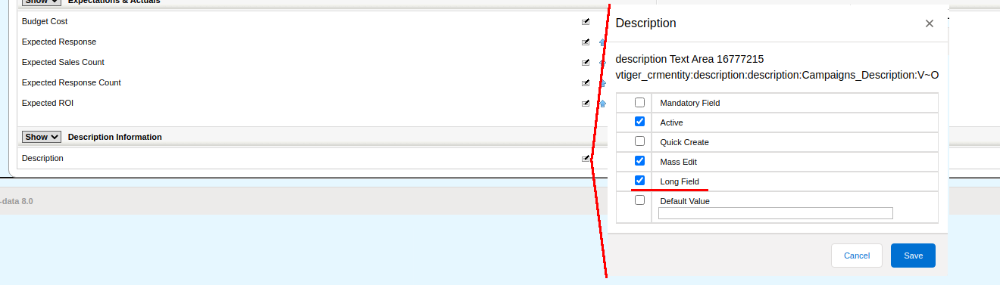
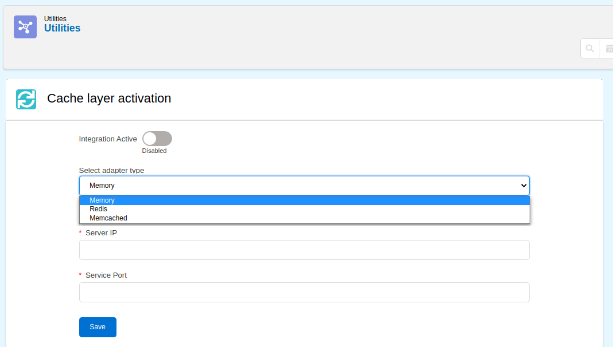
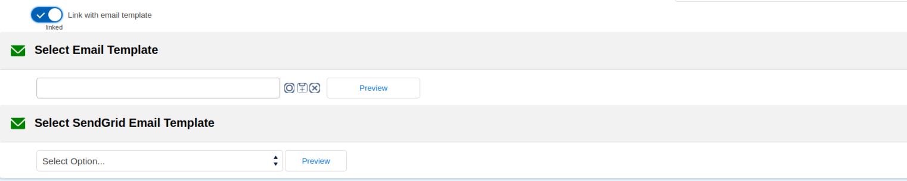
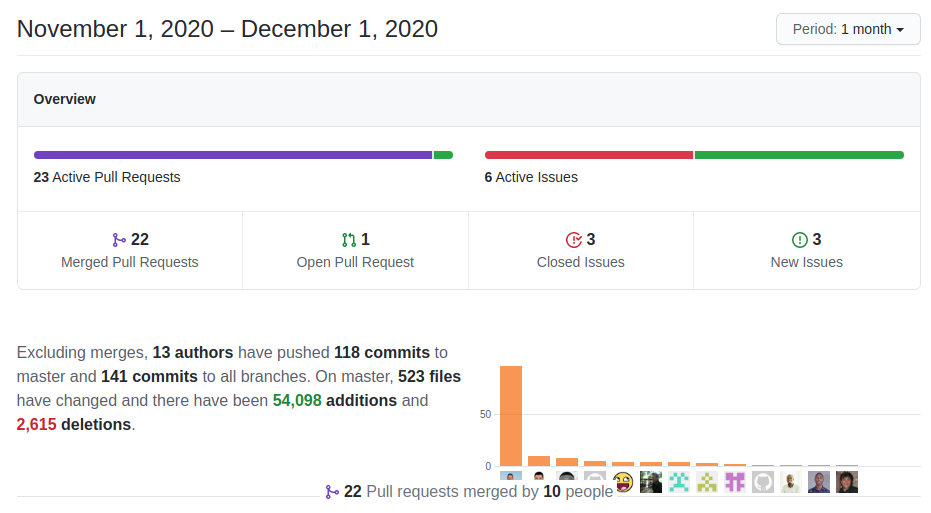

A very interesting month. While most of the development is now happening on the [Denormalization Branch](../denormalize) the master branch gets a rich set of new functionality enhancements. Have a look at all the new things you can do!

===

 ! Features and Implementor/Developer enhancements

- add some background images for **Application_UI_CoverImage**

- **Business Question** gets some enhancements in the builder to support context variables, export to file option, and support for alias in the query columns. This takes the builder closer to an ad hoc reporting system, converting it into a powerful data extraction tool. We are currently working on some other enhancements for better support of native SQL queries. I think the builder is going to become a new reporting interface. Very promising!
  - add functionality for Denorm_Views Export
  - remove variables from conditions
  - add support for new select function screen
  - export results with Alias
  - get context_variable from the request in two steps
  - get headers in two steps

- [OneSignal Integration](../onesignal)
  - add debug message and correct test message parameters
  - test message
  - add space to avoid Smarty/Javascript bracket conflict
  - eliminate warning and format code
  - move logout to href instead of span for better onclick support
  - move sendDesktopNotification to OneSignal class
  - only add unregister OneSignal if it is active
  - remove call to remove external user id  on user logout
  - change variable for constant and eliminate trailing comma in JSON object

- **Product/Service Autocomplete search**. Luke, once again takes this functionality a step further adding some important fixes and functionality. [Read all about it here](https://gist.github.com/Luke1982/d886a67eb661db777d93e7e645076ecc).  Thanks [Luke](https://github.com/Luke1982)!
  - [Add compound search field support](https://gist.github.com/Luke1982/d886a67eb661db777d93e7e645076ecc#search-in-compounded-fields)
  - Add **Application_ProductService_Search_Autocomplete_Limit** global variable that allows tuning the search limit
  - Convert unit price to requested currency if given. will be used if there is no currency set (actual price) for that currency
  - Don't show vendor and manufacture part no when they are disabled
  - MultiCurrency support

- show next possible trigger time in Scheduler

- Long field type editor. Now we can choose in the layout editor if we want a textarea field to occupy one or two cells in the detail and edit views.

- **coreBOS cache integration**. Very interesting work from [Kliv](https://github.com/klivstudiosynthesis) adds a [PSR-16 cache](https://www.php-fig.org/psr/psr-16/) layer to coreBOS supporting In-Memory, Redis, and Memcache. He is currently working on the coreBOS bottlenecks to use this cache layer there and make the application faster. Especially in those installs with a large number of users, roles, and complex permissions configurations.

- Workflow
  - **Email task with linked templates.** We can now select a coreBOS Message Template record and LINK it to the email task. Before this change, you could select a message template but it got COPIED to the email task, any changes you made in the template after it had been copied were not applied to the email. Additionally, we enhance our SendGrid integration to support selecting templates created in SendGrid. This is **extremely powerful** because we send to the SendGrid template all the fields and records that are reachable from the record triggering the workflow. This means that you can use [SendGrid Handlebars](https://sendgrid.com/docs/for-developers/sending-email/using-handlebars/) and fill them in with fields from coreBOS. The syntax of those handlebars is identical to those used in the GenDoc extension, so you can copy/paste them using the GenDoc Labels extension. 
  - **expression function selector** with documentation [plugin:youtube](https://youtu.be/WpPnH1a9yvY)
  - **Events_Related_Contacts** list of related contacts emails metavariable for Calendar: easily send emails to all related contacts
  - **support for copying image fields** from one module to another on Create workflow task. coreBOS intelligently copies a reference to an image field when you duplicate a record. In other words, if you duplicate a record with an image and do not modify the image, the image will not be duplicated on the hard disk, only a reference to the same image will be saved. Now, when you use a Create workflow task to create a record from another record triggering a workflow you can select the image field and it will get copied to the new record being created as a reference.
  - **execute all tasks immediately in schedule mode** there is no need to schedule emails as we are already running in the background. Before this change our scheduled workflow manager was following the same strategy as the normal workflows triggers: if an email task is launched, we automatically put it in the queue to be done in the background so we don't have the user waiting on the email to be sent. We noticed that this is unnecessary as the scheduler is already running un the background so it can send them directly when it encounters an email task. From the users' point of view, the change is not visible at all but from the implementors point of view it is a whole new world because now the scheduled emails are sent with the context of the previous tasks, so we can define tasks that set values that will be read by the email task, like generating a file or a report to attach to the email. That cannot be done with the normal workflow (yet) because the context is lost when the individual email task is put on the queue. We are working on this, not only keeping that context for tasks on the queue but sharing context between workflows. To be continued.

 ! coreBOS Standard Code Formatting, Security, Optimizations, and Tests

- coreBOS Standard Formatting
  - Business Question, application, Inventory, Tracker, OneSignal, Web Service, Global Search, PBXManager, utils, and workflow: format, change quotes, add quotes on array indexes and eliminate warnings
- define variables in Calendar/CustomViews to eliminate warnings
- optimizations
  - Picklist: delete unused variables and call function only when needed in special picklist types
  - Web Service: direct return of results
  - Web Service getFieldAutocomplete: faster and less memory fieldname to columnname translation
  - Web Service getFieldAutocomplete: move limit to query instead of loop to save memory and time
  - Web Service getFieldAutocomplete: move query to function so we can change it
  - List View: call getSalesEntityType instead of direct database access and always set filter condition
  - delete SendGrid cache file
- Continuous Integration add Credentials module to checks

 ! Others

- set network_days end date to today if not given
- mass update format code and set LDS without losing structure which is used by JS. unbind change event and stop button from submitting
- only red text in cancel button in function selection screen to match the select styling
- trim email addresses of stray commas that may break the sending
- add relative positioning to the page-header in settings
- set SendGrid default value of API URL
- prevent showing hidden manufacture and vendor numbers, when a business map entry is made
- adding separators option to import: pipe '|', caret '^', tab '\t'
- update minOccurs for field linkField in ListColumns business map
- increment message name/subject size
- avoid SQL on duplicate Calendar keys in changeset
- syntax error in Contacts
- correctly add empty condition on related fields in Decision Table
- correct Global Search HTML for individual result paging
- Last Viewed was showing one element less than set
- MailManager: eliminate warning trying to convert charset
- MailManager: URL encode password field to support special characters
- CSS to hide scroll bars and better scrolling in Notification Panel
- avoid duplicate join on related fields and use correct table name depending on join in QueryGenerator
- set totalProductCount to permit saving Financial Information on recurring Invoices
- center delete div and format code in Users/Profile
- Web Service: return individual line tax for inventory modules with individual tax mode in Retrieve
- WebService getFieldAutocomplete: add a default value to limit query
- WebService getFieldAutocomplete: set user for permission and correct default operator when empty
- Webservices: validate expressions in Query syntax: expressions not supported
- install: load custom workflow methods only if table exists
- install: update Database
- constant translation effort:
  - context variable table in Business Question
  - Cache Integration
  - Business Question it language
  - error message when actual and unit prices do not match
  - Application_ProductService_Search_Autocomplete_Limit
  - add translation of Import separators label
  - OneSignal integration
  - remove and translate hardcoded string in PBXManager
  - long text field uitype in Settings
  - Workflow
    - email task, link with template, and support SendGrid templates
    - workflow expression functions definitions

**Thanks for reading.**
