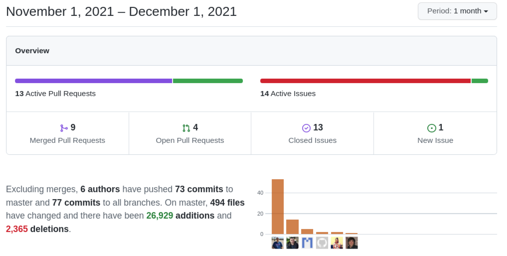

[And The Beat Goes On](https://youtu.be/pEmX5HR9ZxU)

===

 ! Features and Implementor/Developer enhancements

- GeoCoder add GeoCoder library 4.2.0 with support for GoogleMaps, Here, MapBox, Nominatim, and OpenRoute
- based on the GeoCoder Library we add a stub detail view widget to get coordinates from the address
- add related field name to related list block in DetaiViewLayout business map
- merge Business Question filename with context parameters
- make project/helpdesk emails fields displaytype 4 so they can be updated from a workflow
- set Global Variable Name on Test screen when opening with value in URL (gvname)
- Password enhancements for LoginPortal and Users
  - add actions buttons and password check to Password detail view widget
  - strict password support and failed login blocking
  - global variable for minimum password length Application_MinimumPasswordLength
  - password history control: now users cannot repeat passwords
- support editing/creating products in Mobile
- attach direct files in SendGrid integration to make it work like the default phpmailer integration
- add an option to delete custom modules in module manager (thank you [Denald](https://github.com/denaldhushi)!)
- add Stripe activation method
- add retrieve cards and capture method for stripe
- Web Service processmap support for DetaiViewLayout Map and searching for the map by name
- create workflow functions to get information from inventory modules: **getCurrentConfiguredTaxValues** and **getCurrencyConversionValue**
- OneSignal send push notification workflow task

 ! coreBOS Standard Code Formatting, Security, Optimizations, and Tests

- coreBOS Standard Formatting: eliminate warnings eliminate useless code and comments, format code
- Documentation:
  - function headers, and comments
  - non-stop wiki enhancements
- Optimizations
  - delete unused variables in ListView
  - eliminate useless assignment in Mobile
  - eliminate block of unused code for obsolete uitype 62
- Security
  - validate CSRF in on/off task action
  - validate SVG images for malicious content
  - [code Injection on action parameter](https://huntr.dev/bounties/1776bdef-3dc5-4fdf-bb57-b61579bc0c9b/)
  - Improper Neutralization of output in ListView
  - sanitize inputs being written in URLs in ListView
  - Users: eliminate prefview and parentab in favor of is_admin
  - Users: limit password length and eliminate unused parameter
  - Users: limit user duplication to admin users
  - Users: logout user when deleted
  - Sensitive Data Exposure: file path
  - deny access to the vendor directory
  - validate CSRF on workflow actions
- **Unit Tests:** keeps getting more and more assertions

 ! Others

- relate Workflow email message with the record triggering the workflow
- add cbcredentialsid as entityidfield for the module
- modify Global Variable Business Actions. An interesting changeset from [Xhilda](https://github.com/xhildashazivari) that modifies the Global Variable Test Business Action to preset the variable when opening the test from the Detail View. Although Xhilda is not new to coreBOS this is her first official contribution: welcome!!
- set correct calculations on Spanish CIF as per [Wikipedia Article](https://es.wikipedia.org/wiki/C%C3%B3digo_de_identificaci%C3%B3n_fiscal)
- stop running tasks from starting again when the quiet parameter is applied
- set correct Decision Table default value to constant (thank you Adisa)
- DetailView inline edit error: reload formatting incorrectly special characters
- eliminate old calendar restriction in GlobalSearch
- fix Global Variable detailview inline edit broken due to definitions link ID
- fix Global Variable: ignore selected modules if in_module_list is 0
- allow searching with special chars in ListView advanced search
- split column search conditions by non-visible character instead of comma so we can have picklist values with a comma
- set correct ListView default value in TUIGrid list
- only set assigned_to if it is not set when creating records from MailManager
- fix Mobile check box - not shown correctly
- eliminate duplicate function and unused variables in Mobile global search
- fix PivotView JSON object that loads pivot table (thanks Xhilda)
- fix report field label headers for main module and the second module, now we don't show module name if only one module is selected
- apply LDS to Synchronize Support Tickets settings
- format Users error messages using LDS
- fix assigned to for group users issue
- call non-static method correctly in vtlib:Mailer
- add checks to eliminate warnings in RunWebserviceWorkflowTask
- Translations
  - SlemerNet keeps pt_br up to date: cbupdater, users (thanks!)
  - load translation strings for cron error messages in MailConverter
  - change Users password minimum length
  - OneSignal Workflow task
  - translate Workflow tax and currency functions
  - workflow definition

**Thanks for following.**
