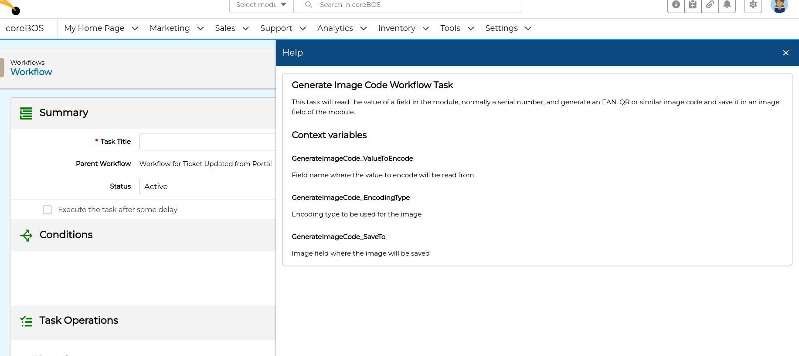
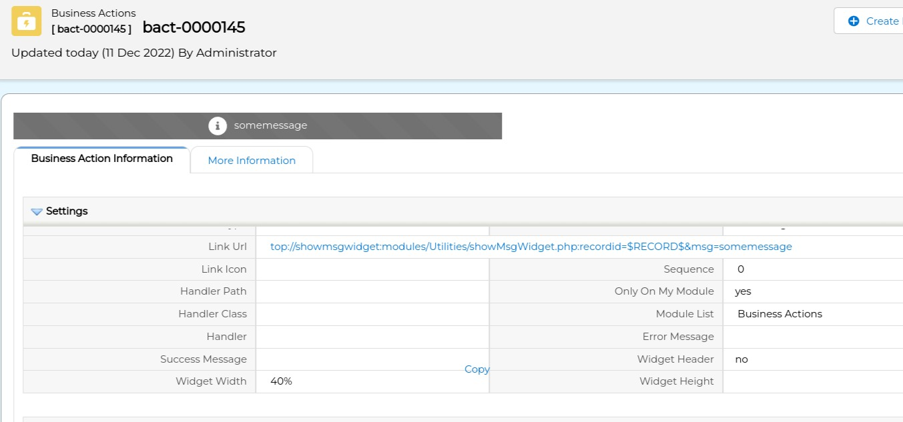
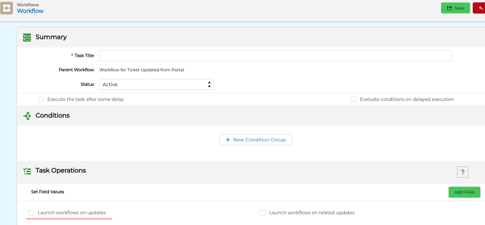
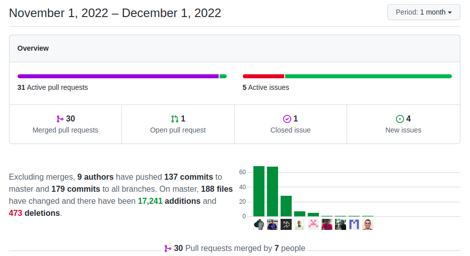

Customization month. New widgets, workflow enhancements, global variables, business actions, and business maps to make the application even more flexible. We also get some very interesting features in the application itself. coreBOS just keeps going!

===

 ! Features and Implementor/Developer enhancements

- Menu typing access. Nice!

[plugin:youtube](https://youtu.be/RFepW-j4-M0)

- `viewtype` support for global variables. Now we have another escalation option in global variables, we can set variables depending on the view we are in. So we can have two different values for a variable in EditView and DetailView. This was necessary for some of the new variables that were created this month. Thanks [Malik](https://github.com/maliknajjar)
- **Help notification panel**. We started a project to add context-sensitive help in coreBOS. This is merely the first step where we add the panel and make it available in workflows as can be seen in the next screen. Constantly growing step by step.

- Business Maps
  - Field Dependency now permits to apply `mode` to actions at a global action level, not just individual actions, and also supports multiple view modes separated by comma
  - PopupFilter BusinessMap that permits us to define the action a uitype 10 field should have when opening its popup. Thanks [Malik](https://github.com/maliknajjar)
    - PopupFilter add `formodule` and `relatedmodule` parameters in conditions for supporting filters in the popup
    - process dynamic variables from the front end
  - AdvancedSearch BusinessMap for saving presets. An interesting map that permits us to define a set of conditions that we want to be predefined when we open the advanced search. The use case was for a user that always has 5 search fields and had to add them each time. Now we define them in the map and the fields are preselected. Thanks [Malik](https://github.com/maliknajjar)
- initial support for widgets on top detail view using the `top://` directive

- Documents PDF preview Widget. Thanks [Timothy](https://github.com/tebajanga)

[plugin:youtube](https://youtu.be/aFzEu2M6zmk)

- add Slider widget using a Vanilla Js carousel library Thanks [Denald](https://github.com/denaldhushi) and [Xhilda](https://github.com/xhildashazivari)
- the Table, Grid, and Pie formats Business Question now supports clickable fields/sections for grouped questions Thanks [Denald](https://github.com/denaldhushi)
- add BusinessActionInformation to the widget context
- Global Variable now always returns the related business map if it is selected. This breaks backward compatibility.
- we can now mass update file fields from the ListView. Thanks [Denald](https://github.com/denaldhushi)
- Mobile list view can now access both edit and detail view directly. Thanks [Malik](https://github.com/maliknajjar)
- Mobile: correctly set URL when the protocol is given
- Edit view now support three special parameters which are Business Maps: `FILTERFIELDSMAP`, `FILTERDEPMAP`, and `FILTERVALMAP`. These variables override (or complement) the default maps. This was added to support special fields, dependencies, and validation in the new popup edit functionality.
- application modifications to support [Process Settings business pattern](../BusinessProcessEnhancements/)
- add `type of question` field to Survey Question
- TiddlyWiki: use title for entityname only if entityname is not already given
- get the master related id in the MasterDetail popup edit view
- support for custom action with CANCELGO parameter in the `Cancel` button. Developers can now define what this button should do.
- support for unique HTML ID on application message DIV, which opens the possibility to have more than one
- `getFilterFieldDefinitionByNameOrLabel` method for Custom View
- Workflow
  - add `getGroupID` expression. Thanks [Xhilda](https://github.com/xhildashazivari)
  - getRequest workflow expression function
  - help panel, button and infrastructure in GenerateImageCodeWorkflowTask
  - support `GenerateImageCode_SaveTo` context variable in Generate Image task
  - option to launch workflows on a field update. This is an important but dangerous enhancement as it can easily convert into a loop. By default, a workflow update field task will not trigger further workflow executions, but sometimes we need just that, you can understand how easy it is to get into an endless loop of updates so we must be very careful with the conditions.

 ! coreBOS Standard Code Formatting, Security, Optimizations, and Tests

- coreBOS Standard Formatting: eliminate warnings, eliminate useless code, variables, and comments. Format code. General, RelatedList Widget, Settings, DetailView, Business Map, Business Question
- Documentation:
  - function headers, and comments
  - edit addObjectsInsideArrayByKey's description
  - non-stop wiki enhancements
- Security
  - SQL injection in the Global Variable module
- Optimizations
  - filter images directly in the query of Slider Widget
  - Business Map: change name to avoid conflict
  - getFormFields to capture form fields
  - assign variable only if not empty in Global Variables
  - using empty instead of isset in List View
- **Unit Tests:** keeps getting more and more assertions.

 ! Global Variables

- **Application_TitleInformation:** text to show in the browser tab or an ID of a rule business map to calculate the title. This Global Variable is based on the view, it can have different values depending on the list, edit or detail view.
- **Application_Global_Search_Action:** when a global search returns only one record, the detail view of that record will automatically appear. This variable permits us to define another action instead (EditView, for example)
- **Application_ListView_FilterPanel_Open:** show or not the filter panel
- **Application_Session_Life_Span, Mobile_Session_Life_Span, and Webservice_Session_Life_Span:** global variables to control session timeout. We no longer depend on the server PHP configuration. The default is 7200 seconds (2 hours).
- **Application_Focus_Element:** when coreBOS finishes loading a page the focus is set to the HTML BODY of the application, if you want to change that focus you can use this variable to indicate the element you wish to set the focus on. This Global Variable is based on the view, it can have different values depending on the list, edit or detail view.

 ! Others

- Business Maps
  - Advanced Filter map: setting advancedSearchData value to 'MAP_NOT_FOUND' if null, check if isset and show saved conditions
  - sending map information to front end in the Advanced Search Popup
  - check if query has rows before returning result in condition query map
  - control character error error
  - init empty array for Conditions in ListColumns
  - Field Dependency: add checks on field references, make fields readonly only if found and improve readonly action, fix appear and disappear blocks actions, fix uitype10 trigger change issue on clear
- find user full name if the given value is an ID in List View
- Custom View Sync script: activate View Permission module if not active and assign records to the correct user
- DependentsList: avoid joining twice on the same table
- check if `field_lists` is set in the request for Emails popup to work on any module with email field
- clickhouse: deactivating intergration and disable saving with empty values and no inputs
- eliminate duplicate FORM element in MassEdit
- Product_Maximum_Number_Images is undefined in MassEdit form
- `moreInfofields` empty in edit mode when we have Master Detail of Inventory Modules
- convert sequence field to integer in case string is given for Master Detail sorting field
- Master Detail parse URL error
- Master Detail handle page size on clicking expansion buttons and overwrite tui-grid-cell CSS to make description appears in full. Thanks [Athuman](https://github.com/ochu-elhadji)
- Settings: set correct labels, translate labels, reduce whitespace, change the ratio of icon and header in the launcher
- Outgoing Email Configuration: mark From as non-mandatory and others as mandatory
- ShowMsg widget now uses a unique ID generator for message DIV and we document business action URL
- hard code User `status` picklist values to recover 'status' as a valid picklist fieldname. A picklist on any module with the name of 'status' would conflict with the status picklist in Users. This does not happen anymore
- Web Service permit accessing images on the Users module now that they are standard image fields
- Workflow
  - check if success and error messages are defined
  - check if WorkflowContext property is set
  - hold ajax action in Create Entity task
  - protect `getIDof` parameters
  - set context correct in expression task
  - fetching selected image from attachments in Sign PDF Document task
- Translations
  - SMTP labels in the correct module
  - AutoNumberPrefix: Dutch translation
  - Business Map: Advanced Search settings map
  - ES Application_ListView_FilterPanel_Open Global Variable
  - HelpDesk DE
  - Slider Widgets

**Denald** beat me again! Not by much, but going strong :-)

**Thanks for reading.**
