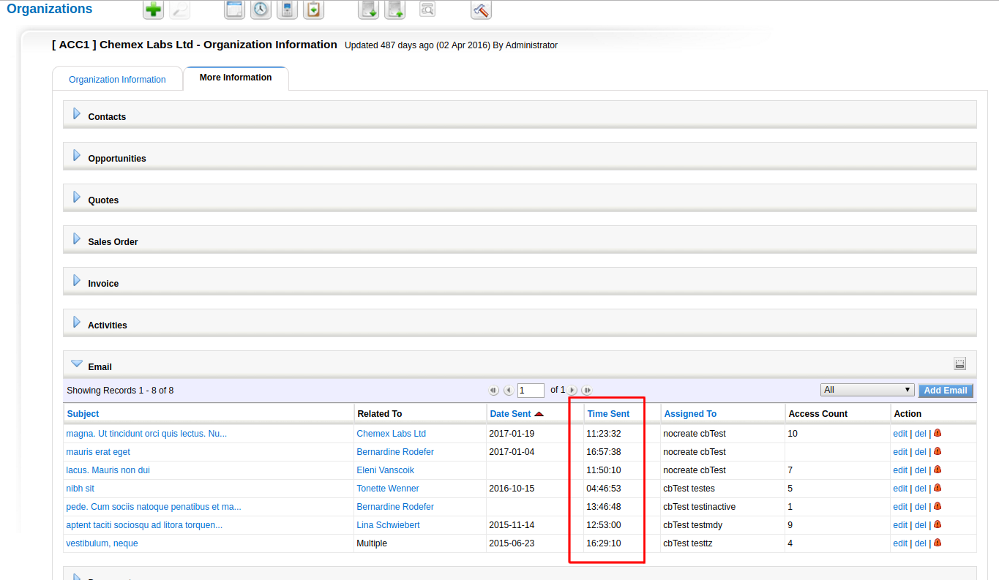
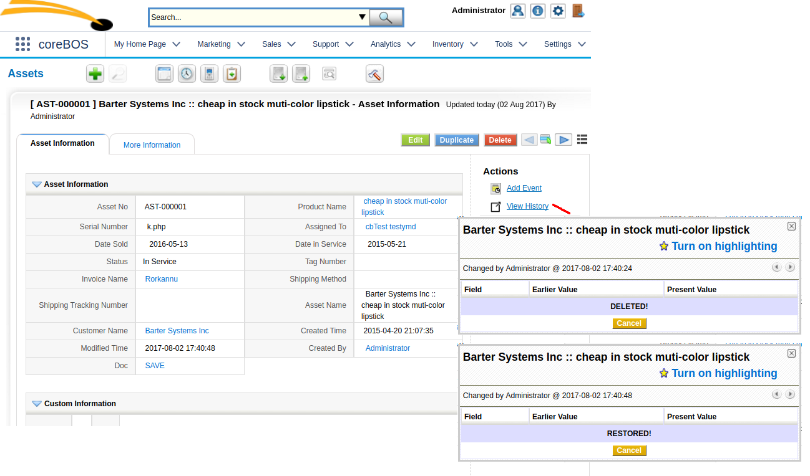

As we are working on a bunch of long running projects that won't get into the main core of the application for a while, this month's development efforts go into functionality enhancements to make the software more flexible and adaptable and easier to use.

===

 ! Move to jQuery

This is one of those long running projects that makes it into the application this month. Technically it is one of those many things that we do that have little impact on the visibility of the application itself.

 !!!! **The real measure of the success of this change is that nobody notices it!**

vtiger CRM was based on the very old prototype library which has become obsolete. So we extracted all the code that used that library and adapted it to jQuery. Today, 2017, we are gradually eliminating jQuery in favor of native javascript and HTML5. That happens a little every day while the users barely notice.

Effectively this does make the application a little faster.

I have to give an enormous **Thank You** to [Edlira Dushku](https://github.com/EdliraDushku) who personally and almost single handed, took on this project and converted it into a reality.

 ! Helper script for direct command line importing

[coreBOS native importing is very powerful](http://corebos.org/documentation/doku.php?noprocess=1&id=en:importingdata) and the recommended way to get external information into the application, but there are use cases where we need to execute unattended imports or initial massive imports that consume a lot of time. For these edge cases, coreBOS has a set of command line import scripts that you can adjust to your specific data and launch directly to **mass import your records**.

The scripts are
 - [importcalendarcsv](https://github.com/tsolucio/corebos/blob/master/build/HelperScripts/importcalendarcsv.php) which is not needed anymore in the coreBOS version alive today because Calendar is not a special module anymore, but a normal module like all the rest and can be imported normally as any other.
 - [importemailcsv](https://github.com/tsolucio/corebos/blob/master/build/HelperScripts/importemailcsv.php)
 - [importpricebookcsv](https://github.com/tsolucio/corebos/blob/master/build/HelperScripts/importpricebookcsv.php) which permits importing the relation and prices of products on price books
 - [importcsv](https://github.com/tsolucio/corebos/blob/master/build/HelperScripts/importcsv.php) generic import script for any standard/custom module based on vtlib library. Thanks to Alan Bell for sharing the initial skeleton

Note that this is October 2015, things are very different today in 2017 as we now have **[import business maps to acheive](http://corebos.org/documentation/doku.php?noprocess=1&id=en:adminmanual:businessmappings:import)** this tasks. I will get to that in upcoming posts that are right around the corner.

 ! Save and show email sent time.

 

 

 ! History Change Tracker support for delete and restore records

 

 ! Pin popup

Usability enhancement that adds a small lock in the popup window so we can set it to NOT close after selecting a record which is the default behavior. This makes mass relating or selecting a breeze!

[plugin:youtube](https://youtu.be/8L26sGiHsuI)

 

 ! Autonumber events

We add four [coreBOS Events](http://corebos.org/documentation/doku.php?noprocess=1&id=en:devel:corebos_hooks) to permit the developer to completely override the logic of incrementing autonumber (uitype 4) fields. With these events, any developer can take control of the next value to assign to an auto-increment field in a module giving it any format or logic.

Using these hooks, we create the [Auto Increment Number Field module](http://corebos.org/documentation/doku.php?noprocess=1&id=en:extensions:extensions:autonumberprefix) which permits you to define advanced formatting for the values and to hold various increment fields on the same module that will increment upon different conditions.

The four new events are:
 - **corebos.filter.ModuleSeqNumber.set:** initial configuration for a field
 - **corebos.filter.ModuleSeqNumber.increment:** increment a field
 - **corebos.filter.ModuleSeqNumber.get:** retrieve the current value of a field
 - **corebos.filter.ModuleSeqNumber.fillempty:** mass fill in all the empty values in a field

 

 ! Click on cell edit

This is a **very important usability enhancement**. The idea is simple, instead of having to click on the edit word/link to open the inline field edit you can click anywhere in the cell to quickly access the editing state.

I have to admit that when [Gerald Bigot, our French coreBOS partner](https://coreboscrm.fr) asked us for it I didn't see it and thought it wasn't useful. Shortly after implementing it one of the first clients we installed it on complained and we had to make a few adjustments and explanations. Now, after a long time having this functionality I have to admit that it is **exceptional**, I find it very powerful and I wouldn't know how to work without it. **Thank you Gerald!**

 

 ! Some others:

 - Workflow is, is not and has changed conditions for reference fields
 - Enhance search to support finding empty phone fields
 - Role to picklist speed enhancements
 - Picklist sorting fix to respect sub roles
 - Start hour and hour format on user
 - Upgrade to [PHPOffice/PHPExcel](https://github.com/PHPOffice/PHPExcel) to support big files and much better formatting
 - Reports get more related modules
 - Support for special characters in mail manager attachment
 - Eliminate warnings, notice, MySQL strict and code cleanup (this one is a constant every month, even today).
 - Translation. Notice warnings, eliminate unused code, cleanup

**Thanks for reading.**

