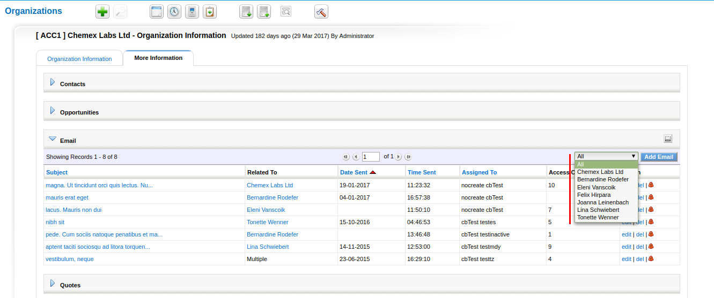
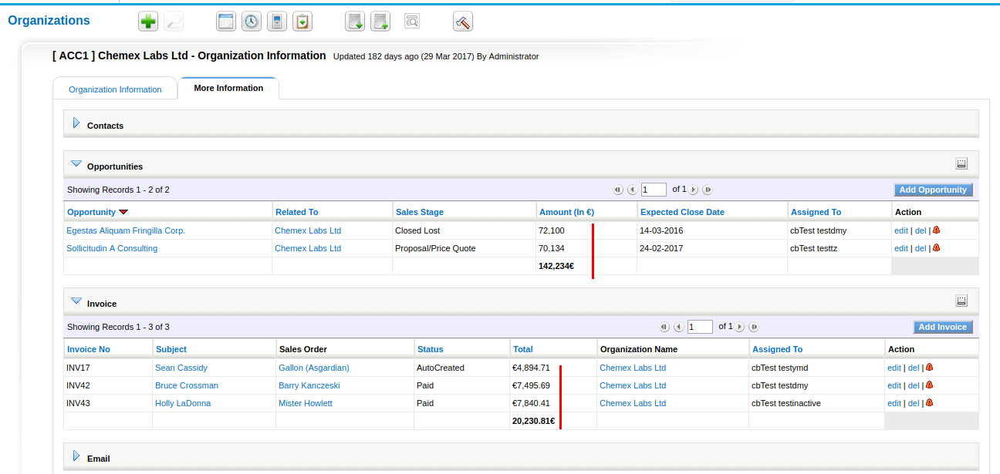
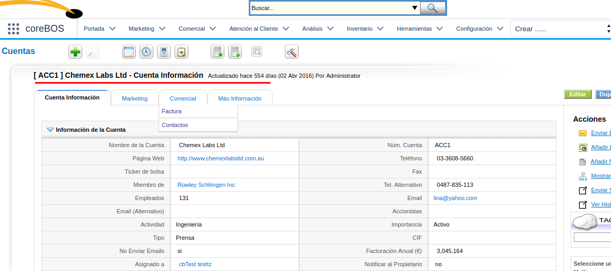
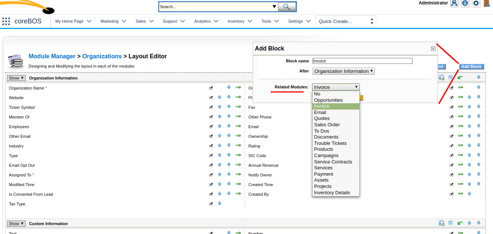
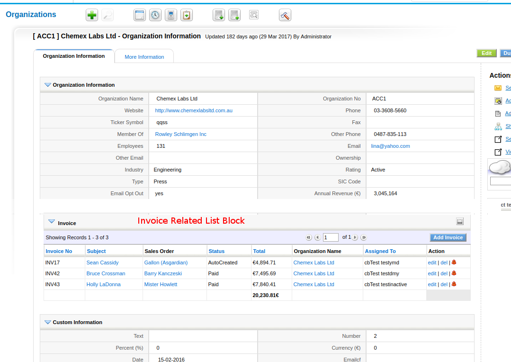

Webcam capture tool, document list view, workflow delete event, module tabs, tooltip, many global variables,... this is **unstoppable!!**

===

 ! Filter email action on Accounts related list

We add a user picklist on the accounts emails related list that permits you to quickly filter on the emails.

 ! Settings clean up

Eliminate **Announcements** from settings, by creating the **Application_Announcement** global variable

Eliminate **Backup, Customer Portal, and Webform** which you can access now as normal modules from the menu or using module manager

 ! Photo2Document extension

A nice little utility tool that permits you to add a webcam capture widget on any module in order to directly capture the image from the webcam into a document that will be automatically belated with the record.

This is ideal and very easy when you need to capture client ID or visit cards, for example.

Have a look at this video for a small tutorial on how to setup and use

[plugin:youtube](https://youtu.be/1dRqWBiB29Q)

 ! Currency field page totals on lists

A small aggregation of currency fields in list views. The system will detect currency fields that appear in a list and automatically sum the values that are visible.

 ! Web Service

 - support for direct HTML5 canvas capture through document save
 - revise support for inventory lines
 - support for deleting inventory lines

 

 ! Global Variables

 - Application_JSCalendar_Load
 - We move **all configuration variables contained in the config.inc.php** file to global variables and eliminate config editor extension
 - Webservice_Enabled
 - SOAP_CustomerPortal_Enabled
 - Import_Full_CSV, Import_Batch_Limit, Import_Scheduled_Limit
 - Application_Help_URL
 - WebService_Session_Life_Span and WebService_Session_Idle_Time
 - Application_Announcement
 - Document_Folder_View
 - White label global variables
 - ToolTip_MaxFieldValueLength

 

 ! Documents normal list view

In coreBOS installations with a lot of documents and folders, it gets extremely slow to access the document list view as the folder view first extracts and orders all the folders and then all the documents inside each one.

In these installs, it is better to have documents as a normal list view like all the other modules, so we add the **Document_Folder_View** global variable for you to be able to activate one view of the other.

 ! Business Maps

**Related panes business map** permits us to configure new tabs on the detail view of any module. We can put inside the new pane any block or related list thanks to another important enhancement we add to the system which is to permit blocks and related lists everywhere.

We can now mix field blocks and related lists in any order on any tab/pane view.

 ! Workflow "On Delete" event

We add a new event to the workflow system that permits configuring some workflow tasks when a record is deleted.

Not all workflow tasks are supported by this event. For example, we cannot launch an update field task because the record doesn't exist anymore but you can send emails and some other tasks.

 ! A very long list of others for this month:

 - Standardizing FAQ module
 - Keep on working on Mobile interface
 - Calendar: better support for different timezone
 - Calendar: show public shared calendar events on list views
 - Eliminate uitype 58 in favor of uitype 10
 - PHP 5.6 email SSL option, verify peer
 - Eliminate zend json in favor of native php among other changes (php7)
 - MySQLi is now the default and recommended database driver on our way to php7
 - MySQL strict SQL fixes
 - Support for packing slip and receive products natively in the application
 - jscalendsr now gets its first day of the week depending on the user's preference in the calendar
 - Eliminate create smarty template to avoid unnecessary duplication of code
 - Convert ticker symbol to a normal field and eliminate unused class_http
 - White label global variables
 - MariaDB testing and validation
 - Helper scripts. Import-Export profiles
 - Report parameter field selection
 - vtlib enhancement to not duplicate field if one already exists with the given label
 - To facilitate JavaScript development we include WS JavaScript library
 - Campaign: unrelated contacts associated to account being unrelated
 - Tooltip permits the same field in tooltip and global variable to set max field value length
 - Tooltip everywhere: popup and global search 
 - Eliminate warnings, notice, MySQL strict and code cleanup (this one is a constant every month, even today).
 - Translation. Notice warnings, eliminate unused code, cleanup

**Thanks for reading.**

