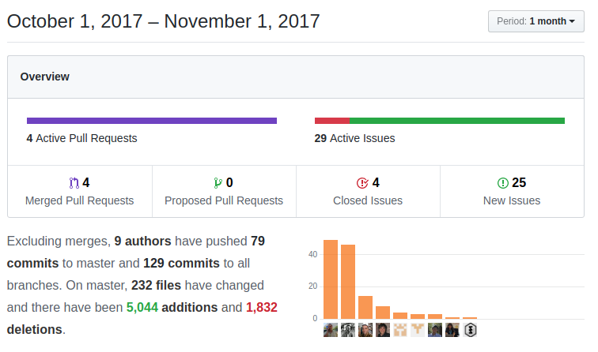

A slow month where we spend most of our time optimizing and stabilizing the application while we are working on related projects (upcoming GenDoc and Metabase). coreBOS is definitely in a state where you can count on it to help you do your business and we are using it for just that: **help our users put coreBOS to work for them!**

===

 ! Calendar

We continue to tweak the new Calendar system by adding some of the features we still hadn't migrated and fixing some bugs along the way, but this month sees the elimination of an incredibly long-standing and bothersome issue: Daylight Saving Time error. With the development of the new calendar module we now correctly save and retrieve dates for all time zones and time format. The definite test happened this month with the DST time change in Spain which turned out to be a total success!

 - calculate duration always and make value visible
 - save module list selection per user on the graphical view
 - replace all crmentity Calendar/Events to cbCalenar
 - clear tokens button when changing gmail account for the same user
 - problem with start/end date format of calendar synced in google
 - avoid name conflict between activitytype and module name
 - set default time length
 - optimize code by eliminating loop and function call which is repeated
 - correctly get events based on user timezone
 - eliminate taskstatus usage, replace taskstatus column name on reports and filters to replace by eventstatus

 

 ! Mobile

The mobile application keeps on getting better as we tune it guided by our user's feedback and this month we give it full calendar support.

 - eliminate uitype 50 as reference field type
 - select current user on create
 - support all uitype 56 on EditView, not just for send notification on Calendar
 - support to new cbCalendar module
  - Not show dtstart and dtend on cbCalendar DetailView
  - Replace Calendar/Events to cbCalendar on menu
 - Eliminate Activity Type setting when creating, it is not necessary anymore
 - support follow-up date on cbCalendar module

 

 ! Optimizations and Security

As we keep making the application faster and more secure we start taking the necessary steps to have it support the **upcoming PHP 7.2**

 - change sizeof to count for PHP 7.2
 - optimize loops and assignments
 - deprecate isFileAccessible in favor of isInsideApplication
 - replace not is_array..array construct for more performant array cast
 - eliminate redundant timezone set code in index, which is executed in config.inc
 - eliminate obsolete and useless function moveMe
 - use SQL_CALC_FOUND_ROWS to get the total number of rows
 - refactor to simplify the assignment
 - use pquery for additional security in Calendar
 - used standard wsGetEntityName instead of a local duplicated method
 - eliminate obsolete code in jscalendar: fix unreachable code warning and remove checks for IE5

 

 ! coreBOS Standard Recommendations

[Rulesets for coreBOS coding guideline: phpcodesniffer and eslint](http://corebos.org/documentation/doku.php?noprocess=1&id=en:devel:developmentguidelines#code_formatting_and_validation_tools)

 ! Developer Enhancements

Besides the arrival of the very important [coreBOS Standard Recommendations](../developmentguidelines), two important developer features make it into coreBOS this oddly hot October.

[corebos.permissions.accessquery hook](http://corebos.org/documentation/doku.php?noprocess=1&id=en:devel:corebos_permission_hooks) we add a new typeOfPermissionOverride **SubstractFromUserPermission** which denies access to the list of records. In other words, a user that would normally have access to a record would not be able to see it if it was returned by the override SQL. It is a combination of 'none' and 'showTheseRecords'.

We add **PDF manipulation support** by including the [fpdi library](https://github.com/Setasign/FPDI) for PDF manipulation and add a system wide class called **pdfConcat** to concatenate PDFs

 ! Reports

Output temporary tables SQL when Debug Report Query is active. When a report query for non-admin users is created, the application constructs a temporary table to filter the records the user can access. The debug output must give us the information to reconstruct this table in order for us to be able to execute the query and study it for optimizations. That is exactly the information we add this month with this change.

 ! Webservice

We enhance the webservice query language to support inventory lines on related queries. The idea is to be able to get some limited access to the special hidden inventory lines using the query language. You can even use column specification to some extent, but the correct and recommended way to access that information is using the **InventoryDetails** module which is fully supported by the webservice interface.

 ! Workflow

Workflows keep getting more and more powerful as we enhance the expression functions and parser.

 - correct evaluation of empty condition on non-existent records
 - eliminate empty string conversion in update field task
 - support for empty strings
 - generic support for expression functions with raw parameters
 - **getEntityType** expression function

 

 ! Others

 - fix CronWatcher to prevent overwriting vtigercron's $cronTask object
 - fix Currency to respect zero decimals when currency pattern is different to 123456789
 - fix Related panes business map which don't work if a related list is present on DetailView
 - fixed issue where product images over a certain size would have incorrect proportions
 - better sizing of uploaded images in DetailView
 - fix Export to support relation fields on any table (custom fields)
 - fix Invoice so it can be related to other modules by calling parent save_related_module
 - generic support for multi-select and eliminate repeated code in Popup
 - QueryGenerator: correct glue for negative condition in multi-valued search values for all data types
 - When there is a block which is a Related List, show or hide block depending on the settings in Layout Editor
 - fix RTE fields to respect new lines correctly and modify CSS to show bullet lists correctly
 - fix an error where mass edit on services loses taxes
 - add support for searching integer fields with multi-valued search values in QueryGenerator
 - eliminate warnings, notice, MySQL strict and code cleanup (this one is a constant every month, even today)
 - translations

**Thanks for reading.**

