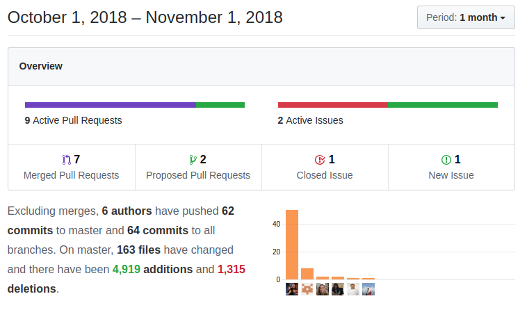

Some interesting development enhancements in Webservice that will make your satellite applications faster and in the application to permit registering and sending emails along with two new modules to control filter management (in the near future) and company information, and topped with the never-ending code optimizations and features fill this month which was really dedicated to a big change that will arrive next month. Keep tuned!

===

 ! coreBOS Standard Code Formatting, Security, and Optimizations

- coreBOS Standard code Formatting and eliminate warnings: cbCompany, CustomView, Email, ListView, MassEdit, Mobile
- eliminate warnings when sending direct email not related to any record from Mail Manager
- refactor repeated function getSearchModules in GlobalSearch
- refactor Email: eliminate unused parameter 'module' in send email
- refactor Mobile code to standardize module access, eliminate a special case which is not special anymore
- eliminate unused array element in Documents
- document send email function in its header
- split Workflow class into two files, each class in their own file
- fix layout variables, clean extra space and set a block variable for customizations in Users module
- eliminate obsolete code to change owner which is now done with the mass edit functionality

 ! Features and New Stuff
- support for loading global variables and executing functions without a context in the [coreBOS rule services](../corebosrules)
- new console command to reload tabdata file
- support all contact fields in related list views
- Lead_Convert_ContactSelected global variable If set to the string "true", the Contact section will be selected when converting a Lead. By default, the section is selected.
- treat uitype 2 as text in Leads conversion mapping to permit more flexible mappings
- align currency numbers on right in ListView
- accept underscore as a valid alphanumeric input

 ! Developer enhancements
- Create display type 5: only on create
- [createEmailRecord](https://github.com/tsolucio/corebos/blob/master/modules/Emails/mail.php#L666) helper function which makes it easy to create an email record related to some entity to register the fact that the application has sent an email.
- Permit sending document files as attachments of email by passing in the document crmid
- Relate document with another record when saving through object property: parentid
- Eliminate UIType 75 and 81 in favor of uitype 10: vendor on Products and PO
- Webservice enhancements:
 - add pagesize to getFilterFields
 - permit getting more than one module Describe information with a comma-separated list of modules
 - add the response of getRelatedModulesInformation to Describe
 - retrieve entity name and attachment information
 - avoid trying to get list information for non-entity modules

[plugin:youtube](https://youtu.be/VmimEXQmOOI)

- **Custom view management module:** first step towards better and more flexible filter management
- **cbCompany module**. Currently, this eliminates the company settings section in favor of a more standard module approach which can be easily related and extended with custom fields. We can even have more than one company and set which one we want to act as the default one. In a far future, this will be the base of multi-company or business units support.

 ! Others
- setting default_time correctly in visual Calendar
- detect Email signature by current user id
- get hide stock after loading the page to avoid CSRF permission error in Inventory Modules
- change href link to onclick for firefox to permit opening document attachment section in Mail Manager
- image fields were not supported correctly in Mobile
- avoid searching for crmid for non-module rows that can appear in direct SQL reports
- avoid double include of a file
- error closing curl connection before the end of use in ZeroBounce validation
- change deprecated PHP function in Validations
- fix report redirect issue when creating a new report
- i18n ServiceContracts, User and MailManager pt_br

**Thanks for reading.**
