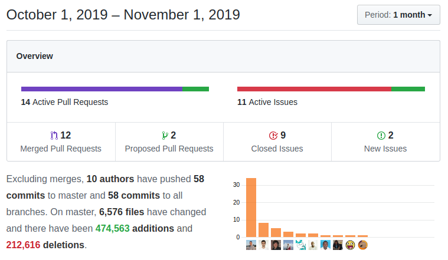

[Hacktoberfest](https://hacktoberfest.digitalocean.com/) brought a bunch of interesting features along with the normal coreBOS Beat 

===

 ! Features/Implementor

- Decision Table support for returning many fields and many rows and ignoring conditions with **\__IGNORE__** value
- add library [smalot/pdfparser](https://github.com/smalot/pdfparser) for better PDF scanning. Thanks Kiko
- change Update Exchange Rate programmed task to use open service and eliminate deprecated Yahoo service. Thanks Denald
- show last exchange update time
- unblock login users automatically: when a user makes an incorrect amount of login attempts the system blocks this user's access. This cron will automatically unblock the user after a few minutes so they can try again without an administrator user intervention. Thanks Timothy
- FieldDependency business map now supports multifield directives. Thanks Albana
- add UIType 10 Field Edit in Layout Editor. Wonderful!  Thanks Mario
- export users query was incorrect
- Webservice Business mapping test script support

 ! Developer enhancements

- include ordering when retrieving Related List SQL Query
- new web service to show internal SQL query from a coreBOS web service query. Thanks Lorida
- support cbRule called by name in Webservice
- **Debug_ActivityReminder_Deactivated** global variable to stop Calendar reminder polling
- fix Decision Table call from web service (cbRule) to send correct context

 ! coreBOS Standard Code Formatting, Security, and Optimizations

- update dependent composer libraries
- fixes for PHP version 7.4 (on our way)
- adapt CI by adding new executables from updated/new libraries
- CI: install a specific version of eslint as latest does not work with our npm version
- avoid warning in updateBrowserTabSession when previous tab session does not exist
- code formating on UnblockUserCron, Currency, DateTimeField, MailManager, REST/SOAP web service call, Query Generator, Search, Business Map, Web service Create (empty attachments)
- ignore DSStore files

 ! User changes and fixes

- updated getWeekendDates and created validateDate functions in DateTimeField
- integrated implementation of function getWeekendDates between two dates in Project
- support for default values defined in a business map in QuickCreate form
- correct concatenation operator error in ANTLR
- (much) better information screen for CSRF timeouts and errors
- correct **COREBOS_DBSERVER** docker environment variable support
- alphabetical sort of GenDoc templates in the widget and select the first template by default. Thanks Fatjola.
- correctly load current user in JS when it still does not exist (install) for Global Variable calls
- handle empty accessed indexed keys in ProductLines
- Home aggregate widget adjustments
- load correct CSS file in Licence
- Users "must change password" returns false if no user is given
- unblock changeset cbRule context parameter
- **add** and **sub** Workflow expression now accept non-numeric values without failing
- always join Workflow Aggregation query conditions with an AND when we are aggregating on brothers
- move GlobalVariable JS function to general JS script so we can use it in there too
- **Continuous translation effort:**
  - Assets, Questions and some other pt_br

**Thanks for reading.**
