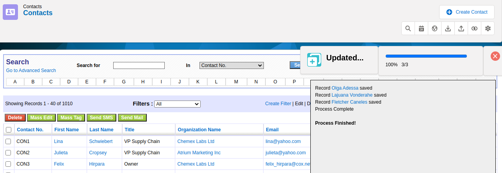
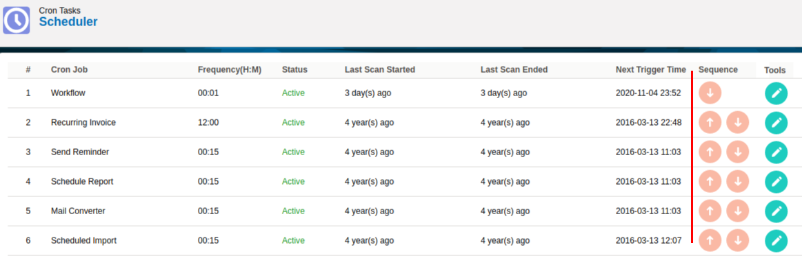
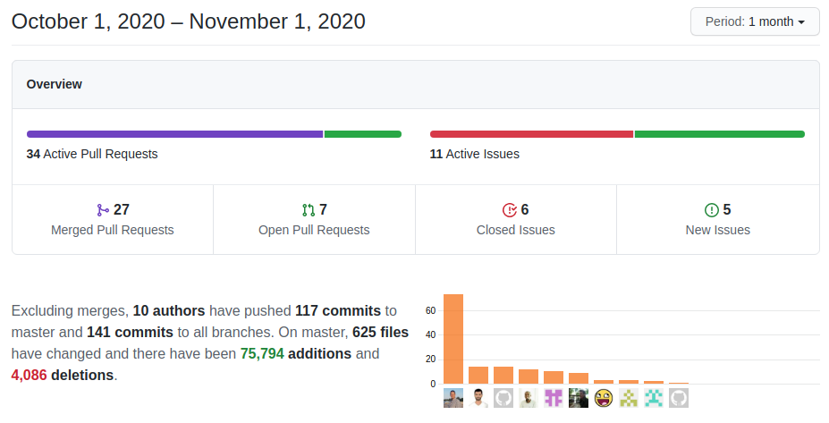

A month full of a large set of small but very interesting changes, a nice balance between user and developer enhancements complement the typical coreBOS beat. Special mention to Single Sign-On and Related list support in email templates.

===

 ! Features and Implementor/Developer enhancements

- support DISTINCT in Web Service ExtendedVTQL: `select distinct industry from Accounts where (true);`
- permit calling a Business Question by name via web service
- allow getting image information for a record through an AJAX call (executefunctions)
- add context variable support for Workflow Generate File task to select Report/Question
- add context variable support for Workflow Email task to get an attachment from Generate File task
- **related lists support in workflow email templates**. We add this template variable:  `$(general : (__VtigerMeta__) relatedlist_MODULE_FORMAT_FIELDS)`
  - Where:
      - module can be the name of any module related to the current record
      - format can be: html, table, or text
      - fields can be: * or a comma-separated list of fields to show
  - An example for the Calendar module could be:  `$(general : (__VtigerMeta__) relatedlist_Contacts_table_firstname,lastname)`
- add get related contacts emails on calendar:  `$(general : (__VtigerMeta__) Events_Related_Contacts)`  will return a comma-separated list of contact emails related to a calendar record which we can use to easily send an email to all of them
- add **sub_workdays** function to Workflow expression language
- autocomplete search in compound entity fields like full name. so we can search in contact "firstname lastname"
- validate asigned_user_id in web service Create and Update operations
- permit sending CSV file via scheduled email report
- **EMail_Signature_BeforeQuote** global variable permits us to set signature before quotes email in MailManager
- **Application_Filter_All_Edit** global variable, permits us to edit the filter "All" fields (Finally!!)
- permit capturing product image information in produce autocomplete
- business question post-process operations on file export: deletedoublequotes
- Single Sign-On (SSO)
  - coreBOS now supports [Auth0 SAML Single Sign-On](https://auth0.com/). In the upcoming weeks, we will add support for a few more providers and document this functionality in the documentation project.
  - web service SSO
  - add support for two more web service redirect URLs so we can attend more than one app with the same API using the RTURL parameter
  - SAML: set certificates directory outside vendor directory
  - set User in Global Variable call to get the correct value
- iCal support
  - iCal workflow support: permit sending ics file by email for calendar events
  - support for sending ics to browser
  - import/export iCal half working, some formatting
  - move iCal library to the new calendar module
  - move Calendar translation strings
- Emails Reply-To field
  - set Reply-To in MailManager and Converter
  - empty Reply-To on reply and correctly format reply to emails when there is more than one

 ! coreBOS Standard Code Formatting, Security, Optimizations, and Tests

- coreBOS Standard Formatting
  - Emails, application, MailManager, Picklist, Calendar, Workflow, general.js: format, change quotes, add quotes on array indexes (still!!) and eliminate warnings
- optimizations
  - delete unused variable in Vendors
  - eliminate unused Inventory field from SQL
  - return the direct result in WSApp
- library updates:
  - iCal library for PHP 7.4. PHP support
  - Gaufrette to latest version v0.9.0
  - Valitron library to 1.4.8
  - add OneLogin library
- MySQL 8: use the correct variable to construct SQL

 ! Others

- add optional ISO3166 country code dropdown in Accounts and Contacts
- show entity name as a link in Mass Edit results page

- add some generic style for modern inventoryblocks
- show next possible trigger time in Scheduler

- avoid SQL error on Calendar duplicate keys
- handle date formatting in business questions CSV export
- fill CSV header if file is empty in business questions CSV export
- include LDS Prompt in Popup window
- switch 'const' to 'var' to avoid redefinition error of LDS Prompt object
- use correct parent module in generic email modules
- launch aftersave.final on payment related to inventory modules so ModTracker can register the changes
- support special-cased legacy fields in new web service query parser
- set the email window size to application standard
- include files for template merge loading. an error was appearing when selecting a template in the email popup window
- format XML on Decision Table save
- EU VAT Validation based on httpS
- select/deselect create and avoid error on extensions in Profile settings
- fix QueryGenerator by escaping single quote on IN operator
- assign currentModule value when it is empty in Scheduled Reports
- set default mass edit for new fields to true in coreBOS Updater
- multiple select field mandatory validation was producing a false positive
- add context on scheduled workflows
- checking referenceField for workflow expression conditions
- format currency in workflow expressions
- remove unnecessary joins from workflow query
- Send File workflow task expression type was lost after save
- resolve formatting of scheduled workflow time
- validation of mandatory fields in workflow using global validator object
- update price & taxes conditioned to dedicated function
- keep special User fields in queries after applying the new SQL parser
- field mapping support for record_id field in Business Map
- Textarea
  - apply global variable styling
  - add missing Application_Textarea_Style calls
  - eliminate reference to deleted uitype 20
- constant translation effort:
  - attach ics on workflow
  - Calendar/MailManager: pt_br
  - ISO Country code
  - Application_Filter_All_Edit Global Variable
  - translate hardcoded strings in mail response header

**Thanks for reading.**
