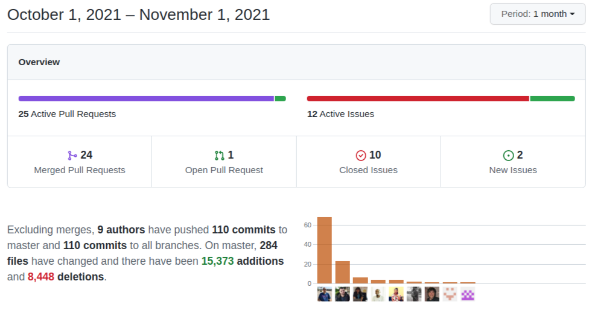

Three projects that have been around for a long time finally make it into the main coreBOS branch: **Module Builder, Mass Actions, and Pivot View.** As if that weren't enough we get the typical set of enhancements and bug fixes. A lot of security issues too thanks to Huntr!  Update and enjoy.

===

 ! Features and Implementor/Developer enhancements

- **Module Builder** I don't know what I am more impressed about with this project. It is something I never planned on having, it is a pure community-driven initiative, it has a rich set of options with a nice (fresh) user interface and it covers almost all the things you can do when creating a new module. I have been asked many times about this one and was always resistant about having it but here it is at last: a coreBOS extension that permits you to create new modules. Thank you to everyone who participated, in special to [Denald](https://github.com/denaldhushi) for starting (and finishing) the project.
- **Pivot view** Lorida, who is moving to new pastures this month, implements a new business map and module view that permits us to aggregate field values in a multi-dimensional table view. You can [read the details in the wiki](https://corebos.com/documentation/doku.php?noprocess=1&id=en:adminmanual:businessmappings:pivot) and expect some more information in the blog and video tutorials in the future. As for Lorida, coreBOS will always be your home and I would enjoy immensely that you stick around as much as you can, your knowledge, professionalism, and personality are a treasure for all those who have had the pleasure to work with you. I wish you the best.
- **Mass Actions** Timothy fixed the workflow mass action section some months ago but I couldn't get around to validating the code mostly because I wanted to redesign the queue system. I finally decided to review and accept the code as it was and not block it any longer. It turned out to be something I should have done much sooner as the code is great, even the queue part. We still have to work on the queue system and create some user-friendly design for this functionality, but now we can launch mass actions from the workflow system! Thank you Timothy.
- **Global Search Business Question** This new type of business question accepts a Type Properties value to launch a global search in the application and return the set of IDs that are found. Combined with the Mass Actions functionality this question will find all the records that fulfill a search (even a tag search) and execute some action on each one (!). The Property accepts this format:

```json
{
"query": "find this",
"searchin": "Assets,Accounts",
"user":1,
"account":74,
"contact":1084
}
```

- new global variable **Lead_Convert_AssignedUser** to select assigned user on lead conversion
- new global variable **Application_Display_QuickCreate** to hide Quick Create menu, also hide it if there are no modules configured
- new global variable **GenDoc_PDFConversion_Retries** to define the number of retries of a GenDoc PDF conversion when it fails
- permit access to asterisk information in Users queries
- new validation method: [validate_EU_VAT_NotBlank](https://github.com/tsolucio/corebos/issues/1010)
- new web service [hook **corebos.filter.portalmodulerestrictions**](https://github.com/tsolucio/corebos/blob/master/include/Webservices/CustomerPortalWS.php#L626) to fine-tune the automatic restrictions that coreBOS imposes on Portal Login users
- support **tag::** search in Web Service global search
- Global Variable definitions page action links permit us to click on the name of a variable in the definitions page to start the creation of a record with that global variable selected

<span></span>

 ! coreBOS Standard Code Formatting, Security, Optimizations, and Tests

- coreBOS Standard Formatting: eliminate warnings initializing vars, eliminate useless code and comments, format code
- Documentation:
  - function headers, and comments
  - non-stop wiki enhancements
- Optimizations
  - prevent query from duplicate joins
  - delete unused variables in List View
  - reduce SQL columns in Mail query
  - extract variable out of loop and substitute variable for constant in role retrieval function
  - use empty instead of count for array evaluation
- Security. The team of [Huntr](https://huntr.dev) is helping out a lot! Thanks.
  - validate CSRF on delete workflow action, on/off task action and a few others
  - XSS in Subject of To Dos
  - XSS in RSS content
  - validate SVG images for malicious content
  - sanitize List View inputs being written in URLs
  - update SimplePie library from 1.4.1 to 1.5.6
  - logout user when deleted
  - sensitive Data Exposure: file path
  - restrict access to system workflows: only admin can access
- **Unit Tests:** keeps getting more and more assertions

<span></span>

 ! Others

- Solve page-shaking bug. The first contribution of our new Community member [@helkyar (Javi)](https://github.com/helkyar) and a **VERY** important one. Welcome and Thank you!
- load and apply coreBOS updates in Github actions
- eliminate the old way of setting the cancel button in Documents
- set values for all Emails fields to avoid SQL Strict mode failure
- permit unselect all modules in Global Search which wasn't working
- synchronize all Global Variable definition files and delete comments
- correctly construct javascript array from sorted role list and apply the same logic to users and groups for Groups management
- increment import field size to support JSON and MEDIUM text fields
- set max and min width of Kanban cards
- set quick create sequence to 0 in Layout Editor when none is set
- correct property name and reduce if (sonarqube)
- List View improvements
  - decode special characters in headers
  - do not validate email field in advanced search
  - open/close actions on hover event
  - remove buttons at the bottom of grid
  - remove session for order by and support 3 types of sorting
  - set equal operator for date in basic search
  - wrong currentModule name in RecycleBin module
  - fix Tooltips
- email configuration per user: use FROM from username, not from general mail settings
- make MailManager inherited CRMEntity properties non-static
- apply LDS modal formatting to MassTag functionality
- sort users and group alphabetically in Reports
- Workflows
  - remove white spaces to the list of bcc emails in workflow Email Task
  - fix the unique Expression indexing for Query Expression substring
  - reduce the time between read and delete tasks in queue
  - show permission message when trying to delete a workflow user does not have access to
- Translations
  - GenDoc_PDFConversion_Retries
  - GlobalVariable/PBX/Menu/Import/Settings: pt_br. Thanks Slemernet!
  - ModuleBuilder: eliminate duplicate keys and es_*

<span></span>



**<span style="font-size:large">Thanks for following.</span>**
