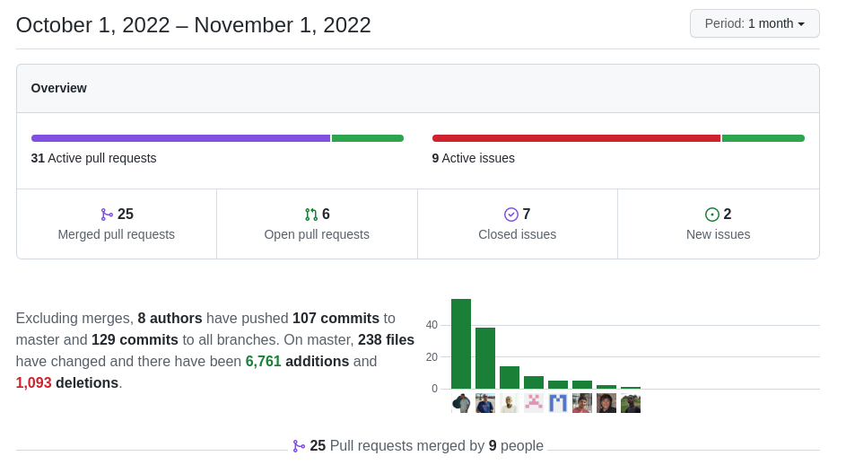

A lot of things to celebrate. Denald not only made more commits than me but has scaled to the second position in the contributors' list. An incredible feat. Congratulations! We have a new developer and community member who has started strong. Welcome Malik. The list of enhancements is big this month and it is very distributed among our contributors which makes me very happy. All in all a great month!

===

 ! Features and Implementor/Developer enhancements

- Global Search: a VERY useful enhancement to make the global search much more powerful. Thanks to [Malik](https://github.com/maliknajjar), we can now use:
  - `#::` to search in tags, equivalent to `tag::`
  - `$::` to search in currency fields, equivalent to `currency::`
  - `site::` to search in URL fields, equivalent to `url::`
  - `@::` to search in email fields, equivalent to `email::`
  - `-` to exclude words from your search: Put `-` in front of a word you want to leave out. For example, `jaguar speed -car`
  - quotes to perform a search with an exact match: Put a word or phrase inside quotes. For example, `"tallest building"`
  - `..` to search within a range of numbers: Put `..` between two numbers. For example, `camera $::50..$::100`
  - `OR` to combine searches: Put `OR` between each search query. For example, `marathon OR race`
  - you can combine `OR` and an exact match
- recover support for related module fields in Advanced Search
- add autocomplete feature to uitypes 11, 13 and 7. Thanks [Kiko](https://github.com/kikojover)
- Business Actions
  - add widget size and header fields: we can now indicate if we want to have a header or not and the width and height of the widget. Thanks [Timothy](https://github.com/tebajanga)
  - add alert fields: for those actions that return a success/failure result we can indicate the message to show directly in the record. Thanks [Denald](https://github.com/denaldhushi)
  - show a custom alert message in Actions
- Business Map
  - change RelatedListBlock map format to accept multiple modules
  - show on another module the tree related list block, tooltip
  - Field Dependency: add support for MODE based conditions at the dependency and field level. This permits us to define dependencies that will be applied or not depending on the state of the action. We support:
      - mode = 0: dependency is applied in all modes
      - mode = 1: dependency is applied when creating a record
      - mode = 2: dependency is applied when editing a record
      - mode = 3: dependency is applied when viewing (DetailView) a record
  - Field Dependency: new directive to include dependency or actions from other records. We can now load a whole branch of the XML into a `dependency` or an `action` making these maps easier to maintain and reducing the amount of duplicate code. This looks like this:
```xml
<dependency>
<loadfrom>map name or id</loadfrom>
</dependency>
```
- convert SQL checkbox to a picklist with Query Type in Business Question. The first step to supporting Clickhouse in the questions. We also merge some pending Clickhouse enhancements. Thanks [Timothy](https://github.com/tebajanga)
- Widgets:
  - LaunchWorkflow action button widget. Can launch any workflow from a button with styling. Thanks [Timothy](https://github.com/tebajanga)
- `Delete Handler` to reset Remaining Units when Check Invoice Lines. Thanks [Kiko](https://github.com/kikojover)
- calculate the sum of uitype 7 fields in Listview. Thanks [Xhilda](https://github.com/xhildashazivari)
- Master Detail: Thanks [Xhilda](https://github.com/xhildashazivari) and [Denald](https://github.com/denaldhushi)
  - add default order functionality
  - suport uitype 28 in master detail grid
- RelatedList Widget. Thanks [Xhilda](https://github.com/xhildashazivari) and [Denald](https://github.com/denaldhushi)
  - support more than one parent record and access records in 4 levels
  - show all related modules recursively
- Export and Import functionality for Groups, Roles, and Privileges. Thanks [Mohamed](https://github.com/shibe2018)
- show related product information in Tooltip for all inventory modules
- support multiple image fields in Users. Convert uitype 105 to a normal uitype 69
- TiddlyWiki. Thanks [Xhilda](https://github.com/xhildashazivari)
  - a nice integration widget that permits us to drag a tiddler with a specific set of fields into coreBOS to quickly create records. The goal of this is to document projects with actionable elements that can be easily imported into coreBOS. For example, you can define the global variables or business maps your project needs and then just drag the tiddlers into coreBOS to get them created for you.
- TUI Table
  - applying padding in grid cell header
  - handling wrong text in a grid cell
  - overwrite tui-grid-cell CSS to make the description appear in full length. Thanks [Athuman](https://github.com/ochu-elhadji)
- Webservices: skip updates in MassCreate if the skip option is set
- Workflow:
  - Sign PDF Document task. An interesting workflow task that permits us to stamp an image into a PDF. Thanks [Timothy](https://github.com/tebajanga)
  - allow 'ReplyToEmail' context param to be set when sending e-mails. Thanks [Luke](https://github.com/Luke1982)
  - array workflow expression function
  - flattenarray workflow expression function
  - statistics and frequency workflow expression functions using the hi-folks/statistics library
  - use specialModules property to check for special modules that don't have crmentity table relation like workflows
  - basic support for multireference fields (uitype 1025)

<span></span>

 ! coreBOS Standard Code Formatting, Security, Optimizations, and Tests

- coreBOS Standard Formatting: eliminate warnings, eliminate useless code, variables, and comments, format code. MailManager, RelatedListWidget, Templates, Tooltip, Utilities, ListView
- Documentation:
  - function headers, and comments
  - non-stop wiki enhancements
  - README more information
- Security
  - updating fpdf version from 1.8.1 to 1.84
- Optimizations
  - delete obsolete vtlib code and mark related functions as deprecated
  - add missing library dependencies and eliminate PHP version check
  - move CustomView edit functions to class to use them everywhere
  - delete duplicated ListView functions and use native ones
  - replaced deprecated utf8_encode with mb_convert_encoding (on our way to PHP 8.1)
- **Unit Tests:** keeps getting more and more assertions.

<span></span>

 ! Global Variables

- No new global variables this month.

<span></span>

 ! Others

- Advanced Filter: show module and block related to the field in the search
- Advanced Filter: delete the first filter if we have more than one filter active
- Business Actions: increase sequence of Actions +1 to save the same order of blocks
- Business Questions: set the correct variable for the default value and optimize the update query to avoid error
- Custom View: initialize variables
- show DetailView widgets in the first position
- Grid referencefield: check for modules with different columname and fieldname
- Install process: memory limit and max_input_vars limits
- uitype 1616, show viewname instead of id in listview
- MailManager: hold and set the correct current module
- MasterDetail: returning the sortfield, use id to find buttons in every MD grid, use paragraph instead of span for field formatting
- menu dropdown working in Mozilla firefox
- load edit fields from map, remove current record from session in RelatedListWidget
- apply LDS to edit group form
- isMandatoryField: return correct variable name
- Web Service:
  - include required file for extended query
  - RelatedRecords: return product component information for product-product relations
- Workflow
  - less restrictive workflow launch condition in web service execution
  - removing unused file and statements
- Translations
  - Business Actions: error and success message labels, widget field labels, alert fields
  - Business Question query type
  - LaunchWorkflowButton widget
  - Settings and Workflow
  - Tooltip, ES product lines

<span></span>



**<span style="font-size:large">Thanks for reading.</span>**
