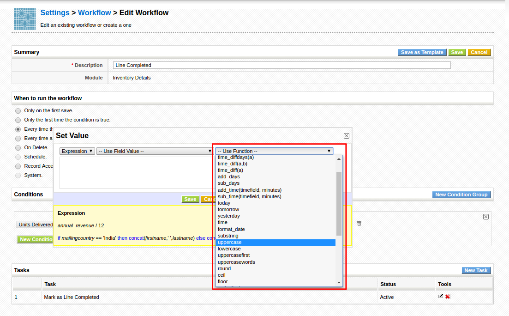
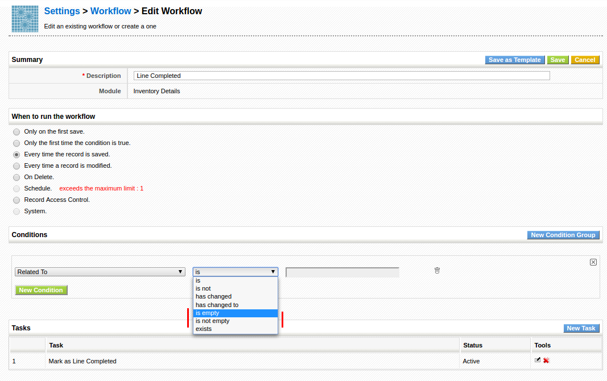
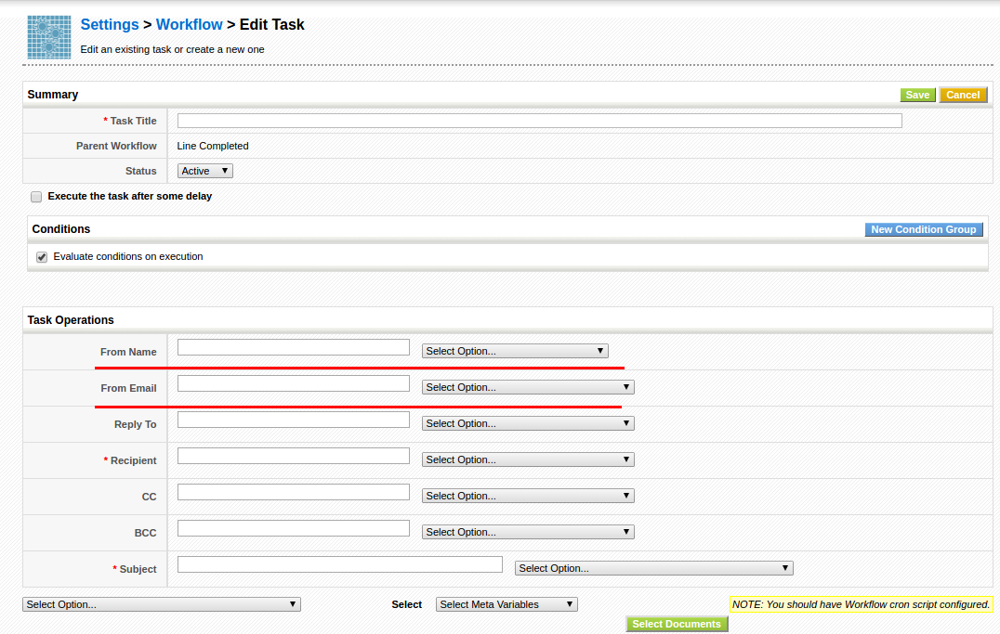
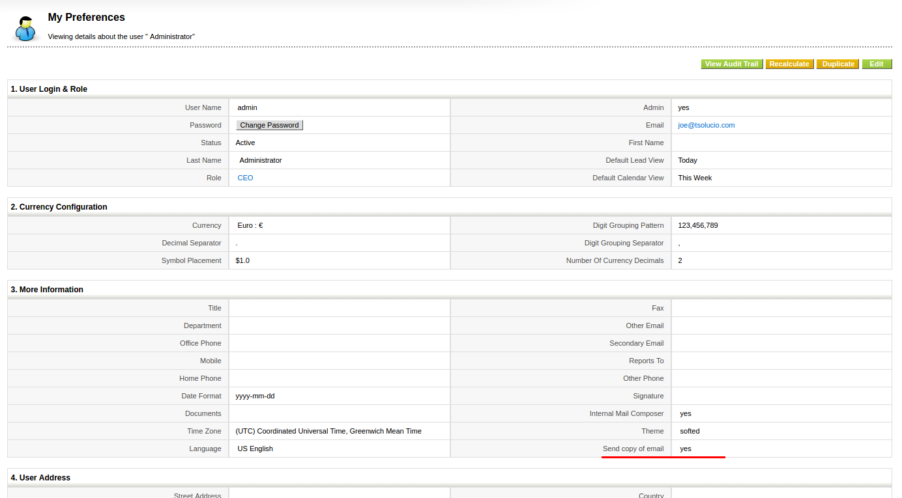

October and November of 2014 find us starting to add new functionality to **coreBOS** while keeping alive the constant beat of improvements.

===

### Development

 ! [vtiger CRM](https://www.vtiger.com/) 6.x migration scripts

We create vtiger crm 6.x migration scripts which you can use to convert any 6.x version database to the 5.4 structure and from there you can upgrade to the latest version of coreBOS.
During this process we get the optimizations and useful changes vtiger has put into their 6.x series and put them into coreBOS too.

[Read all about it here](http://corebos.org/documentation/doku.php?id=en:devel:vt60tocb&noprocess)

 ! Workflow enhancements

We add a set of new **Expression functions** like upper, lower, substring, add time parameter to get_date workflow expression to get the current time, ...

Conditions empty/notempty

We add a **From name** and **From email** field on the workflow email task so you can completely customize the automatic messages going out of the application

[Return name, not ID on related field reference](http://corebos.org/development/view.php?id=245&noprocess)

 ! Option to receive emails being sent

We inherited from vtiger crm a curious feature whereas you will receive in your inbox a copy of all emails you send. This should be changed to save the email copy in your sent box but in the mean time we add a per-user option to deactivate this functionality.

 ! Composer installer

This is a very important **implementor feature** called **Perspectives** which I will explain in an individual blog post after this one.

 ! Make all blocks in detail view sortable, even detail view widgets and custom blocks

[Sortable detail view blocks](http://corebos.org/documentation/doku.php?id=issuetracker:corebos:issue:238&noprocess)

 ! Related list hook

[Add a related list on a module that is already installed or is a pure base module like Accounts or Contacts.](http://corebos.org/documentation/doku.php?id=en:devel:corebos_hooks:related_list_hook&noprocess)

 ! Webservice: GetReferenceAutocomplete

This is an important developer enhancement which permits us to launch a search for a record and retrieve a list of possible candidates. It is the necessary functionality to create an autocomplete field. In fact we use it in the [coreBOSCP Project](../coreboscp-gplv3) and will use it in the near future to implement this functionality inside the application for capture fields (uitype 10).

This feature can be used both from the webservice and the internal API interface.

 ! Some others:

 - REST preflight CORS support
 - Translation and special characters support
 - Eliminate warnings, notice, MySQL strict and code cleanup (this one is a constant every month, even today)
 - Translations: Add full **Italian support**
 - Translations: Fix errors with special characters, specially ampersand on import, export, **picklists**, **reports**,...
 - Add empty database which is a step forward in optimizing the install process
 - Fill account or contact when creating an invoice from an opportunity
 - Alphabetical order everywhere
 - Security and speed

**Thanks for reading.**

