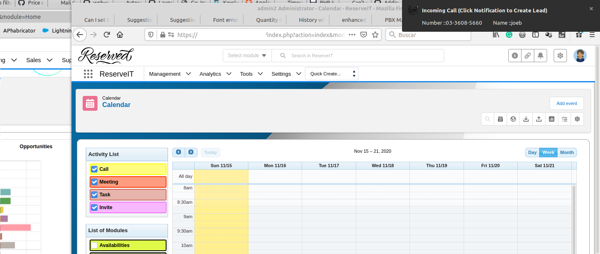

Desktop notifications are a "thing" nowadays with most browsers supporting them and being really useful due to all the overlapping tabs and windows we have open all day. So this new integration is a step towards a more engaging software application.

===

coreBOS released an integration with [OneSignal](https://onesignal.com/) this week. We can read on their website what they do:

> OneSignal is the fastest and most reliable service to send push notifications, in-app messages, and emails to your users on mobile and web.

In other words, this integration will permit us to open a popup notification of some event in the computer desktop screen you are working in. Not inside the browser, but in the operating system desktop.

From the coreBOS point of view, the OneSignal term "user" in the definition above can be understood in two ways:

* a user of the coreBOS application, a user created in the Settings section, a person who can login to the application
* an account, contact, or lead, one of our clients who has authorized us to send them notifications of certain events

In this first release of the integration, we support only the first type of user. We can send notifications of events to the users of the coreBOS application. For example, we can notify of an upcoming calendar event, of the approximation of an invoice due date, or an incoming call from our PBX integration.

Also, we can only send notifications by programming them, we can't trigger them via a workflow or a business action.

So, what we can do is configure the integration, authorize our users, send notifications via code and we have implemented the PBX notifications as a proof of the functionality. That means that if you have both PBX and OneSignal configured, you will get a desktop notification (and the internal application popup) when a call arrives.

All that said, we have the missing features in mind and will be adding them as time and resources permit.

The important "take away" is that now we have all the hard work and infrastructure laid out for this functionality to grow.

You can [read about the configuration here.](https://corebos.com/documentation/doku.php?noprocess=1&id=en:integrations:onesignal)

**Enjoy!**

<a href='https://www.freepik.com/vectors/background'>Post image created by rawpixel.com - www.freepik.com</a>