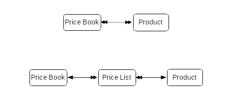

Learn how we made price books much more powerful and flexible by just changing them to the coreBOS standard module and relation.

===

 !!! Where were we?

The Price Book-Product scheme in coreBOS, which we inherited from vtigerCRM, was extremely limited in functionality, to the point that I doubt anyone was using it.

It had a custom editor for the relation which made it hard to extend, all (messy and redundant) custom code. This code showed a table with all the products so you could **manually** introduce the prices which is not practical at all, not even feasible if you have more than a couple dozen products. You could not:

* mass update prices
* import/initialize them in any way
* no support for reporting
* no support for Generate Document or printing price books
* no web service support
* no workflow support

We never got around to fixing this part of the application because we were using the [Discount module](../pricecalculation/item.md) which permits escalation rules to adapt the product price and also a very advanced and custom product-price development for complex price decisions in bigger companies.

 !!! What did we do?

Recently, due to a client request, I revisited this module and decided to throw away all the custom code and convert the internal database table where the many to many relation was being stored into a normal coreBOS module and change the custom related lists into normal standard related lists.

This development, besides cleaning up the code base, has opened a whole new world of possibilities to the price lists in coreBOS.

 !!! Where are we now?

Now we have a new module named `Price Lists`, this module holds the many to many relation between Price Books and Products/Services. In other words, for each Price Book and Product/Service we have a record in a standard coreBOS module that holds the price tag that product/service has in that Price Book.

All of a sudden we can easily:

* mass update prices
* import/initialize them in any way
* support for reporting
* support for Generate Document or printing price books
* web service support. to get the list of prices for a product using web service you just need a query like this
  * `select listprice, PriceBooks.bookname from pricebookproductrel where productid='99'`
* search and filter functionality
* with the advanced grid model we can inline edit prices right on the list view
* any other functionality coreBOS modules have:
  * decision tables: directly use the module in any decision table
  * pivot tables
  * workflows
  * modification tracker
  * custom fields
  * business maps
* ...

By simply using coreBOS as it is we have made the Price Books-Product scheme something powerful and useful.

**Enjoying the power of coreBOS!**

Photo by <a href="https://unsplash.com/@imperiumnordique?utm_source=unsplash&utm_medium=referral&utm_content=creditCopyText">Helena Hertz</a> on <a href="https://unsplash.com/s/photos/price?utm_source=unsplash&utm_medium=referral&utm_content=creditCopyText">Unsplash</a>
