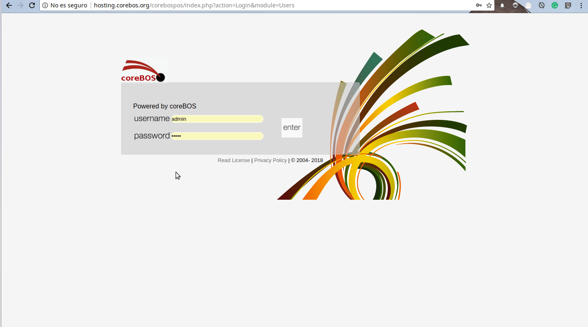
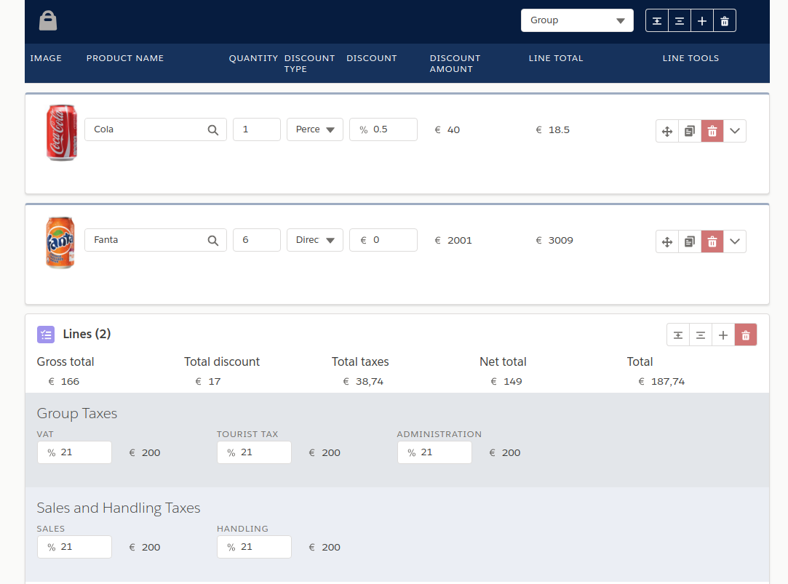

The other day, the head of sales at TSolucio sat down with me to ask some questions and the session turned out to be very enlightening, enough for me to create this post so our partners and users can get an idea of some of the things that are going on.

===

 ! Thursday, April 19, 2018

> Llorenç Perez - 6:18 PM

Hello

> Joe Bordes - 6:18 PM

Hello

> Llorenç Perez - 6:19 PM

Do you have time for a few high-level questions?

> Joe Bordes - 6:19 PM

Sure

> Llorenç Perez - 6:20 PM

If we needed to make a simple invoice from a counter using coreBOS, what would you use?

(Direct to the heart, no warm-up :-) )

> Joe Bordes - 6:22 PM

I would use the POS solution Omar implemented. Simple: ask for client, product, units and get the money.

[You can find a demo here](http://hosting.corebos.org/tpv) after logging in to [the associated coreBOS](http://hosting.corebos.org/corebospos)

> Llorenç Perez - 6:24 PM

Ok, you would use a POS solution. What exactly do you mean by client, product, units, money?

> Joe Bordes - 6:24 PM

I mean something simple, the minimum set of questions you need, who is buying, what are they buying, how many, get the price and get paid. Like a cashier you find in most shops where there isn't even a client and the products are scanned, all they have to do is put the units if there is more than one.

> Llorenç Perez - 6:25 PM

Just to be sure, you would use coreBOSTPV not create a new applicstion/UI? 

> Joe Bordes - 6:26 PM

Correct, unless you have something special in mind which invalidates it and the user is a low latency POS, not a supermarket, for example, I would use coreBOSTPV

> Llorenç Perez - 6:27 PM

It is for a furniture and decoration shop.

> Joe Bordes - 6:28 PM

Yes, I think that would fit.

> Llorenç Perez - 6:31 PM

ok.

Next question...

How would you make faster and more agile the introduction of purchase orders when the material arrives?

There are two use cases:
 1. We have previously introduced the PO in the system
 2. We do not have the PO in the system 

> Joe Bordes - 6:37 PM

Well, this is similar to the previous request, but we don't have anything implement. I would create a frontend application, probably using polymer web components and a PWA. Something simple oriented towards a tablet where we ask for the vendor or select the existing PO and the list of expected products is shown so you can tick them off or select products and units.

> Llorenç Perez - 6:38 PM

Would you support  OCR?

> Joe Bordes - 6:39 PM

That could be a bit complicated, but it could be done

> Llorenç Perez - 6:40 PM

Is it possible to add product autocomplete in the existing Inventory modules or would it be better to create a new interface?

> Joe Bordes - 6:41 PM

Well, we have a patch with dusty bits lying around somewhere that adds this functionality to the inventory modules, so it is possible and rather easy, but I would seriously look into using the phenomenal work that [Luke](https://github.com/Luke1982) has done in his IDLines project.

[Luke's Inventory Details UX](http://blog.corebos.org/IDLinesUX/)

> Llorenç Perez - 6:41 PM

Wow! Really pretty and powerful!

What is our roadmap to this respect? Are we going to stay with the current functionality or replace it with something else?

> Joe Bordes - 6:42 PM

My current plan is to gradually migrate the whole application to LDS and use Luke's work for the inventory modules. No timeframe for that yet but it is where we are going.

> Llorenç Perez - 7:20 PM

But we could use that to create invoices or another master-detail module in coreBOS now?

> Joe Bordes - 7:21 PM

Yes, absolutely

> Llorenç Perez - 7:35 PM

How long would it take to integrate that?

> Joe Bordes - 7:44 PM

I'm not sure. Estimate a couple days at least

> Llorenç Perez - 7:45 PM

One last question.

If you had to create a new interface, like a mini-portal with just one screen, how would you do it?

> Joe Bordes - 7:45 PM

[PWA](https://developers.google.com/web/progressive-web-apps/) with [Polymer](http://polymer-project.org/) [web components](https://www.webcomponents.org/)

> Llorenç Perez - 7:49 PM

Thank you.

> Joe Bordes - 7:49 PM

My pleasure ☺

**Don't hesitate to contact us if you have any questions.**

