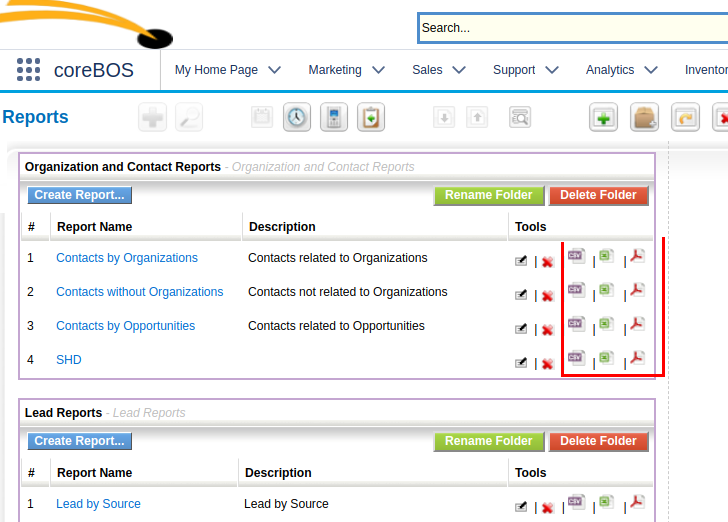
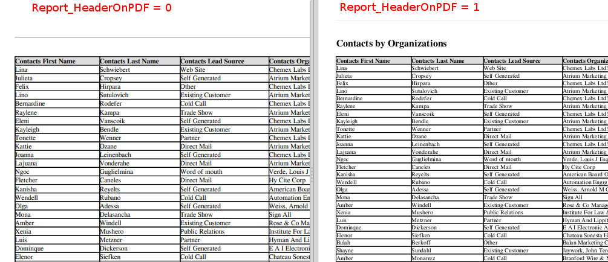

This is the first part in a three-part series that will cover how the coreBOS reporting system works and where the limits are. You can [read the second](../Reports02) and [third part](../Reports03) if you are coming from the future :-)

===

 ! Functionality on screen: buttons icons and quick actions

One of the first enhancements we made to the reporting system was to add quick action icons on the reports. At that time, the issue was that to be able to export the report you had to go IN to the report which would send the full contents to the browser. This massive amount of information would many times hang the browser so you couldn't get the information in any way.

With the quick action icons at least you could get the information out of the system.

 !!! Today we have solved this problem with paged reports but the quick action buttons are still very useful.

 ! Global variables that affect how reports act

**Report_ListView_PageSize**

This integer value defines how many rows of a report we will see in each page. The default value is 40 records

**Report_MaxRows_OnScreen**

When exporting a report to the browser in HTML it is easy to collapse the browser if too much information is sent, so we limit the maximum number of rows in HTML exports with this variable.

**Report_MaxRelated_Modules**

In the second step of the creation or customization of a report, we are given the option to select additional modules that are related to the main module of the report. When we relate many modules it is possible to create an invalid SQL command, so we limit the number of possible relations with this variable.

**Report_Send_Scheduled_ifEmpty**

By default scheduled reports are always sent even if they are empty. We can change this behavior with this variable

**Report_HeaderOnXLS** and **Report_HeaderOnPDF**

These variables will add the name of the Report to the output. This will complicate the spreadsheet automated processing but looks totally correct on the PDF.

 ! Sharing

The information that appears in a report will always be restricted by the privileges of the user launching the report, but we can also define who can access the report itself in the penultimate step of the report customization.

We will be able to share the report with other users, groups or roles.

 ! Programming regular send by email

We can program any report to be generated and sent by email at regular intervals to different application users.

The report can be sent in PDF, Excel or as a direct URL to the application

For this feature to work correctly we must have the scheduled report programmed task active and the coreBOS cron system correctly configured 

[Continue reading the next part here](../Reports02)

Photo by Stephen Dawson on Unsplash
<a style="background-color:black;color:white;text-decoration:none;padding:4px 6px;font-family:-apple-system, BlinkMacSystemFont, &quot;San Francisco&quot;, &quot;Helvetica Neue&quot;, Helvetica, Ubuntu, Roboto, Noto, &quot;Segoe UI&quot;, Arial, sans-serif;font-size:12px;font-weight:bold;line-height:1.2;display:inline-block;border-radius:3px" href="https://unsplash.com/@srd844?utm_medium=referral&amp;utm_campaign=photographer-credit&amp;utm_content=creditBadge" target="_blank" rel="noopener noreferrer" title="Download free do whatever you want high-resolution photos from Stephen Dawson"><svg xmlns="http://www.w3.org/2000/svg" style="height:12px;width:auto;position:relative;vertical-align:middle;top:-1px;fill:white" viewBox="0 0 32 32"><title>unsplash-logo</title><path d="M20.8 18.1c0 2.7-2.2 4.8-4.8 4.8s-4.8-2.1-4.8-4.8c0-2.7 2.2-4.8 4.8-4.8 2.7.1 4.8 2.2 4.8 4.8zm11.2-7.4v14.9c0 2.3-1.9 4.3-4.3 4.3h-23.4c-2.4 0-4.3-1.9-4.3-4.3v-15c0-2.3 1.9-4.3 4.3-4.3h3.7l.8-2.3c.4-1.1 1.7-2 2.9-2h8.6c1.2 0 2.5.9 2.9 2l.8 2.4h3.7c2.4 0 4.3 1.9 4.3 4.3zm-8.6 7.5c0-4.1-3.3-7.5-7.5-7.5-4.1 0-7.5 3.4-7.5 7.5s3.3 7.5 7.5 7.5c4.2-.1 7.5-3.4 7.5-7.5z"></path></svg>Stephen Dawson</a>

