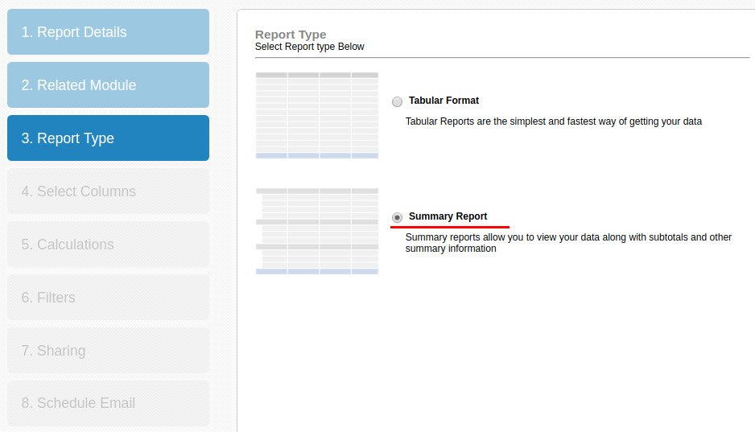
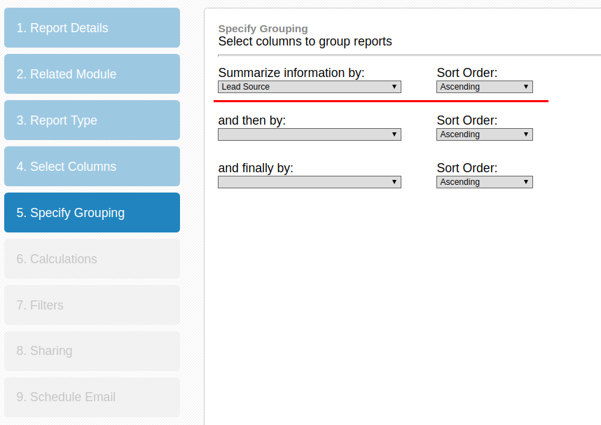
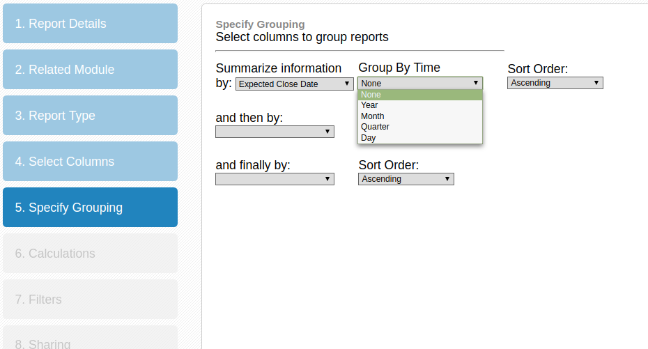
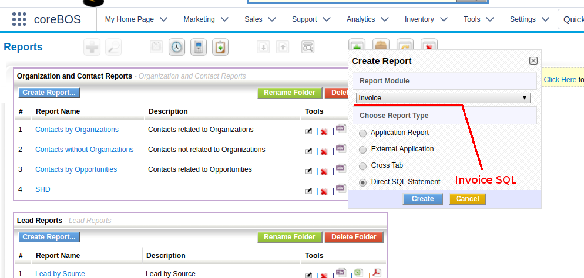
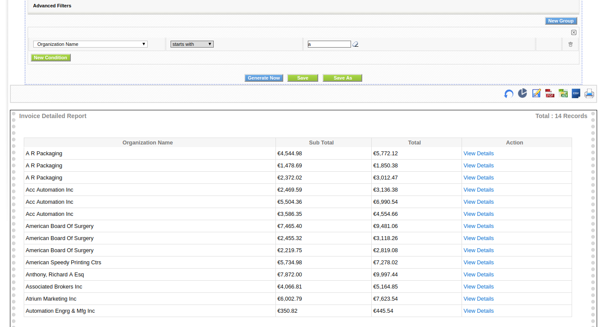
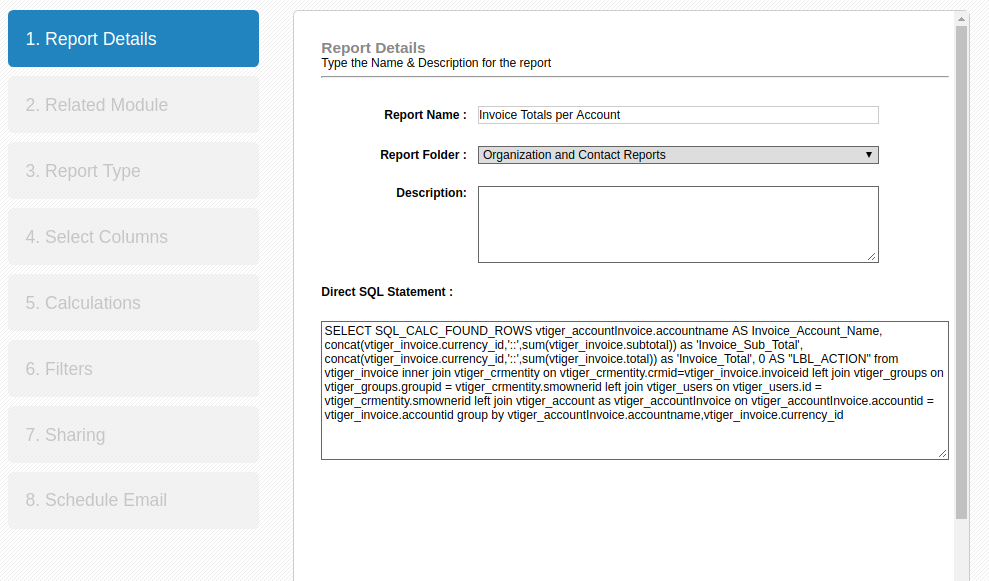
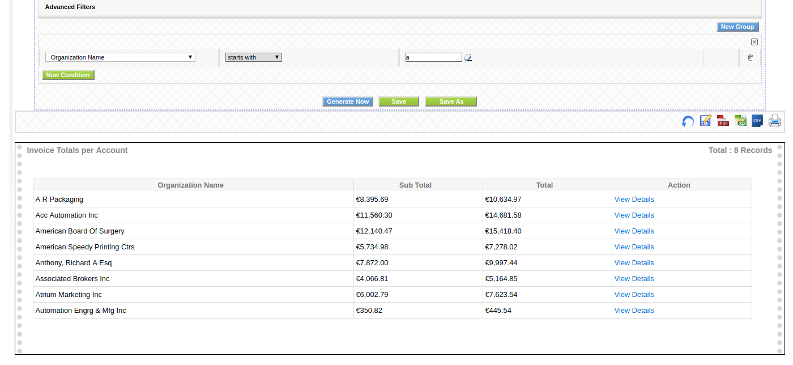

This is the second part of a three-part series on the coreBOS reporting system. You can [read the first part here](../Reports01) and the [third part here](../Reports03).

===

 ! Grouping and Getting graphs.

All reports that have a grouping will automatically get a bar and pie chart at the end of the page.

To add a grouping we must select the summary type on the third step of the report creation



 and a field to group by in the fifth step



If we select a field of type date we will get an additional choice to group by the different parts of the date value. But this isn't a grouping option for aggregations it simply sorts the records together by that part of the date.



Let me repeat that, all grouping options do not group the report records themselves, they will only be used in the charts and to order/sort the values together. In the case of date values the sorting will be done starting by the year and UP TO the date part chosen. So if we select a date field and then group by day it will effectively order by the complete date

```SQL
order by DATE_FORMAT(Potentials_Expected_Close_Date, '%Y' ) ASC,
  CEIL(DATE_FORMAT(Potentials_Expected_Close_Date,'%m')%13) ASC,
  DATE_FORMAT(Potentials_Expected_Close_Date,'%d')
```

if we select month the rows will be ordered by year and month

```SQL
order by DATE_FORMAT(Potentials_Expected_Close_Date, '%Y' ) ASC,
  CEIL(DATE_FORMAT(Potentials_Expected_Close_Date,'%m')%13)
```

and if we order by quarter, they will be sorted by year and quarter

```SQL
order by DATE_FORMAT(Potentials_Expected_Close_Date, '%Y' ) ASC,
  CEIL(DATE_FORMAT(Potentials_Expected_Close_Date,'%m')/3)
```

 ! Direct SQL reports

In order to enhance the possibilities of the reporting system, we added the option to introduce a direct SQL statement.

For the reporting extension to work correctly with the SQL command there are some rules that must be respected.

 - each column must have an alias that is the module name followed by the field label with all spaces substituted by underscores.
 - The last column must be the crmid of the record of the row with an alias of ACTION
 - you must select the main module of the SQL command when creating the report in order to support ad-hoc conditions
 - you cannot use conditions on groups (having)



The most demanded feature that is resolved with the direct SQL option is to calculate some aggregation on records grouped by some relation. For example. **the total invoiced per client**.

We can create a normal report where we order the invoices by the account and filter those that start with a letter "A":



Now if we want to sum the total of each invoice per account we would create a report with direct SQL like this:

```SQL
SELECT SQL_CALC_FOUND_ROWS vtiger_accountInvoice.accountname AS Invoice_Account_Name,
 concat(vtiger_invoice.currency_id,'::',sum(vtiger_invoice.subtotal)) as 'Invoice_Sub_Total',
 concat(vtiger_invoice.currency_id,'::',sum(vtiger_invoice.total)) as 'Invoice_Total',
 0 AS "LBL_ACTION"
 from vtiger_invoice
 inner join vtiger_crmentity on vtiger_crmentity.crmid=vtiger_invoice.invoiceid
 left join vtiger_groups on vtiger_groups.groupid = vtiger_crmentity.smownerid
 left join vtiger_users on vtiger_users.id = vtiger_crmentity.smownerid
 left join vtiger_account as vtiger_accountInvoice on vtiger_accountInvoice.accountid = vtiger_invoice.accountid
 group by vtiger_accountInvoice.accountname,vtiger_invoice.currency_id
```



The resulting report filtered by those organizations whose name start with "A" looks like this:




[Continue reading the next part here](../Reports03).


Photo by rawpixel on Unsplash
<a style="background-color:black;color:white;text-decoration:none;padding:4px 6px;font-family:-apple-system, BlinkMacSystemFont, &quot;San Francisco&quot;, &quot;Helvetica Neue&quot;, Helvetica, Ubuntu, Roboto, Noto, &quot;Segoe UI&quot;, Arial, sans-serif;font-size:12px;font-weight:bold;line-height:1.2;display:inline-block;border-radius:3px" href="https://unsplash.com/@rawpixel?utm_medium=referral&amp;utm_campaign=photographer-credit&amp;utm_content=creditBadge" target="_blank" rel="noopener noreferrer" title="Download free do whatever you want high-resolution photos from rawpixel"><span style="display:inline-block;padding:2px 3px"><svg xmlns="http://www.w3.org/2000/svg" style="height:12px;width:auto;position:relative;vertical-align:middle;top:-1px;fill:white" viewBox="0 0 32 32"><title>unsplash-logo</title><path d="M20.8 18.1c0 2.7-2.2 4.8-4.8 4.8s-4.8-2.1-4.8-4.8c0-2.7 2.2-4.8 4.8-4.8 2.7.1 4.8 2.2 4.8 4.8zm11.2-7.4v14.9c0 2.3-1.9 4.3-4.3 4.3h-23.4c-2.4 0-4.3-1.9-4.3-4.3v-15c0-2.3 1.9-4.3 4.3-4.3h3.7l.8-2.3c.4-1.1 1.7-2 2.9-2h8.6c1.2 0 2.5.9 2.9 2l.8 2.4h3.7c2.4 0 4.3 1.9 4.3 4.3zm-8.6 7.5c0-4.1-3.3-7.5-7.5-7.5-4.1 0-7.5 3.4-7.5 7.5s3.3 7.5 7.5 7.5c4.2-.1 7.5-3.4 7.5-7.5z"></path></svg></span><span style="display:inline-block;padding:2px 3px">rawpixel</span></a>
