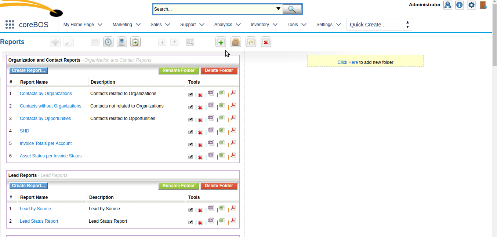
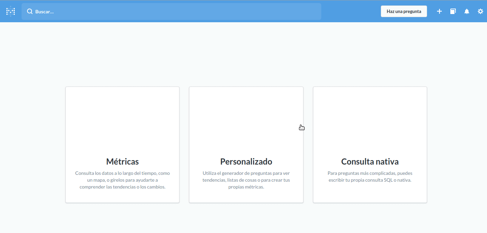

This is the third part of a three-part series on the coreBOS reporting system. You can read the [first part here](../Reports01) and the [second part here](../Reports02).

===

 ! Crosstab or pivot reports

This type of report aggregates the values of a field on a module grouped by a field on another related module.

For example we can get the **total sum of invoices grouped by the status of assets**

Or the **count of support tickets per status and product**

Or the count of support tickets with related payments paid and pending...

This functionality is still in an early stage of development. It only supports standard capture fields (uitype10) to establish the relationship and it is the stepping stone upon which we will construct the possibility of creating grouped reports in the system.

 !!! Help is needed to finish his part of the reporting engine.

 ! External reports

This functionality is very similar to what can be done in the **My Sites** extension but it always opens the URL in a new tab. The main idea is to have a central place for all your users to access their reports, at least the most important ones even if they are reports generated in another application.

Creating a report of this type consists of simply introducing the URL in the input box and indicating if the report needs to know what user is opening it.

Have a look at the next video to see an example using the [Metabase](https://metabase.com) integration: we create a report/question in metabase, activate sharing on the question, copy the URL of the question and put it in the coreBOS report definition.

I hope this tutorial has helped you understand better the functionality and limitations of the reporting system.

As a closing note, I leave a few related links from the documentation wiki and a **VERY** serious nudge for you to dedicate some time to getting [Metabase](https://metabase.com) working, it will be well worth every minute you spend.

 - [User Manual::Report Charts](http://corebos.org/documentation/doku.php?id=en:reporting:report_charts&noprocess=1)
 - [User Manual::Reporting](http://corebos.org/documentation/doku.php?id=en:reporting&noprocess=1)
 - [A trouble ticket report in vtiger CRM](http://corebos.org/documentation/doku.php?id=temporaryhold:vtcrmreporttt&noprocess=1)

Let me know if I missed some part you would have liked to have seen or simply express your needs in [our gitter channel](https://gitter.im/corebos/discuss) or [forum](http://discussions.corebos.org/).

**Thanks for reading.**

Photo by rawpixel on Unsplash
<a style="background-color:black;color:white;text-decoration:none;padding:4px 6px;font-family:-apple-system, BlinkMacSystemFont, &quot;San Francisco&quot;, &quot;Helvetica Neue&quot;, Helvetica, Ubuntu, Roboto, Noto, &quot;Segoe UI&quot;, Arial, sans-serif;font-size:12px;font-weight:bold;line-height:1.2;display:inline-block;border-radius:3px" href="https://unsplash.com/@rawpixel?utm_medium=referral&amp;utm_campaign=photographer-credit&amp;utm_content=creditBadge" target="_blank" rel="noopener noreferrer" title="Download free do whatever you want high-resolution photos from rawpixel"><svg xmlns="http://www.w3.org/2000/svg" style="height:12px;width:auto;position:relative;vertical-align:middle;top:-1px;fill:white" viewBox="0 0 32 32"><title>unsplash-logo</title><path d="M20.8 18.1c0 2.7-2.2 4.8-4.8 4.8s-4.8-2.1-4.8-4.8c0-2.7 2.2-4.8 4.8-4.8 2.7.1 4.8 2.2 4.8 4.8zm11.2-7.4v14.9c0 2.3-1.9 4.3-4.3 4.3h-23.4c-2.4 0-4.3-1.9-4.3-4.3v-15c0-2.3 1.9-4.3 4.3-4.3h3.7l.8-2.3c.4-1.1 1.7-2 2.9-2h8.6c1.2 0 2.5.9 2.9 2l.8 2.4h3.7c2.4 0 4.3 1.9 4.3 4.3zm-8.6 7.5c0-4.1-3.3-7.5-7.5-7.5-4.1 0-7.5 3.4-7.5 7.5s3.3 7.5 7.5 7.5c4.2-.1 7.5-3.4 7.5-7.5z"></path></svg>rawpixel</a>
