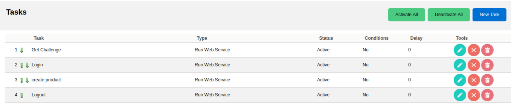

Learn how to call external applications using the workflow system to get or send information, with a real example of synchronizing information between two coreBOS installs.

===

In the summer of 2019 coreBOS received a new workflow task named **Run Web Service**. The importance of this task and the possibilities it opens have gone notably unsung since then mostly due to a lack of time. This 2020 I have seen three implementations based on this task that made me want to dedicate this blog post to this powerful workflow task.

The [documentation page](https://corebos.com/documentation/doku.php?noprocess=1&id=en:adminmanual:businessmappings:webservicecall) of this task defines it as:

> This workflow task can be used to launch a REST or SOAP call to another system and retrieve the results to be saved in fields of coreBOS or to be passed along to other tasks to be consumed by using the context.

Creating a graphical user interface for this task is very hard, it has so many options and parts to consider that we did what we always do in this case: create a Business Map to define all the options so we can use the functionality now while we wait to create the UI.

The Business Map that defines the functionality of this task is called **Webservice Mapping** and is [detailed in the documentation](https://corebos.com/documentation/doku.php?noprocess=1&id=en:adminmanual:businessmappings:webservicecall) with some examples. The map is divided into three parts:

* configuration of the call
* parameters of the call
* response management

So, what this task permits us to do is make a call to another application using information from coreBOS and manage the response to get it into coreBOS.

A high-level explanation of the three use cases I have seen this year is:

* Integration with [FacturaScripts](https://facturascripts.com/). We needed an accounting system for coreBOS. We decided to use the accounting system in FacturaScripts for the task instead of implementing one ourselves. When an account, product, or service is modified we send the information to FacturaScripts with a web service call to their API. Then we do the same with the Invoices. Simple and effective
* A refund portal where we have to send modifications that happen inside coreBOS to a central MDM, so we interface those changes with the web service call task
* coreBOS to coreBOS synchronization. We have various coreBOS tracking time control records in different areas and want to centralize all that information in one coreBOS for reporting.

I am going to enter in a little more detail in this last use case to teach you how that can be done and, hopefully, transmit how this functionality works.

Let's suppose that I want to synchronize the products between two coreBOS installs, send them from one coreBOS to another. Create them in the destination system when they are created in the origin coreBOS and update them in the destination when they are modified in the origin.

If we were to do this using a programming language we would do something like

* detect the change of the product
* login to the destination application
* create or update the product
* log out of the system

Since we are going to resolve this using the workflow system it will detect the changes for us and trigger on create and update, so we can move directly to the login step. Logging in to a coreBOS application is a two-step process, so we will have to create two business maps, one for each step.

The first step is the getchallenge call. [This is the map.](coreBOSSyncChallenge.xml) Let's highlight the important parts.

We set the URL where we want to connect to and how we need to make that call, GET in this case. The methodname is not used in this call but we set it for logging and documentation purposes. The rest of the settings in the header are explained in the wiki.

Next, we set the parameters for the call. We can use any fields we want from the record triggering the workflow, but in this case, we don't need any, we just need two constants: the name of the operation and the username.

Finally, the response is the challenge token which we save in the context with the name `cb_token`. Note how we can access array elements with the dot notation.

So, it is that easy to make a getChallenge call to coreBOS from another coreBOS. Let's see [the login step](coreBOSSyncLogin.xml).

The call settings are very similar, we have to use POST and change the content-type, but the general idea is the same.

The parameters are also very similar, there is just one more where we use the workflow expression language to retrieve the challenge token from the context and apply an MD5 on the concatenation with the access key. This is the normal login process.

Finally, the same as in the previous map, we save the sessionName in the context for subsequent calls to use it.

With these two maps, we successfully log in to the other coreBOS. We can use these maps to execute any further operations.

For our case, we are going to [create a product with this map](ProductSyncCreate.xml). As can be seen, the idea is the same as the previous maps. It is worth mentioning that we have to manually create the JSON string which is a bit cumbersome, and that we save the ID returned in the product triggering the workflow in order for it to be used in the Update operation.

The [last step](coreBOSSyncLogout.xml) is just a Logout call following the same process as the previous ones.

The final setup in the workflow looks like this:

The [update workflow](ProductSyncUpdate.xml) is almost identical, changing only the Update step where we use the ID we saved in the create step to launch a Revise.

Hopefully, this explanation is enough for the reader to understand the possibilities that this workflow task brings to the system. I leave you with a small video showing these maps in actions.

[plugin:youtube](https://youtu.be/w-YjveRnhPc)

**Stay safe!**

Photo by <a href="https://unsplash.com/@axellvak?utm_source=unsplash&amp;utm_medium=referral&amp;utm_content=creditCopyText">Remy_Loz</a> on <a href="https://unsplash.com/s/photos/computer-domore?utm_source=unsplash&amp;utm_medium=referral&amp;utm_content=creditCopyText">Unsplash</a>