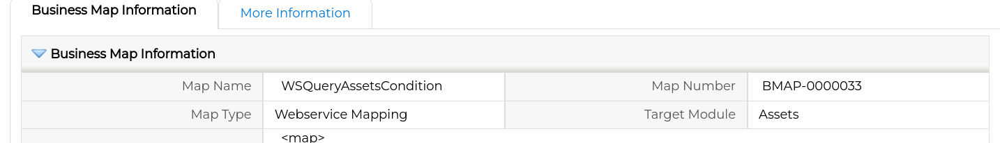

Learn how you can use the [Run Web Service workflow task](../RunWSWFTask) from anywhere in the coreBOS code. No longer is this task limited and confined by the workflow system!

===

In the previous posts, you can find me saying 

> The [Run Web Service workflow task](../RunWSWFTask) is one of those tasks that has surprised me, I see it being used as a powerful integration mechanism in an ever more connected and service-based world.

And here we are again with yet another interesting enhancement to this task.

First, let's start with a nice feature that came by the hand of Adisa who is using this task a lot. She needed to return the full response of the web service call, not just some picked fields. We discussed the request together and decided to use the dot (.) as an alias for "give me the whole response". It makes sense from the perspective of the dotted notation we support now for accessing individual fields (read about it in the previous posts). It turns out that this feature has a great impact on the functionality we describe in the rest of the post. **Thanks Adisa :-)**

coreBOS gives us a way of [executing workflows from the application UI and code using Business Actions](https://discussions.corebos.org/documentation/doku.php?id=en:adminmanual:businessactions#business_actionlaunch_workflow) but workflow tasks do not return any output. They are backend tasks that accomplish some goal without returning any response (except a positive or negative status). Following this situation the Run Web Service workflow task natively supports saving values it gets from the web service call into fields in some module record while also loading those values into the workflow context to be processed by other tasks.

The Run Web Service workflow task is much more powerful than that. It can call any endpoint in the world and return any type of information with which we could want to do any type of processing. So we need a generic way to call any endpoint and get the response anywhere in our code, not just from inside the workflow system.

What we did is a small change in the workflow task that permits us to use the mapping and existing functionality anywhere in the code that we want and get the full response (thanks to the new dot feature!) or any subset of the response we may need.

Then Geofrey added a new [developer block](https://discussions.corebos.org/documentation/doku.php?id=en:devel:add_special_block#developer_blocks) that permits us to call the workflow task using a business action. **Thanks Geofrey**

There is one small catch; the workflow system and its tasks are triggered by a record inside the application. All the workflow tasks require to have a valid record to give them the context they require, they can't just do their work/functionality without knowing the record they are working with.

We have been slowly preparing coreBOS to work correctly with this restriction by supporting the "special" record ID **0x0**. In most of the application we can use 0x0 as a way of informing coreBOS that it must do its work without all the information of an existing record. The possibilities are fewer when using the 0x0 record ID, but many times it is enough. For example, when you are calling a web service to some external system and just want to process the result, you may not need any information from a record in coreBOS.

I created two maps and a small standalone script to test and validate the liberation of the run web service workflow task from its confinement in the workflow system. Have a look and reach out to us if you need any help.

 !!! Web Service Map with a static query


```xml
<map>
<originmodule>
<originname>Assets</originname>
</originmodule>

<wsconfig>
<wsurl><![CDATA[http://localhost/coreBOSTest/webservice.php]]></wsurl>
<wshttpmethod>GET</wshttpmethod>
<methodname>wsquery</methodname>
<wsresponsetime></wsresponsetime>
<wsuser></wsuser>
<wspass></wspass>
<wsheader>
</wsheader>
<wstype>REST</wstype>
<inputtype>URL</inputtype>
<outputtype>JSON</outputtype>
</wsconfig>

<fields>
<field>
<fieldname>sessionName</fieldname>
<Orgfields>
<Orgfield>
<OrgfieldName>getFromContext('sessionName')</OrgfieldName>
<OrgfieldID>EXPRESSION</OrgfieldID>
</Orgfield>
<delimiter></delimiter>
</Orgfields>
</field>
<field>
<fieldname>operation</fieldname>
<Orgfields>
<Orgfield>
<OrgfieldName>query</OrgfieldName>
<OrgfieldID>CONST</OrgfieldID>
</Orgfield>
<delimiter></delimiter>
</Orgfields>
</field>
<field>
<fieldname>query</fieldname>
<Orgfields>
<Orgfield>
<OrgfieldName>select%20assetname,serialnumber%20from%20Assets%20limit%204;</OrgfieldName>
<OrgfieldID>CONST</OrgfieldID>
</Orgfield>
<delimiter></delimiter>
</Orgfields>
</field>
</fields>

<Response>
<field>
<fieldname>.</fieldname>
<destination>
<field>response</field>
</destination>
</field>
</Response>
</map>
```

 !!! Web Service Map with a conditional query



```xml
<map>
<originmodule>
<originname>Assets</originname>
</originmodule>

<wsconfig>
<wsurl><![CDATA[http://localhost/coreBOSTest/webservice.php]]></wsurl>
<wshttpmethod>GET</wshttpmethod>
<methodname>wsquery</methodname>
<wsresponsetime></wsresponsetime>
<wsuser></wsuser>
<wspass></wspass>
<wsheader>
</wsheader>
<wstype>REST</wstype>
<inputtype>URL</inputtype>
<outputtype>JSON</outputtype>
</wsconfig>

<fields>
<field>
<fieldname>sessionName</fieldname>
<Orgfields>
<Orgfield>
<OrgfieldName>getFromContext('sessionName')</OrgfieldName>
<OrgfieldID>EXPRESSION</OrgfieldID>
</Orgfield>
<delimiter></delimiter>
</Orgfields>
</field>
<field>
<fieldname>operation</fieldname>
<Orgfields>
<Orgfield>
<OrgfieldName>query</OrgfieldName>
<OrgfieldID>CONST</OrgfieldID>
</Orgfield>
<delimiter></delimiter>
</Orgfields>
</field>
<field>
<fieldname>query</fieldname>
<Orgfields>
<Orgfield>
<OrgfieldName>concat('select%20assetname,serialnumber%20from%20Assets%20where%20assetname%20like%20\'%',getFromContext('assetname'),'%\'%20limit%202;')</OrgfieldName>
<OrgfieldID>EXPRESSION</OrgfieldID>
</Orgfield>
<delimiter></delimiter>
</Orgfields>
</field>
</fields>

<Response>
<field>
<fieldname>.</fieldname>
<destination>
<field>response</field>
</destination>
</field>
</Response>
</map>
```

 !!! Code that uses the two maps. Notice how I load the context with the 0x0 record.

```php
include_once 'vtlib/Vtiger/Module.php';
include_once 'modules/com_vtiger_workflow/tasks/RunWebserviceWorkflowTask.inc';
include_once 'modules/com_vtiger_workflow/expression_functions/cbexpSQL.php';

$util = new VTWorkflowUtils();
$adminUser = $util->adminUser();
$entityCache = new VTEntityCache($adminUser);
$wfentity = new cbexpsql_environmentstub('Assets', '0x0');
$sessionName = '3b3372496249b33cc1339';
$context = array(
	'WSCall_ReturnResultWithNoSave' => 1,
	'record_id' => '0x0',
	'sessionName' => $sessionName,
	// add other parameters here
);
$wfentity->WorkflowContext = $context;

$runwstask = new RunWebserviceWorkflowTask();
$runwstask->bmapid = 44205;
$runwstask->bmapid_display = 'WSQuery4Assets';
$rdo = $runwstask->doTask($wfentity);
var_dump($rdo);

$context = array(
	'WSCall_ReturnResultWithNoSave' => 1,
	'record_id' => '0x0',
	'assetname' => 'Re',
	'sessionName' => $sessionName,
	// add other parameters here
);
$wfentity->WorkflowContext = $context;
$runwstask->bmapid = 44206;
$runwstask->bmapid_display = 'WSQueryAssetsCondition';
$rdo = $runwstask->doTask($wfentity);
var_dump($rdo);
```


**<span style="font-size:large">Happy programming!</span>**

Photo by <a href="https://unsplash.com/@adityaries?utm_source=unsplash&utm_medium=referral&utm_content=creditCopyText">Aditya Saxena</a> on <a href="https://unsplash.com/s/photos/freedom?utm_source=unsplash&utm_medium=referral&utm_content=creditCopyText">Unsplash</a>
